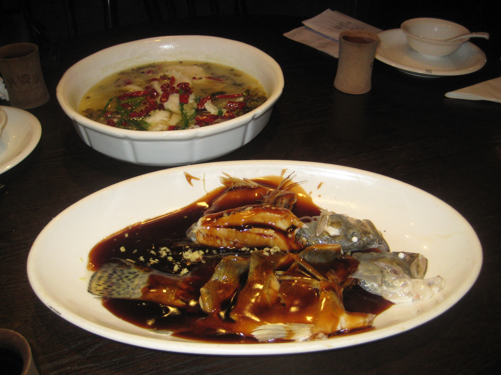
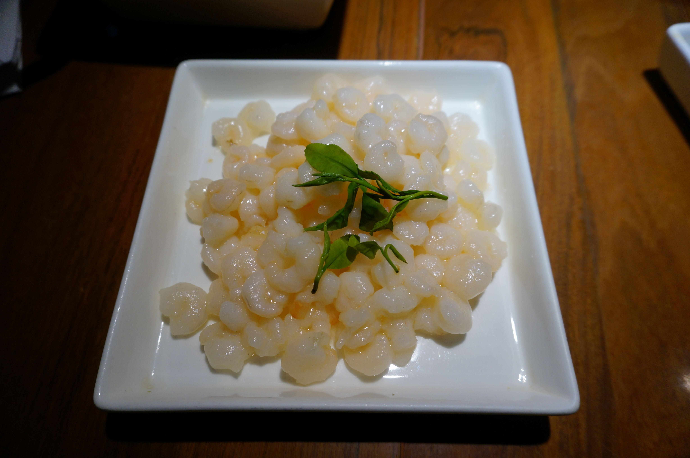

<p align="center">
  <h1 align="center">杭州菜谱<br><sub>Traditional Hangzhou Cuisine Recipes</sub></h1>
  <p align="center">
    <em>清鲜脆嫩，原汁原味 — 浙江菜系的精华</em><br>
    <em>Fresh, Crisp & Delicate — The Essence of Zhejiang Cuisine</em>
  </p>
</p>

<p align="center">
  <a href="#经典名菜--classic-dishes"></a>
  <a href="recipes/"></a>
  <a href="LICENSE"></a>
</p>

---

## 简介 | Introduction

杭州菜是**浙江菜系（浙菜）**的重要组成部分，历史悠久，可追溯至南宋时期。杭帮菜以**清鲜、脆嫩、爽滑**著称，注重**原汁原味**，讲究**时令食材**，善用绍兴黄酒、西湖醋、龙井茶等本地特产入菜。

Hangzhou cuisine is a vital branch of **Zhejiang cuisine (Zhe Cai)**, one of China's Eight Great Culinary Traditions. Dating back to the Southern Song Dynasty (1127–1279), it is celebrated for its **freshness, crispness, and delicate flavors**, with an emphasis on **seasonal ingredients** and signature local products such as Shaoxing wine, West Lake vinegar, and Longjing tea.

---

## 经典名菜 | Classic Dishes

<table>
  <tr>
    <td align="center" width="33%">
      <a href="recipes/classics/西湖醋鱼.md">
        <br>
        <b>西湖醋鱼</b><br>
        <sub>West Lake Fish in Vinegar Gravy</sub>
      </a>
    </td>
    <td align="center" width="33%">
      <a href="recipes/classics/东坡肉.md">
        <br>
        <b>东坡肉</b><br>
        <sub>Dongpo Braised Pork</sub>
      </a>
    </td>
    <td align="center" width="33%">
      <a href="recipes/classics/龙井虾仁.md">
        <br>
        <b>龙井虾仁</b><br>
        <sub>Stir-fried Shrimp with Longjing Tea</sub>
      </a>
    </td>
  </tr>
</table>

---

## 完整菜单 | Full Menu

### 经典名菜 | Classics

| 菜名 | English | 菜谱 |
|------|---------|------|
| 西湖醋鱼 | West Lake Fish in Vinegar Gravy | [查看 / View](recipes/classics/西湖醋鱼.md) |
| 东坡肉 | Dongpo Braised Pork | [查看 / View](recipes/classics/东坡肉.md) |
| 龙井虾仁 | Stir-fried Shrimp with Longjing Tea | [查看 / View](recipes/classics/龙井虾仁.md) |

### 更多菜谱即将更新 | More Recipes Coming Soon

- 叫化童鸡 | Beggar's Chicken
- 宋嫂鱼羹 | Sister Song's Fish Soup
- 西湖莼菜汤 | West Lake Water Shield Soup
- 杭州酱鸭 | Hangzhou Soy-Braised Duck
- 干炸响铃 | Crispy Tofu Skin Rolls
- 片儿川 | Pian'er Chuan Noodles
- 葱包桧 | Scallion Pancake Rolls

---

## 目录结构 | Project Structure

```
Hangzhoucai/
├── README.md
├── LICENSE
├── images/
│   └── classics/          # 菜品图片 / Dish photos
└── recipes/
    ├── classics/           # 经典名菜 / Classic dishes
    ├── home-style/         # 家常菜 / Home-style dishes
    └── snacks/             # 小吃点心 / Snacks & dim sum
```

---

## 贡献 | Contributing

欢迎提交 Pull Request 补充菜谱或修正内容！

Contributions are welcome! Feel free to submit a PR to add new recipes or improve existing ones.

**贡献指南 | Guidelines:**

1. 每道菜谱使用单独的 Markdown 文件 / Each recipe should be a separate Markdown file
2. 中英文对照 / Include both Chinese and English
3. 附上食材清单和步骤 / Include ingredients list and cooking steps
4. 如有图片请放入 `images/` 目录 / Place images in the `images/` directory

---

## 图片来源 | Image Credits

本项目使用的菜品图片来自 Wikimedia Commons，采用 CC BY-SA 4.0 协议。

Dish photos are sourced from Wikimedia Commons under the CC BY-SA 4.0 license.

---

## 许可证 | License

本项目采用 [MIT License](LICENSE) 开源。

This project is licensed under the [MIT License](LICENSE).
