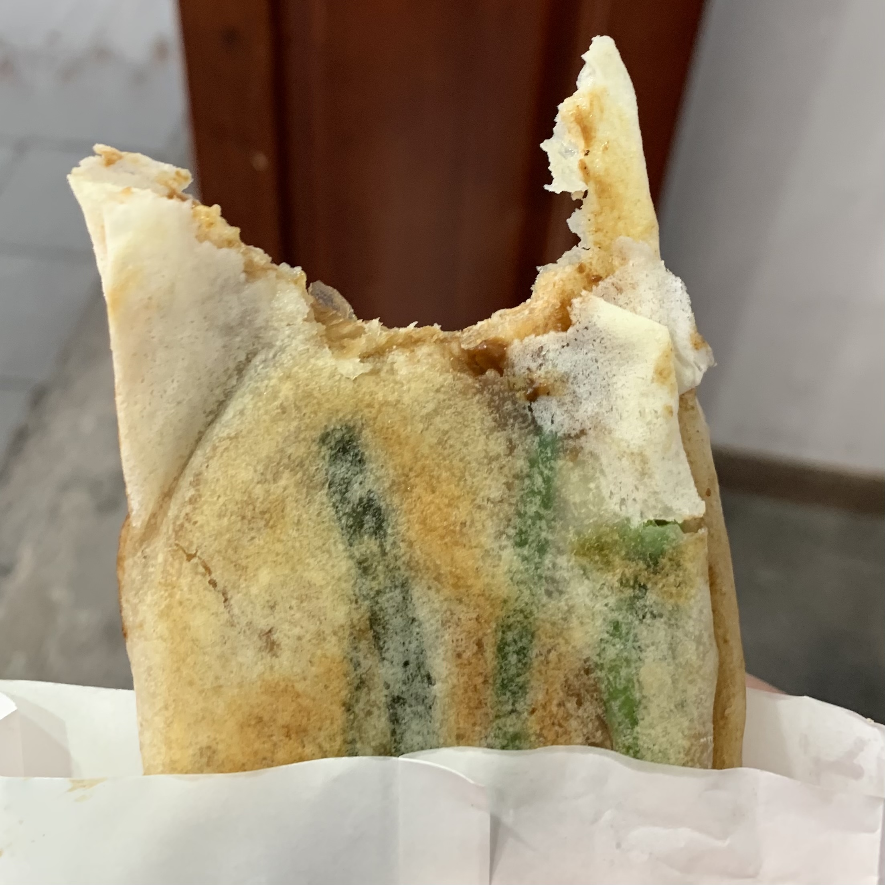
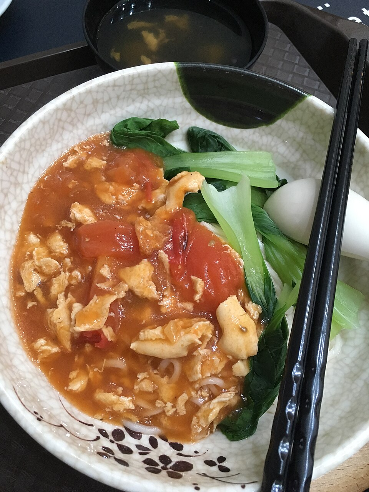
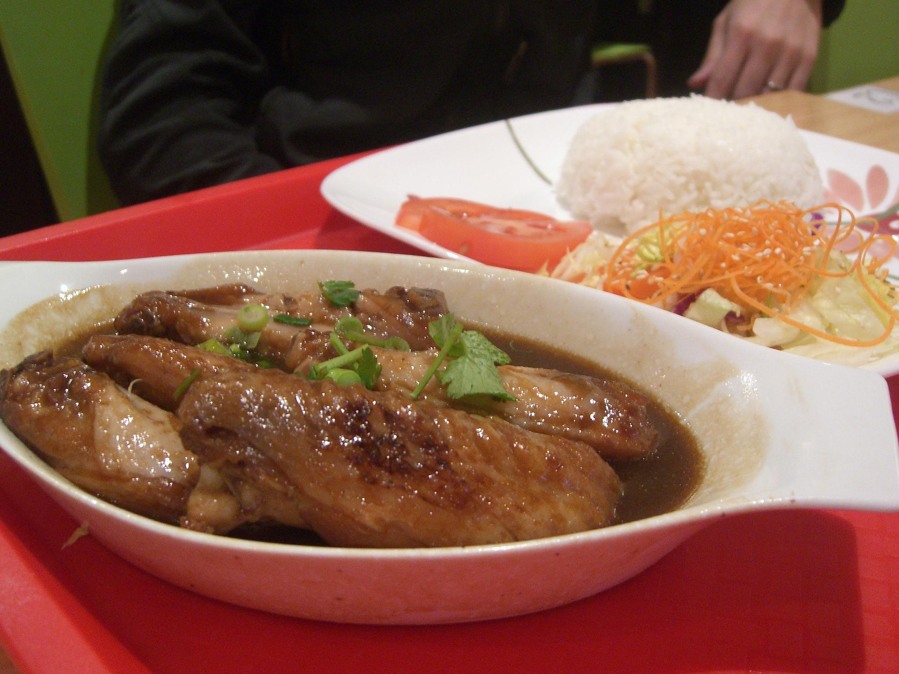
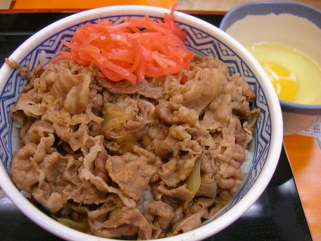
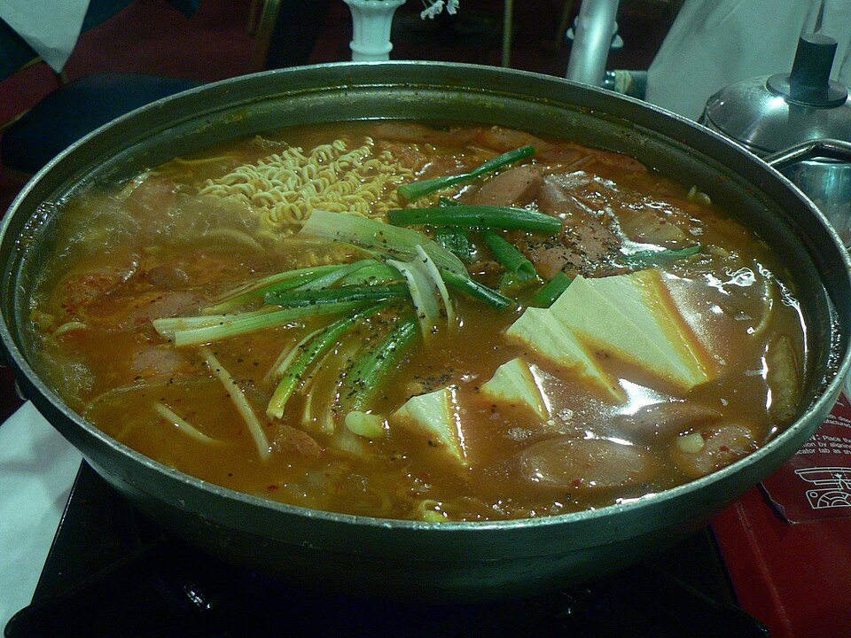

<p align="center">
  <h1 align="center">Tasty Exotic Food<br><sub>Easy Recipes Recreated with American Supermarket Ingredients</sub></h1>
  <p align="center">
    <em>留学生饮食指南 — 想家的时候，就自己做一顿吧</em><br>
    <em>International Student Food Guide — When you miss home, cook yourself a taste of it.</em>
  </p>
</p>

<p align="center">
  <a href="#经典名菜--classic-dishes"></a>
  <a href="#小吃点心--snacks"></a>
  <a href="#家常菜--home-style"></a>
  <a href="#一锅出--one-pot-meals"></a>
  <a href="#快手菜--quick-meals"></a>
  <a href="#国际料理--global-cuisine"></a>
  <a href="#素食--vegetarian"></a>
  <a href="#甜品--desserts"></a>
  <a href="#早餐--breakfast"></a>
  <a href="recipes/"></a>
  <a href="guides/american-substitutions.md"></a>
  <a href="LICENSE"></a>
</p>

---

## 这个项目是什么 | What Is This

这是一份专为**在美留学生**准备的中国菜复刻指南。我们知道留学生活最难熬的不是 GPA，是想家时那口吃不到的味道。

本项目收录**杭州经典菜、一锅出、快手菜**等多种类型，涵盖浙菜、川菜等多个菜系。每道菜谱都包含：

- **中英双语**的详细步骤 | Bilingual step-by-step instructions
- **美国超市食材替代方案** — Trader Joe's、Costco、Walmart、Target、Whole Foods | American supermarket substitution tips
- **新手友好**的难度标注和入门推荐 | Beginner-friendly difficulty ratings

*This is a Chinese cooking guide made for **international students in America**. We know the hardest part of studying abroad isn't the coursework — it's missing the flavors of home.*

*This project covers **Hangzhou classics, one-pot meals, quick weeknight dishes**, and more — spanning Zhejiang, Sichuan, and beyond. Every recipe includes bilingual instructions, American supermarket tips, and beginner guidance.*

> **为什么从杭州菜开始？** 杭帮菜以**清鲜、脆嫩、爽滑**著称，注重原汁原味，讲究时令食材，善用绍兴黄酒、西湖醋、龙井茶等本地特产入菜。历史可追溯至南宋时期，是浙江菜系的精华。
>
> **Why start with Hangzhou?** Hangzhou cuisine — a crown jewel of China's Eight Great Culinary Traditions — is celebrated for its freshness, crispness, and delicate flavors. Dating back to the Southern Song Dynasty, it uses signature ingredients like Shaoxing wine, Chinkiang vinegar, and Longjing tea.

---

## 从这里开始 | Start Here

刚来美国，厨房还是一片空白？先看这个：

*New to cooking in America? Start here:*

| 步骤 / Step | 做什么 / What to Do | 说明 / Description |
|------------|--------------------|--------------------|
| 1 | 读 [超市采购指南](guides/american-substitutions.md#新手推荐--where-to-start) / Read the [Shopping Guide](guides/american-substitutions.md#新手推荐--where-to-start) | 了解去哪家超市买什么，一次采购搞定 / Learn what to buy and where — one trip, done |
| 2 | 先做 [番茄炒蛋](recipes/quick/番茄炒蛋.md) 或 [蛋炒饭](recipes/quick/蛋炒饭.md) / Start with [Tomato Egg](recipes/quick/番茄炒蛋.md) or [Fried Rice](recipes/quick/蛋炒饭.md) | 3种食材，10分钟，零失败 / 3 ingredients, 10 min, zero chance of failure |
| 3 | 试试 [番茄鸡蛋面](recipes/one-pot/番茄鸡蛋面.md) 或 [可乐鸡翅](recipes/quick/可乐鸡翅.md) / Try [Tomato Egg Noodles](recipes/one-pot/番茄鸡蛋面.md) or [Cola Wings](recipes/quick/可乐鸡翅.md) | 一锅出，暖胃又解馋 / One-pot comfort food |
| 4 | 探索更多菜谱 ↓ / Explore more recipes below ↓ | 慢慢解锁全部37道菜！ / Unlock all 37 dishes! |

---

## 经典名菜 | Classic Dishes

<table>
  <tr>
    <td align="center" width="33%">
      <a href="recipes/classics/西湖醋鱼.md">
        <br>
        <b>西湖醋鱼</b><br>
        <sub>West Lake Fish in Vinegar Gravy</sub>
      </a>
    </td>
    <td align="center" width="33%">
      <a href="recipes/classics/东坡肉.md">
        <br>
        <b>东坡肉</b><br>
        <sub>Dongpo Braised Pork</sub>
      </a>
    </td>
    <td align="center" width="33%">
      <a href="recipes/classics/龙井虾仁.md">
        <br>
        <b>龙井虾仁</b><br>
        <sub>Stir-fried Shrimp with Longjing Tea</sub>
      </a>
    </td>
  </tr>
  <tr>
    <td align="center" width="33%">
      <a href="recipes/classics/叫化童鸡.md">
        <br>
        <b>叫化童鸡</b><br>
        <sub>Beggar's Chicken</sub>
      </a>
    </td>
    <td align="center" width="33%">
      <a href="recipes/classics/宋嫂鱼羹.md">
        <br>
        <b>宋嫂鱼羹</b><br>
        <sub>Sister Song's Fish Soup</sub>
      </a>
    </td>
    <td align="center" width="33%">
      <a href="recipes/classics/西湖莼菜汤.md">
        <br>
        <b>西湖莼菜汤</b><br>
        <sub>West Lake Water Shield Soup</sub>
      </a>
    </td>
  </tr>
  <tr>
    <td align="center" width="33%">
      <a href="recipes/classics/杭州酱鸭.md">
        <br>
        <b>杭州酱鸭</b><br>
        <sub>Hangzhou Soy-Braised Duck</sub>
      </a>
    </td>
    <td align="center" width="33%"></td>
    <td align="center" width="33%"></td>
  </tr>
</table>

---

## 小吃点心 | Snacks

<table>
  <tr>
    <td align="center" width="33%">
      <a href="recipes/snacks/干炸响铃.md">
        <br>
        <b>干炸响铃</b><br>
        <sub>Crispy Tofu Skin Rolls</sub>
      </a>
    </td>
    <td align="center" width="33%">
      <a href="recipes/snacks/片儿川.md">
        <br>
        <b>片儿川</b><br>
        <sub>Pian'er Chuan Noodles</sub>
      </a>
    </td>
    <td align="center" width="33%">
      <a href="recipes/snacks/葱包桧.md">
        <br>
        <b>葱包桧</b><br>
        <sub>Scallion Pancake Rolls</sub>
      </a>
    </td>
  </tr>
</table>

---

## 一锅出 | One-Pot Meals

<table>
  <tr>
    <td align="center" width="25%">
      <a href="recipes/one-pot/番茄鸡蛋面.md">
        <br>
        <b>番茄鸡蛋面</b><br>
        <sub>Tomato Egg Noodle Soup</sub>
      </a>
    </td>
    <td align="center" width="25%">
      <a href="recipes/one-pot/咖喱鸡饭.md">
        <br>
        <b>咖喱鸡饭</b><br>
        <sub>Curry Chicken Rice</sub>
      </a>
    </td>
    <td align="center" width="25%">
      <a href="recipes/one-pot/酸辣汤.md">
        <br>
        <b>酸辣汤</b><br>
        <sub>Hot & Sour Soup</sub>
      </a>
    </td>
    <td align="center" width="25%">
      <a href="recipes/one-pot/红烧牛腩.md">
        <br>
        <b>红烧牛腩</b><br>
        <sub>Braised Beef Brisket</sub>
      </a>
    </td>
  </tr>
</table>

---

## 快手菜 | Quick Meals

<table>
  <tr>
    <td align="center" width="33%">
      <a href="recipes/quick/番茄炒蛋.md">
        <br>
        <b>番茄炒蛋</b><br>
        <sub>Tomato & Egg Stir-fry</sub>
      </a>
    </td>
    <td align="center" width="33%">
      <a href="recipes/quick/麻婆豆腐.md">
        <br>
        <b>麻婆豆腐</b><br>
        <sub>Mapo Tofu</sub>
      </a>
    </td>
    <td align="center" width="33%">
      <a href="recipes/quick/宫保鸡丁.md">
        <br>
        <b>宫保鸡丁</b><br>
        <sub>Kung Pao Chicken</sub>
      </a>
    </td>
  </tr>
  <tr>
    <td align="center" width="33%">
      <a href="recipes/quick/蛋炒饭.md">
        <br>
        <b>蛋炒饭</b><br>
        <sub>Egg Fried Rice</sub>
      </a>
    </td>
    <td align="center" width="33%">
      <a href="recipes/quick/可乐鸡翅.md">
        <br>
        <b>可乐鸡翅</b><br>
        <sub>Cola Chicken Wings</sub>
      </a>
    </td>
    <td align="center" width="33%">
      <a href="recipes/quick/凉拌黄瓜.md">
        <br>
        <b>凉拌黄瓜</b><br>
        <sub>Smashed Cucumber Salad</sub>
      </a>
    </td>
  </tr>
</table>

---

## 国际料理 | Global Cuisine

<table>
  <tr>
    <td align="center" width="20%">
      <a href="recipes/global/日式牛丼.md">
        <br>
        <b>日式牛丼</b><br>
        <sub>Gyudon (Japan)</sub>
      </a>
    </td>
    <td align="center" width="20%">
      <a href="recipes/global/韩式部队锅.md">
        <br>
        <b>韩式部队锅</b><br>
        <sub>Budae Jjigae (Korea)</sub>
      </a>
    </td>
    <td align="center" width="20%">
      <a href="recipes/global/意式番茄肉酱面.md">
        <br>
        <b>意式肉酱面</b><br>
        <sub>Bolognese (Italy)</sub>
      </a>
    </td>
    <td align="center" width="20%">
      <a href="recipes/global/泰式炒河粉.md">
        <br>
        <b>泰式炒河粉</b><br>
        <sub>Pad Thai (Thailand)</sub>
      </a>
    </td>
    <td align="center" width="20%">
      <a href="recipes/global/墨西哥鸡肉卷.md">
        <br>
        <b>墨西哥鸡肉卷</b><br>
        <sub>Burrito Bowl (Mexico)</sub>
      </a>
    </td>
  </tr>
</table>

---

## 家常菜 | Home-Style

<table>
  <tr>
    <td align="center" width="33%">
      <a href="recipes/home-style/油焖春笋.md">
        <br>
        <b>油焖春笋</b><br>
        <sub>Braised Spring Bamboo Shoots</sub>
      </a>
    </td>
    <td align="center" width="33%">
      <a href="recipes/home-style/糖醋排骨.md">
        <br>
        <b>糖醋排骨</b><br>
        <sub>Sweet & Sour Spare Ribs</sub>
      </a>
    </td>
    <td align="center" width="33%">
      <a href="recipes/home-style/杭州小炒.md">
        <br>
        <b>杭州小炒</b><br>
        <sub>Hangzhou Stir-fry</sub>
      </a>
    </td>
  </tr>
</table>

---

## 素食 | Vegetarian

| 菜名 | Dish | 时间 | 菜谱 / Recipe |
|------|------|------|---------------|
| 地三鲜 | Di San Xian | 25min | [查看 / View](recipes/vegetarian/地三鲜.md) |
| 蒜蓉西兰花 | Garlic Broccoli | 10min | [查看 / View](recipes/vegetarian/蒜蓉西兰花.md) |
| 皮蛋豆腐 | Century Egg Tofu | 5min | [查看 / View](recipes/vegetarian/皮蛋豆腐.md) |

---

## 甜品 | Desserts

| 菜名 | Dish | 时间 | 菜谱 / Recipe |
|------|------|------|---------------|
| 芒果糯米饭 | Mango Sticky Rice | 35min | [查看 / View](recipes/desserts/芒果糯米饭.md) |
| 红豆汤 | Red Bean Soup | 60min | [查看 / View](recipes/desserts/红豆汤.md) |
| 鸡蛋布丁 | Egg Pudding | 20min | [查看 / View](recipes/desserts/鸡蛋布丁.md) |

---

## 早餐 | Breakfast

| 菜名 | Dish | 时间 | 菜谱 / Recipe |
|------|------|------|---------------|
| 皮蛋瘦肉粥 | Century Egg Congee | 45min | [查看 / View](recipes/breakfast/皮蛋瘦肉粥.md) |
| 鸡蛋饼 | Chinese Egg Pancake | 8min | [查看 / View](recipes/breakfast/鸡蛋饼.md) |
| 法式吐司 | French Toast | 8min | [查看 / View](recipes/breakfast/法式吐司.md) |

---

## 完整菜单 | Full Menu

### 经典名菜 | Classics

| 菜名 | Dish | 难度 / Difficulty | 菜谱 / Recipe |
|------|------|-------------------|---------------|
| 西湖醋鱼 | West Lake Fish in Vinegar Gravy | ⭐⭐ | [查看 / View](recipes/classics/西湖醋鱼.md) |
| 东坡肉 | Dongpo Braised Pork | ⭐ | [查看 / View](recipes/classics/东坡肉.md) |
| 龙井虾仁 | Stir-fried Shrimp with Longjing Tea | ⭐⭐ | [查看 / View](recipes/classics/龙井虾仁.md) |
| 叫化童鸡 | Beggar's Chicken | ⭐⭐ | [查看 / View](recipes/classics/叫化童鸡.md) |
| 宋嫂鱼羹 | Sister Song's Fish Soup | ⭐ | [查看 / View](recipes/classics/宋嫂鱼羹.md) |
| 西湖莼菜汤 | West Lake Water Shield Soup | ⭐⭐⭐ | [查看 / View](recipes/classics/西湖莼菜汤.md) |
| 杭州酱鸭 | Hangzhou Soy-Braised Duck | ⭐⭐ | [查看 / View](recipes/classics/杭州酱鸭.md) |

### 小吃点心 | Snacks

| 菜名 | Dish | 难度 / Difficulty | 菜谱 / Recipe |
|------|------|-------------------|---------------|
| 干炸响铃 | Crispy Tofu Skin Rolls | ⭐⭐ | [查看 / View](recipes/snacks/干炸响铃.md) |
| 片儿川 | Pian'er Chuan Noodles | ⭐⭐ | [查看 / View](recipes/snacks/片儿川.md) |
| 葱包桧 | Scallion Pancake Rolls | ⭐⭐ | [查看 / View](recipes/snacks/葱包桧.md) |

### 一锅出 | One-Pot Meals

| 菜名 | Dish | 难度 / Difficulty | 菜谱 / Recipe |
|------|------|-------------------|---------------|
| 番茄鸡蛋面 | Tomato Egg Noodle Soup | ⭐ | [查看 / View](recipes/one-pot/番茄鸡蛋面.md) |
| 咖喱鸡饭 | Curry Chicken Rice | ⭐ | [查看 / View](recipes/one-pot/咖喱鸡饭.md) |
| 酸辣汤 | Hot & Sour Soup | ⭐ | [查看 / View](recipes/one-pot/酸辣汤.md) |
| 红烧牛腩 | Braised Beef Brisket | ⭐⭐ | [查看 / View](recipes/one-pot/红烧牛腩.md) |

### 快手菜 | Quick Meals

| 菜名 | Dish | 难度 / Difficulty | 菜谱 / Recipe |
|------|------|-------------------|---------------|
| 番茄炒蛋 | Tomato & Egg Stir-fry | ⭐ | [查看 / View](recipes/quick/番茄炒蛋.md) |
| 麻婆豆腐 | Mapo Tofu | ⭐ | [查看 / View](recipes/quick/麻婆豆腐.md) |
| 宫保鸡丁 | Kung Pao Chicken | ⭐ | [查看 / View](recipes/quick/宫保鸡丁.md) |
| 蛋炒饭 | Egg Fried Rice | ⭐ | [查看 / View](recipes/quick/蛋炒饭.md) |
| 可乐鸡翅 | Cola Chicken Wings | ⭐ | [查看 / View](recipes/quick/可乐鸡翅.md) |
| 凉拌黄瓜 | Smashed Cucumber Salad | ⭐ | [查看 / View](recipes/quick/凉拌黄瓜.md) |

### 国际料理 | Global Cuisine

| 菜名 | Dish | 国家 / Origin | 难度 / Difficulty | 菜谱 / Recipe |
|------|------|-------------|-------------------|---------------|
| 日式牛丼 | Gyudon | 日本 Japan | ⭐ | [查看 / View](recipes/global/日式牛丼.md) |
| 韩式部队锅 | Budae Jjigae | 韩国 Korea | ⭐ | [查看 / View](recipes/global/韩式部队锅.md) |
| 意式番茄肉酱面 | Spaghetti Bolognese | 意大利 Italy | ⭐ | [查看 / View](recipes/global/意式番茄肉酱面.md) |
| 泰式炒河粉 | Pad Thai | 泰国 Thailand | ⭐⭐ | [查看 / View](recipes/global/泰式炒河粉.md) |
| 墨西哥鸡肉卷 | Burrito Bowl | 墨西哥 Mexico | ⭐ | [查看 / View](recipes/global/墨西哥鸡肉卷.md) |

### 家常菜 | Home-Style

| 菜名 | Dish | 难度 / Difficulty | 菜谱 / Recipe |
|------|------|-------------------|---------------|
| 油焖春笋 | Braised Spring Bamboo Shoots | ⭐ | [查看 / View](recipes/home-style/油焖春笋.md) |
| 糖醋排骨 | Sweet & Sour Spare Ribs | ⭐ | [查看 / View](recipes/home-style/糖醋排骨.md) |
| 杭州小炒 | Hangzhou Stir-fry | ⭐ | [查看 / View](recipes/home-style/杭州小炒.md) |

### 素食 | Vegetarian

| 菜名 | Dish | 难度 / Difficulty | 菜谱 / Recipe |
|------|------|-------------------|---------------|
| 地三鲜 | Di San Xian | ⭐ | [查看 / View](recipes/vegetarian/地三鲜.md) |
| 蒜蓉西兰花 | Garlic Broccoli | ⭐ | [查看 / View](recipes/vegetarian/蒜蓉西兰花.md) |
| 皮蛋豆腐 | Century Egg Tofu | ⭐ | [查看 / View](recipes/vegetarian/皮蛋豆腐.md) |

### 甜品 | Desserts

| 菜名 | Dish | 难度 / Difficulty | 菜谱 / Recipe |
|------|------|-------------------|---------------|
| 芒果糯米饭 | Mango Sticky Rice | ⭐ | [查看 / View](recipes/desserts/芒果糯米饭.md) |
| 红豆汤 | Red Bean Soup | ⭐ | [查看 / View](recipes/desserts/红豆汤.md) |
| 鸡蛋布丁 | Egg Pudding | ⭐ | [查看 / View](recipes/desserts/鸡蛋布丁.md) |

### 早餐 | Breakfast

| 菜名 | Dish | 难度 / Difficulty | 菜谱 / Recipe |
|------|------|-------------------|---------------|
| 皮蛋瘦肉粥 | Century Egg Congee | ⭐ | [查看 / View](recipes/breakfast/皮蛋瘦肉粥.md) |
| 鸡蛋饼 | Chinese Egg Pancake | ⭐ | [查看 / View](recipes/breakfast/鸡蛋饼.md) |
| 法式吐司 | French Toast | ⭐ | [查看 / View](recipes/breakfast/法式吐司.md) |

> ⭐ = 新手友好，主流超市食材即可 | Beginner-friendly, mainstream store ingredients
> ⭐⭐ = 需要亚洲超市或网购部分食材 | Some items need Asian market or online order
> ⭐⭐⭐ = 挑战级，食材较难找 | Advanced — hard-to-source ingredients

---

## 实用指南 | Guides

| 指南 / Guide | 说明 / Description | 链接 / Link |
|-------------|-------------------|-------------|
| 美国超市采购指南 / Supermarket Shopping Guide | 各超市食材清单 / Store-by-store ingredient lists | [查看 / View](guides/american-substitutions.md) |
| 厨房装备指南 / Kitchen Equipment Guide | 必买清单、工具替代、宿舍党指南 / Must-haves, tools, dorm tips | [查看 / View](guides/kitchen-tools.md) |
| 一周饮食计划 / Weekly Meal Plans | 3个方案：忙碌周、Meal Prep、极限省钱 / 3 plans: busy, prep, ultra-budget | [查看 / View](guides/meal-plan.md) |
| 万能购物清单 / Shopping Lists | 新手入门包、月度常备、Costco/TJ's 攻略 / Starter kit, monthly, store guides | [查看 / View](guides/shopping-list.md) |
| 常见问题 / FAQ | 翻车急救、食材替代、工具选择 / Troubleshooting, substitutions, equipment | [查看 / View](FAQ.md) |

> 详细列出 **Trader Joe's、Target、Whole Foods、Costco、Walmart** 各超市能买到的中国菜食材，亚洲超市必买清单，以及 Amazon/Weee!/Yami 网购推荐。附新手一次采购清单。
>
> *A complete store-by-store breakdown of where to find Chinese cooking ingredients in America — from Trader Joe's to Costco, plus Asian market must-buys and online shopping tips.*

---

## 目录结构 | Project Structure

```
Hangzhoucai/
├── README.md
├── LICENSE
├── guides/
│   ├── american-substitutions.md   # 超市采购指南 / Shopping guide
│   ├── kitchen-tools.md           # 厨房装备指南 / Kitchen equipment guide
│   ├── meal-plan.md               # 一周饮食计划 / Weekly meal plans
│   └── shopping-list.md           # 万能购物清单 / Shopping lists
├── images/
│   ├── classics/                   # 经典菜品图片 / Classic dish photos
│   ├── one-pot/                    # 一锅出图片 / One-pot photos
│   ├── quick/                      # 快手菜图片 / Quick meal photos
│   ├── global/                     # 国际料理图片 / Global cuisine photos
│   ├── snacks/                     # 小吃图片 / Snack photos
│   └── home-style/                 # 家常菜图片 / Home-style photos
└── recipes/
    ├── classics/                   # 经典名菜 / Classic dishes (7)
    ├── one-pot/                    # 一锅出 / One-pot meals (4)
    ├── quick/                      # 快手菜 / Quick meals (6)
    ├── global/                     # 国际料理 / Global cuisine (5)
    ├── home-style/                 # 家常菜 / Home-style dishes (3)
    ├── vegetarian/                 # 素食 / Vegetarian (3)
    ├── desserts/                   # 甜品 / Desserts (3)
    ├── breakfast/                  # 早餐 / Breakfast (3)
    └── snacks/                     # 小吃点心 / Snacks & dim sum (3)
```

---

## 贡献 | Contributing

欢迎所有留学生贡献你家乡的菜谱！不限于杭州菜，任何中国菜系都欢迎。

Contributions welcome! Not limited to Hangzhou cuisine — recipes from any Chinese regional cuisine are appreciated.

**贡献指南 | Contribution Guidelines:**

1. 每道菜谱使用单独的 Markdown 文件 | Each recipe should be a separate Markdown file
2. 中英文对照 | Include both Chinese and English
3. 附上食材清单和详细步骤 | Include ingredients list and detailed cooking steps
4. **务必附上美国超市替代方案** | **Must include American supermarket substitutions**
5. 如有图片请放入 `images/` 对应目录 | Place images in the appropriate `images/` subdirectory

---

## 图片来源 | Image Credits

本项目使用的菜品图片来自 Wikimedia Commons，采用 CC BY-SA 4.0 协议。

Dish photos are sourced from Wikimedia Commons under the CC BY-SA 4.0 license.

---

## 许可证 | License

本项目采用 [MIT License](LICENSE) 开源。

This project is licensed under the [MIT License](LICENSE).
