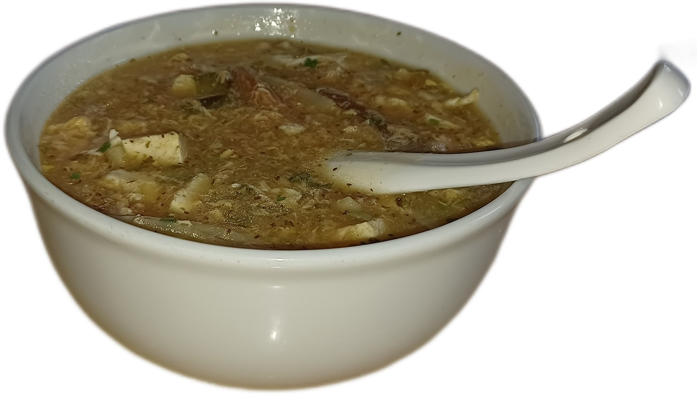
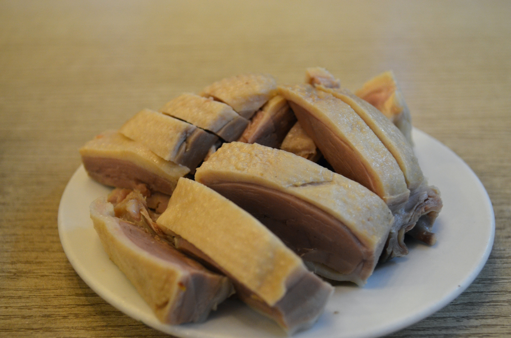

<p align="center">
  <h1 align="center">Tasty Exotic Food<br><sub>5000 Years of Food History × AI Flavor Science × American Supermarket Ingredients</sub></h1>
  <p align="center">
    <em>518道菜谱 · 11个分类 · 50+个文明 · 5000年历史 · 233道AI原创</em><br>
    <em>518 Recipes · 11 Categories · 50+ Civilizations · 5000 Years · 233 AI Originals</em>
  </p>
</p>

<p align="center">
  <a href="recipes/ancient/README.md"></a>
  <a href="recipes/fusion/README.md"></a>
  <a href="recipes/INDEX.md"></a>
  <a href="guides/flavor-science.md"></a>
  <a href="guides/american-substitutions.md"></a>
  <a href="LICENSE"></a>
</p>

---

> **想家了？** 那就自己做一顿吧。这个项目是为每一个在美国想念家乡味道的留学生准备的。
>
> **Homesick?** Cook yourself a taste of home. This project is for every international student in America who misses the flavors they grew up with.

---

## 快速导航 | Quick Navigation

| 我想... | I want to... | 去这里 / Go here |
|---------|-------------|-----------------|
| 🔰 刚学做饭，从零开始 | Just learning to cook | [番茄炒蛋 — 3种食材10分钟](recipes/quick/番茄炒蛋.md) |
| 🏛️ 探索5000年古代美食 | Explore ancient food history | [217道古代菜全目录](recipes/ancient/README.md) |
| 🤖 看AI设计的疯狂融合菜 | See AI-designed fusion recipes | [233道AI原创全目录](recipes/fusion/README.md) |
| 🛒 第一次去美国超市买什么 | First grocery trip in America | [超市采购指南](guides/american-substitutions.md) |
| 📖 浏览全部518道菜 | Browse all 518 recipes | [完整索引](recipes/INDEX.md) |
| 🧪 了解风味科学原理 | Learn flavor science | [风味科学指南](guides/flavor-science.md) |

---

## 为什么这个项目独特 | What Makes This Unique

| | 特色 | Feature |
|--|------|---------|
| 🏛️ | **217道古代名菜** — 从古埃及(2000BC)到拿破仑(1800AD)，跨越50+个文明 | **217 Ancient Recipes** — From Ancient Egypt to Napoleon, spanning 50+ civilizations |
| 🤖 | **233道AI原创菜** — Claude AI用风味科学设计，每道附分子级解析 | **233 AI-Original Recipes** — Designed by Claude AI with molecular-level flavor science |
| 🇺🇸 | **每道菜都有美国超市替代方案** — Trader Joe's, Costco, Walmart, Target 具体到品牌 | **Every recipe has US supermarket substitutions** — brand-specific for TJ's, Costco, Walmart |
| 🌍 | **中英双语** — 每个字都有对照翻译 | **Fully bilingual** — Chinese/English throughout |
| 📊 | **6份实用指南** — 超市采购、厨房装备、meal plan、购物清单、风味科学、5000年时间线 | **6 practical guides** — shopping, equipment, meal plans, flavor science, food timeline |

---

## 这个项目是什么 | What Is This

这是一份专为**在美留学生**准备的中国菜复刻指南。我们知道留学生活最难熬的不是 GPA，是想家时那口吃不到的味道。

本项目收录**中国经典菜、一锅出、快手菜、国际料理、AI 原创融合菜**等多种类型，涵盖浙菜、川菜、粤菜、日韩泰意墨等多国菜系。每道菜谱都包含：

- **中英双语**的详细步骤 | Bilingual step-by-step instructions
- **美国超市食材替代方案** — Trader Joe's、Costco、Walmart、Target、Whole Foods | American supermarket substitution tips
- **时间+成本+标签** — 每道菜都标注准备时间、人均费用和分类 | Time, cost, and tags for every recipe
- **AI 原创菜** — Claude AI 根据风味科学设计的独创菜谱 | Original recipes designed by Claude AI using flavor science

*This is a food guide for **international students in America**. We know the hardest part of studying abroad isn't the coursework — it's missing the flavors of home.*

*This project covers **Chinese classics, one-pot meals, quick weeknight dishes, global cuisine, and AI-original fusion recipes** — spanning Zhejiang, Sichuan, Japanese, Korean, Thai, Italian, Mexican, and beyond. Every recipe includes bilingual instructions, American supermarket tips, and time/cost metadata.*

---

## 从这里开始 | Start Here

刚来美国，厨房还是一片空白？先看这个：

*New to cooking in America? Start here:*

| 步骤 / Step | 做什么 / What to Do | 说明 / Description |
|------------|--------------------|--------------------|
| 1 | 读 [超市采购指南](guides/american-substitutions.md#新手推荐--where-to-start) / Read the [Shopping Guide](guides/american-substitutions.md#新手推荐--where-to-start) | 了解去哪家超市买什么，一次采购搞定 / Learn what to buy and where — one trip, done |
| 2 | 先做 [番茄炒蛋](recipes/quick/番茄炒蛋.md) 或 [蛋炒饭](recipes/quick/蛋炒饭.md) / Start with [Tomato Egg](recipes/quick/番茄炒蛋.md) or [Fried Rice](recipes/quick/蛋炒饭.md) | 3种食材，10分钟，零失败 / 3 ingredients, 10 min, zero chance of failure |
| 3 | 试试 [番茄鸡蛋面](recipes/one-pot/番茄鸡蛋面.md) 或 [可乐鸡翅](recipes/quick/可乐鸡翅.md) / Try [Tomato Egg Noodles](recipes/one-pot/番茄鸡蛋面.md) or [Cola Wings](recipes/quick/可乐鸡翅.md) | 一锅出，暖胃又解馋 / One-pot comfort food |
| 4 | 探索更多菜谱 ↓ / Explore more recipes below ↓ | 慢慢解锁全部518道菜！ / Unlock all 518 dishes! |

---

## 经典名菜 | Classic Dishes (7道)

<table>
  <tr>
    <td align="center" width="33%">
      <a href="recipes/classics/西湖醋鱼.md">
        <br>
        <b>西湖醋鱼</b><br>
        <sub>West Lake Fish in Vinegar Gravy</sub>
      </a>
    </td>
    <td align="center" width="33%">
      <a href="recipes/classics/东坡肉.md">
        <br>
        <b>东坡肉</b><br>
        <sub>Dongpo Braised Pork</sub>
      </a>
    </td>
    <td align="center" width="33%">
      <a href="recipes/classics/龙井虾仁.md">
        <br>
        <b>龙井虾仁</b><br>
        <sub>Stir-fried Shrimp with Longjing Tea</sub>
      </a>
    </td>
  </tr>
  <tr>
    <td align="center" width="33%">
      <a href="recipes/classics/叫化童鸡.md">
        <br>
        <b>叫化童鸡</b><br>
        <sub>Beggar's Chicken</sub>
      </a>
    </td>
    <td align="center" width="33%">
      <a href="recipes/classics/宋嫂鱼羹.md">
        <br>
        <b>宋嫂鱼羹</b><br>
        <sub>Sister Song's Fish Soup</sub>
      </a>
    </td>
    <td align="center" width="33%">
      <a href="recipes/classics/西湖莼菜汤.md">
        <br>
        <b>西湖莼菜汤</b><br>
        <sub>West Lake Water Shield Soup</sub>
      </a>
    </td>
  </tr>
  <tr>
    <td align="center" width="33%">
      <a href="recipes/classics/杭州酱鸭.md">
        <br>
        <b>杭州酱鸭</b><br>
        <sub>Hangzhou Soy-Braised Duck</sub>
      </a>
    </td>
    <td align="center" width="33%"></td>
    <td align="center" width="33%"></td>
  </tr>
</table>

---

## 精选菜谱 | Featured Recipes

### ⭐ 经典名菜 | Classics — [查看全部7道 →](recipes/classics/)

<table>
  <tr>
    <td align="center" width="33%">
      <a href="recipes/classics/东坡肉.md">
        <br>
        <b>东坡肉</b><br>
        <sub>Dongpo Braised Pork</sub>
      </a>
    </td>
    <td align="center" width="33%">
      <a href="recipes/quick/番茄炒蛋.md">
        <br>
        <b>番茄炒蛋</b><br>
        <sub>Tomato & Egg (10min)</sub>
      </a>
    </td>
    <td align="center" width="33%">
      <a href="recipes/quick/宫保鸡丁.md">
        <br>
        <b>宫保鸡丁</b><br>
        <sub>Kung Pao Chicken</sub>
      </a>
    </td>
  </tr>
</table>

### 🤖 AI原创融合 | AI Fusion — **[查看全部233道 →](recipes/fusion/README.md)**

> Claude AI 用风味科学设计的独创菜谱，每道附分子级解析。

| 菜名 | Dish | 为什么好吃 / Why It Works |
|------|------|-------------------------|
| 老干妈意面 | [Lao Gan Ma Pasta](recipes/fusion/老干妈意面.md) | TikTok 爆款，辣酱×意面 |
| 花椒巧克力熔岩蛋糕 | [Sichuan Choc Lava Cake](recipes/fusion/花椒巧克力熔岩蛋糕.md) | 麻觉放大甜味感知 |
| 酱油冰淇淋 | [Soy Sauce Ice Cream](recipes/fusion/酱油冰淇淋.md) | 鲜咸×甜冷 = 味觉爆炸 |
| 咖啡红烧肉 | [Coffee Braised Pork](recipes/fusion/咖啡红烧肉.md) | 咖啡苦×红烧甜咸 |
| 泡菜汉堡 | [Kimchi Smash Burger](recipes/fusion/泡菜汉堡.md) | 韩式发酵×美式经典 |
| 味噌焦糖三文鱼 | [Miso Caramel Salmon](recipes/fusion/味噌焦糖三文鱼.md) | 鲜味×焦糖化×Omega-3 |

### 🏛️ 古代名菜 | Ancient — **[查看全部217道 →](recipes/ancient/README.md)**

> 跨越5000年，从古埃及到清代宫廷，50+个文明的味觉记忆。

| 菜名 | Dish | 年代 | 文明 |
|------|------|------|------|
| 古埃及扁豆汤 | [Egyptian Lentil Soup](recipes/ancient/古埃及扁豆汤.md) | ~2000BC | 古埃及 |
| 古巴比伦羊肉饼 | [Babylonian Lamb Pie](recipes/ancient/古巴比伦羊肉饼.md) | ~1700BC | 巴比伦 |
| 唐代胡饼 | [Tang Sesame Flatbread](recipes/ancient/唐代胡饼.md) | ~700AD | 大唐 |
| 佛跳墙 | [Buddha Jumps Over Wall](recipes/ancient/佛跳墙简易版.md) | ~1876 | 清代 |
| 维京蜜酒炖肉 | [Viking Mead Stew](recipes/ancient/维京蜜酒炖肉.md) | ~900AD | 维京 |
| 拿破仑行军鸡 | [Napoleon's Chicken](recipes/ancient/拿破仑行军鸡.md) | ~1800 | 法国 |

---

## 全部518道菜 | All 518 Recipes

> **📖 [查看完整索引 / View Full Index →](recipes/INDEX.md)**
>
> 按分类浏览 | Browse by category:

| 分类 | Category | 数量 | 精选 / Highlights | 链接 |
|------|----------|------|------------------|------|
| 🏛️ 古代名菜 | Ancient | **217** | 古埃及扁豆汤、唐代胡饼、佛跳墙、维京蜜酒炖肉... | [全部 →](recipes/ancient/README.md) |
| 🤖 AI原创 | Fusion | **233** | 老干妈意面、味噌焦糖三文鱼、花椒巧克力蛋糕... | [全部 →](recipes/fusion/README.md) |
| ⭐ 经典名菜 | Classics | 7 | 东坡肉、西湖醋鱼、龙井虾仁 | [浏览 →](recipes/classics/) |
| 🌍 国际料理 | Global | 14 | 牛丼、Pad Thai、Bibimbap、Pho | [浏览 →](recipes/global/) |
| ⚡ 快手菜 | Quick | 12 | 番茄炒蛋、蛋炒饭、宫保鸡丁 | [浏览 →](recipes/quick/) |
| 🍲 一锅出 | One-Pot | 7 | 酸菜鱼、红烧牛腩、咖喱鸡饭 | [浏览 →](recipes/one-pot/) |
| 🏠 家常菜 | Home | 7 | 鱼香肉丝、回锅肉、水煮肉片 | [浏览 →](recipes/home-style/) |
| 🥟 小吃 | Snacks | 6 | 锅贴、葱油饼、韭菜盒子 | [浏览 →](recipes/snacks/) |
| 🥦 素食 | Veggie | 5 | 地三鲜、虎皮青椒 | [浏览 →](recipes/vegetarian/) |
| 🍰 甜品 | Desserts | 5 | 芒果糯米饭、黑芝麻汤圆 | [浏览 →](recipes/desserts/) |
| 🌅 早餐 | Breakfast | 5 | 皮蛋瘦肉粥、鸡蛋饼 | [浏览 →](recipes/breakfast/) |

---

## 实用指南 | Guides

| 指南 / Guide | 说明 / Description | 链接 / Link |
|-------------|-------------------|-------------|
| 🧪 风味科学 / Flavor Science | AI创菜原理、味觉搭配黄金法则 / AI recipe design methodology | [查看 / View](guides/flavor-science.md) |
| 📜 5000年时间线 / Food Timeline | 从古埃及到AI时代的美食演变 / 5000 years of food history | [查看 / View](guides/ancient-food-timeline.md) |
| 🇺🇸 超市采购 / Supermarket Guide | TJ's、Costco、Walmart 各超市食材 / Store-by-store lists | [查看 / View](guides/american-substitutions.md) |
| 🔧 厨房装备 / Kitchen Equipment | 必买清单、工具替代、宿舍党 / Must-haves, dorm tips | [查看 / View](guides/kitchen-tools.md) |
| 📅 一周计划 / Weekly Meal Plans | 忙碌周$25、Meal Prep、极限省钱$15 / 3 budget plans | [查看 / View](guides/meal-plan.md) |
| 🛒 购物清单 / Shopping Lists | 新手入门包$30、月度常备 / Starter kit, monthly restock | [查看 / View](guides/shopping-list.md) |
| ❓ 常见问题 / FAQ | 翻车急救、食材替代 / Troubleshooting, substitutions | [查看 / View](FAQ.md) |
| 📖 全部菜谱索引 / Recipe Index | 518道菜完整目录 / Complete catalog of all 518 recipes | [查看 / View](recipes/INDEX.md) |

> 详细列出 **Trader Joe's、Target、Whole Foods、Costco、Walmart** 各超市能买到的中国菜食材，亚洲超市必买清单，以及 Amazon/Weee!/Yami 网购推荐。附新手一次采购清单。
>
> *A complete store-by-store breakdown of where to find Chinese cooking ingredients in America — from Trader Joe's to Costco, plus Asian market must-buys and online shopping tips.*

---

## 目录结构 | Project Structure

```
tasty-exotic-food/
├── README.md                        # 项目主页
├── CONTRIBUTING.md                  # 贡献指南
├── FAQ.md                           # 常见问题
├── LICENSE
├── .github/ISSUE_TEMPLATE/          # Issue 模板
├── guides/                          # 6份实用指南
│   ├── flavor-science.md            # 🧪 风味科学
│   ├── ancient-food-timeline.md     # 📜 5000年时间线
│   ├── american-substitutions.md    # 🇺🇸 超市采购
│   ├── kitchen-tools.md             # 🔧 厨房装备
│   ├── meal-plan.md                 # 📅 一周计划
│   └── shopping-list.md             # 🛒 购物清单
└── recipes/                         # 518道菜谱
    ├── INDEX.md                     # 📖 全部索引
    ├── ancient/    (217)            # 🏛️ 古代名菜
    ├── fusion/     (233)            # 🤖 AI原创融合
    ├── classics/   (7)              # ⭐ 经典名菜
    ├── global/     (14)             # 🌍 国际料理
    ├── quick/      (12)             # ⚡ 快手菜
    ├── one-pot/    (7)              # 🍲 一锅出
    ├── home-style/ (7)              # 🏠 家常菜
    ├── snacks/     (6)              # 🥟 小吃点心
    ├── vegetarian/ (5)              # 🥦 素食
    ├── desserts/   (5)              # 🍰 甜品
    └── breakfast/  (5)              # 🌅 早餐
```

---

## 贡献 | Contributing

欢迎所有留学生贡献你的菜谱！中国菜、国际料理、创意融合菜都欢迎。

Contributions welcome! Chinese dishes, global cuisine, creative fusion — all are appreciated.

**贡献指南 | Contribution Guidelines:**

1. 每道菜谱使用单独的 Markdown 文件 | Each recipe should be a separate Markdown file
2. 中英文对照 | Include both Chinese and English
3. 附上食材清单和详细步骤 | Include ingredients list and detailed cooking steps
4. **务必附上美国超市替代方案** | **Must include American supermarket substitutions**
5. 如有图片请放入 `images/` 对应目录 | Place images in the appropriate `images/` subdirectory

---

## 喜欢这个项目？| Love This Project?

<p align="center">

**如果这个项目帮到了你，请帮我们一个忙：**

*If this project helped you, please do us a favor:*

</p>

| 行动 | Action | 为什么 / Why |
|------|--------|-------------|
| ⭐ **Star 这个仓库** | **Star this repo** | 让更多留学生发现这个项目 / Help more students find us |
| 🍴 **Fork** | **Fork it** | 保存到你自己的收藏 / Save to your own collection |
| 📤 **分享给朋友** | **Share with friends** | 发到微信群/朋友圈/留学生论坛 / WeChat, forums, social media |
| 📝 **贡献菜谱** | **[Contribute a recipe](CONTRIBUTING.md)** | 加入你家乡的味道 / Add your hometown's flavors |
| 🐛 **报告问题** | **[Report an issue](https://github.com/howard-lynn-ye/-tasty-exotic-food/issues)** | 帮我们变得更好 / Help us improve |

---

## 图片来源 | Image Credits

菜品图片来自 Wikimedia Commons (CC BY-SA 4.0)。 | Photos from Wikimedia Commons (CC BY-SA 4.0).

## 许可证 | License

[MIT License](LICENSE) — 自由使用、修改和分享。 | Free to use, modify, and share.

---

<p align="center">
  <em>Made with ❤️ for every international student who misses the taste of home.</em><br>
  <em>为每一个想家的留学生，用心制作。</em><br><br>
  <strong>Powered by Claude AI × Human Creativity</strong>
</p>
