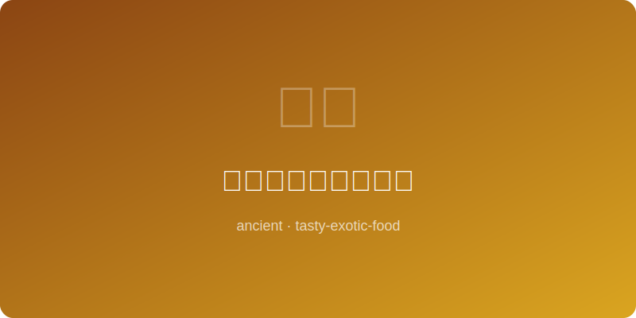

# 加勒比海盗朗姆炖肉 Caribbean Pirate Rum Stew

  

> **时代 Era:** 大航海时代 Age of Piracy · 约公元1600年 (~1600 AD)
> **地区 Region:** 加勒比海 Caribbean Sea
> **类型 Type:** 炖肉 Stew / 主菜 Main Course
> **难度 Difficulty:** ★★☆☆☆

---

## 历史背景 Historical Background

16-17世纪的加勒比海盗和私掠船员在漫长航行中依靠腌肉和朗姆酒为生。他们将盐腌猪肉与船上仅有的食材一锅炖煮——朗姆酒既是调味料也是防腐剂。这种"海盗锅"（salmagundi的变体）是粗犷但有效的航海饮食，热量充足以应对繁重的甲板劳动。

Caribbean pirates and privateers of the 16th-17th centuries survived long voyages on salt-cured meat and rum. They stewed salted pork with whatever provisions remained — rum served as both flavoring and preservative. This "pirate pot" (a variant of salmagundi) was rough but effective maritime fare, calorie-dense enough for grueling deck work.

---

## 食材 Ingredients

| 食材 Ingredient | 用量 Amount |
|---|---|
| 猪肩肉 Pork shoulder (切大块 large chunks) | 500g |
| 深色朗姆酒 Dark rum | 80ml |
| 红薯 Sweet potato (切块 cubed) | 2 个 medium |
| 洋葱 Onion (切块 chunked) | 1 个 |
| 多香果粉 Allspice (ground) | 1 茶匙 tsp |
| 盐 Salt | 1 茶匙 tsp |

---

## 步骤 Steps

### 第一步 Step 1 — 煎肉 Sear meat
猪肉用盐和多香果粉搓匀。厚底锅加少许油大火烧热，将猪肉块每面煎至焦黄，约6-8分钟。
Rub pork with salt and allspice. Heat a little oil in a heavy pot over high heat. Sear pork on all sides until deeply browned, about 6-8 minutes.

### 第二步 Step 2 — 加酒炖煮 Deglaze and stew
倒入朗姆酒，刮起锅底焦香渣。加入洋葱和足量清水没过肉块，大火煮沸后转小火加盖炖1小时。加入红薯块，再炖30分钟。
Pour in rum and scrape up browned bits from the bottom. Add onion and enough water to cover the meat. Boil, then reduce to low heat, cover, and stew 1 hour. Add sweet potatoes and cook 30 more minutes.

### 第三步 Step 3 — 收汁上桌 Reduce and serve
开盖转中火收汁至浓稠，汤汁应能裹住肉块。盛入深碗，搭配粗面包或直接食用。
Uncover and raise to medium heat to reduce sauce until thick enough to coat the meat. Serve in deep bowls with crusty bread, or eat straight from the pot.

---

## 替代建议 Substitutions

| 原料 Original | 替代 Substitute | 说明 Note |
|---|---|---|
| 深色朗姆酒 Dark rum | 白兰地 Brandy | 同为烈酒炖肉 Also a spirit-based braise |
| 红薯 Sweet potato | 南瓜 Pumpkin | 加勒比常用食材 Common Caribbean ingredient |
| 多香果 Allspice | 肉桂+丁香 Cinnamon + clove (少量) | 模拟多香果风味 Approximates allspice |
