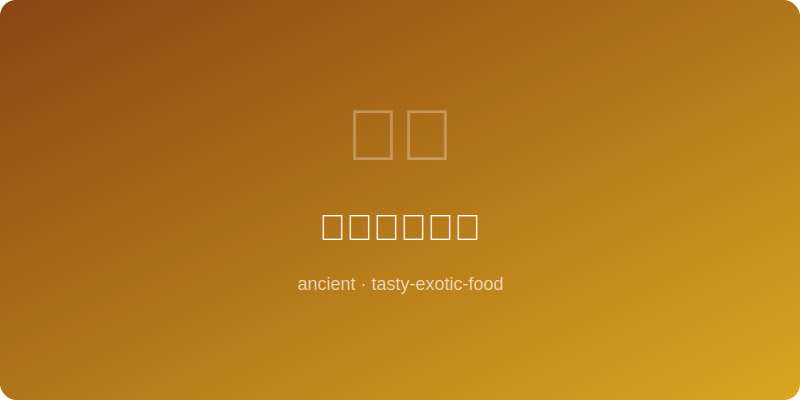

# 印加藜麦沙拉 | Inca Quinoa Salad (~1400AD)

  

> ⏱ 准备10分+烹饪20分 | 💰~$7/份 | 🏷️ 古代名菜、印加帝国

> **📜 历史** — 印加人称藜麦为"粮食之母"，是安第斯山区数千年的主粮，印加士兵行军时随身携带。
> **📜 History** — *The Inca called quinoa "mother of all grains"; it sustained Andean civilizations for millennia and was carried by Inca soldiers on campaigns.*

---

## 食材 | Ingredients
| 食材 | Ingredient | 用量 / Amount |
|------|-----------|---------------|
| 藜麦 | Quinoa | 200g / 1 cup |
| 番茄 | Tomato | 2个 / 2 |
| 牛油果 | Avocado | 1个 / 1 |
| 玉米粒 | Corn kernels | 100g / 0.5 cup |
| 青柠 | Lime | 1个 / 1 |
| 盐 | Salt | 适量 / To taste |

---

## 做法 | Directions

### 1. 煮藜麦 | Cook Quinoa
藜麦洗净加两倍水煮15分钟，沥干放凉。

Rinse quinoa, cook with double water for 15 minutes, drain and cool.

### 2. 备料 | Prep Vegetables
番茄和牛油果切丁，玉米粒煮熟。

Dice tomato and avocado, cook corn kernels.

### 3. 拌匀 | Toss
所有食材混合，挤入青柠汁加盐拌匀即可。

Combine all ingredients, squeeze in lime juice, season with salt, and toss.

---

## 要点 | Tips
| 要点 | Tip |
|------|-----|
| 藜麦煮前务必反复冲洗，去除表面皂苷的苦味 | Rinse quinoa thoroughly before cooking to remove the bitter saponin coating |
| 牛油果要选稍硬的，太熟会在拌匀时变成泥状 | Choose slightly firm avocados; overripe ones will turn to mush when tossed |
| 可加入烤南瓜籽增加口感层次，更贴近安第斯风味 | Add toasted pumpkin seeds for extra crunch and a more authentic Andean touch |

---

## 历史注解 | Historical Notes
藜麦在安第斯山区已有五千年以上的种植历史，印加帝国将其视为神圣作物，每年由皇帝亲自主持播种仪式。西班牙殖民者曾试图禁种藜麦以削弱原住民文化，但它顽强存活于高海拔山区，直到21世纪才被世界重新发现。

*Quinoa has been cultivated in the Andes for over 5,000 years; the Inca Empire considered it a sacred crop, with the emperor personally presiding over its planting ceremony each year. Spanish colonizers attempted to ban quinoa cultivation to weaken indigenous culture, but it survived stubbornly in high-altitude regions until being rediscovered by the world in the 21st century.*

---

## 替代食材 | American Substitutions
| 原料 | Ingredient | 替代 / Substitute | 备注 / Notes |
|------|-----------|-------------------|-------------|
| 藜麦 | Quinoa | Couscous | 口感不同 / Different texture |
| 青柠 | Lime | Lemon | 直接替代 / Direct substitute |
| 玉米粒 | Corn kernels | Canned corn | 沥干使用 / Drain before use |
