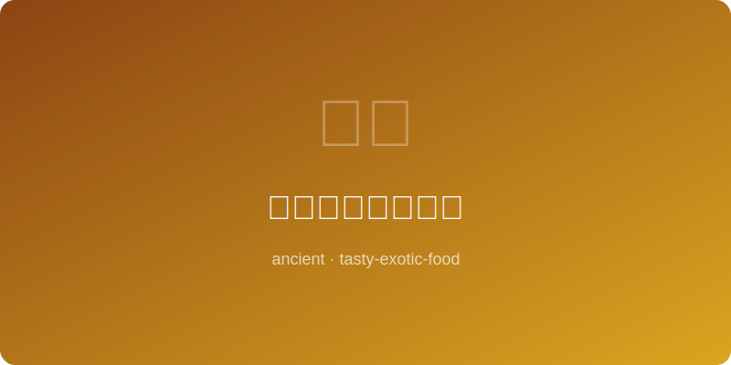

# 古代日本怀石前菜 | Ancient Kaiseki Appetizer (日本室町时代, ~1400 AD)

  

> ⏱ 准备 30分钟 + 烹饪 15分钟 | 💰 ~$8/份 | 🏷️ 古代名菜、日本、怀石、素食

> **📜 历史** — 怀石料理（懐石料理）源于室町时代（1336-1573）的禅宗茶道，"怀石"之名来自禅僧在修行中将温热的石头放入怀中抵御饥寒的做法。千利休将茶会前的简单素食发展为精致的料理艺术，强调"一期一会"的美学精神。怀石前菜（先付）是整套料理的序曲，以极简的食材呈现季节之美，体现了日本料理"少即是多"的哲学。每一道前菜都是对当季最佳食材的致敬。
> **📜 History** — *Kaiseki cuisine originated from Muromachi-era (1336-1573) Zen Buddhist tea ceremony. The name "kaiseki" (懐石) comes from Zen monks placing warm stones against their stomachs to stave off hunger during meditation. Sen no Rikyu developed simple pre-tea-ceremony meals into a refined culinary art, emphasizing the aesthetic spirit of "ichigo ichie" (once in a lifetime). The kaiseki appetizer (sakizuke) is the overture to the full course — presenting seasonal beauty through minimal ingredients, embodying Japanese cuisine's "less is more" philosophy.*

---

## 食材 | Ingredients

| 食材 | Ingredient | 用量 | Amount |
|------|-----------|------|--------|
| 嫩豆腐 | Silken tofu | 1块（约300克） | 1 block (~10 oz) |
| 毛豆（去壳） | Edamame (shelled) | 1/4杯 | 1/4 cup |
| 山药（切薄片） | Yamaimo/yam (thinly sliced) | 1/4根 | 1/4 |
| 白萝卜（磨泥） | Daikon (grated) | 2汤匙 | 2 tbsp |
| 出汁（日式高汤） | Dashi broth | 1/2杯 | 1/2 cup |
| 淡口酱油 | Light soy sauce | 1汤匙 | 1 tbsp |
| 味醂 | Mirin | 1茶匙 | 1 tsp |
| 柚子皮 | Yuzu zest | 少许 | a sliver |
| 海苔丝 | Nori strips | 少许 | a few strips |

---

## 做法 | Directions

1. **制出汁** — 用昆布和�的鱼花制作出汁（或使用出汁粉），加淡口酱油和味醂调味，冷却备用。
   *Make dashi from kombu and bonito flakes (or use instant dashi powder). Season with light soy sauce and mirin, cool and set aside.*

2. **处理食材** — 豆腐切成2厘米方块，毛豆煮熟沥干，山药切薄片后浸冷水防变色。
   *Cut tofu into 2 cm cubes. Boil edamame and drain. Slice yamaimo thin and soak in cold water to prevent browning.*

3. **摆盘** — 选用雅致的小碗或小盘。将豆腐块居中放置，周围点缀毛豆和山药片，顶部放一小团萝卜泥。
   *Choose an elegant small bowl or plate. Place tofu cubes in the center, arrange edamame and yamaimo slices around them, top with a small mound of grated daikon.*

4. **浇汁上桌** — 轻轻浇入冷出汁至碗的三分之一高度，放上柚子皮和海苔丝点缀。注意留白之美。
   *Gently pour chilled dashi to fill the bowl one-third high. Garnish with yuzu zest and nori strips. Embrace the beauty of empty space.*

---

## 历史注解 | Historical Notes

- 千利休的茶道哲学"和敬清寂"深刻影响了怀石料理的呈现方式——器皿、摆盘、食材都追求质朴之美。
  *Sen no Rikyu's tea philosophy "wa-kei-sei-jaku" (harmony, respect, purity, tranquility) deeply influenced kaiseki presentation — vessels, plating, and ingredients all pursue rustic beauty.*

- 室町时代的怀石料理严格遵循"三菜一汤"的形式，比现代怀石简朴得多。
  *Muromachi-era kaiseki strictly followed the "three dishes, one soup" format — far simpler than modern kaiseki.*

---

## 替代食材 | American Substitutions

| 原始食材 | Original | 替代品 | Substitution |
|----------|----------|--------|-------------|
| 山药（yamaimo） | Japanese mountain yam | 去皮黄瓜薄片 | Thinly sliced peeled cucumber |
| 柚子皮 | Yuzu zest | 柠檬皮加少许橙皮 | Lemon zest with a touch of orange zest |
| 出汁 | Dashi broth | Hondashi 出汁粉（亚洲超市有售） | Hondashi powder (from Asian markets) |
