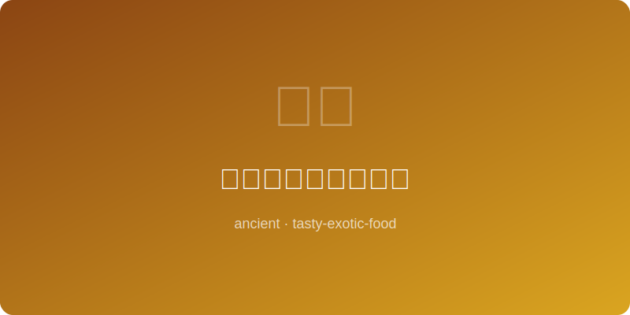

# 古代波利尼西亚烤鱼 | Polynesian Grilled Fish (~1000AD)

  

> ⏱ 准备15分+烹饪25分 | 💰~$14/份 | 🏷️ 古代名菜、波利尼西亚

> **📜 历史** — 古波利尼西亚人以独木舟横渡太平洋，捕获鲜鱼后裹以蕉叶，在地坑火灶（imu）中闷烤，是太平洋岛屿烹饪的源头。
> **📜 History** — *Ancient Polynesians crossed the Pacific in canoes, wrapping fresh-caught fish in banana leaves and roasting in earth ovens (imu) — the origin of Pacific Island cookery.*

---

## 食材 | Ingredients
| 食材 | Ingredient | 用量 / Amount |
|------|-----------|---------------|
| 红鲷鱼 | Red snapper | 1条 / 1 whole (~700g) |
| 椰奶 | Coconut milk | 200ml / ¾ cup |
| 香蕉叶 | Banana leaves | 2大张 / 2 large sheets |
| 青柠 | Lime | 2个 / 2 pcs |
| 海盐 | Sea salt | 5g / 1 tsp |
| 姜黄根 | Fresh turmeric | 10g / 1 thumb |
| 葱 | Scallion | 2根 / 2 stalks |

---

## 做法 | Directions
### 1. 腌制 | Marinate
鱼身划刀，挤青柠汁，抹海盐和磨碎姜黄，腌15分钟。Score the fish, squeeze lime juice, rub with sea salt and grated turmeric, marinate 15 minutes.

### 2. 包裹 | Wrap
香蕉叶过火软化，将鱼放上，淋椰奶，撒葱段，包紧。Soften banana leaves over flame, place fish on top, drizzle coconut milk, add scallions, wrap tightly.

### 3. 烤制 | Roast
烤箱190°C烤25分钟，或炭火地坑闷烤至鱼肉松嫩。Bake at 375°F for 25 minutes, or roast in a charcoal pit until fish is tender and flaky.

### 4. 上桌 | Serve
打开蕉叶，挤新鲜青柠汁，搭配芋头或白米饭。Unwrap leaves, squeeze fresh lime, serve with taro or steamed rice.

---

## 替代食材 | American Substitutions
| 原料 | Ingredient | 替代 / Substitute | 备注 / Notes |
|------|-----------|-------------------|-------------|
| 红鲷鱼 | Red snapper | Tilapia / Mahi-mahi | 整鱼或鱼片均可 / Whole or fillet |
| 香蕉叶 | Banana leaves | Aluminum foil + parchment | 效果接近 / Similar result |
| 姜黄根 | Fresh turmeric | 姜黄粉 ½ tsp / Turmeric powder | 颜色略浅 / Slightly less vivid |
