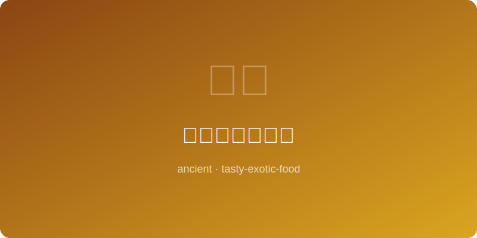

# 古代爱尔兰炖羊 | Ancient Irish Lamb Stew (~500AD)

  

> ⏱ 准备20分+烹饪90分 | 💰~$16/份 | 🏷️ 古代名菜、爱尔兰

> **📜 历史** — 凯尔特人时代的爱尔兰牧民以陶罐慢炖羊肉和根茎蔬菜，是欧洲最古老的炖菜之一，在中世纪修道院手稿中多次被提及。
> **📜 History** — *Celtic-era Irish herders slow-cooked lamb with root vegetables in clay pots — one of Europe's oldest stews, mentioned in medieval monastery manuscripts.*

---

## 食材 | Ingredients
| 食材 | Ingredient | 用量 / Amount |
|------|-----------|---------------|
| 羊肩肉 | Lamb shoulder | 500g / 1.1 lb |
| 土豆 | Potato | 3个 / 3 medium |
| 胡萝卜 | Carrot | 2根 / 2 pcs |
| 洋葱 | Onion | 1个 / 1 large |
| 大麦 | Barley | 50g / ¼ cup |
| 百里香 | Thyme | 3枝 / 3 sprigs |
| 盐 | Salt | 适量 / To taste |
| 水 | Water | 1L / 4 cups |

---

## 做法 | Directions
### 1. 煎肉 | Sear Meat
羊肉切块，用少许油煎至表面焦黄。Cut lamb into chunks, sear in a little oil until browned on all sides.

### 2. 炖煮 | Stew
加入切块的洋葱、胡萝卜和水，大火煮沸后转小火，加入大麦和百里香，慢炖60分钟。Add diced onion, carrot, and water. Bring to a boil, reduce heat, add barley and thyme, simmer 60 minutes.

### 3. 加土豆 | Add Potatoes
放入切块土豆，继续炖30分钟至土豆软烂，调盐。Add potato chunks, cook 30 more minutes until potatoes are tender, season with salt.

### 4. 上桌 | Serve
盛入深碗，搭配粗粮面包。Ladle into deep bowls, serve with rustic bread.

---

## 替代食材 | American Substitutions
| 原料 | Ingredient | 替代 / Substitute | 备注 / Notes |
|------|-----------|-------------------|-------------|
| 羊肩肉 | Lamb shoulder | Beef chuck | 炖时间相同 / Same cook time |
| 大麦 | Barley | Farro / brown rice | 口感略不同 / Slightly different texture |
| 百里香 | Thyme | Italian seasoning | 减量使用 / Use less |
