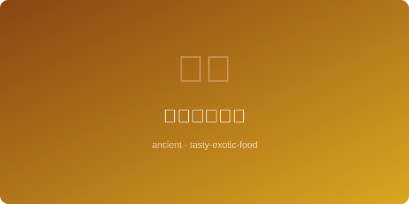

# 古波斯烤羊排

  

# Ancient Persian Lamb Chops

> **年代** | Era: 约公元前500年 (~500 BC)
> **起源** | Origin: 古波斯阿契美尼德帝国 | Achaemenid Persian Empire
> **类型** | Type: 主菜 | Main Course

---

## 简介 | Introduction

波斯帝国是古代世界最辉煌的文明之一，其饮食文化融合了中亚草原的豪放与波斯高原的精致。烤羊排是波斯皇室宴席的核心菜肴，以藏红花、石榴汁和杏仁等珍贵食材调味，展现了波斯人对烹饪艺术的极致追求。

The Persian Empire was among the most magnificent civilizations of the ancient world, its cuisine blending Central Asian boldness with Persian Plateau refinement. Roast lamb chops were the centerpiece of royal Persian feasts, seasoned with precious saffron, pomegranate juice, and almonds, showcasing Persian devotion to culinary art.

---

## 食材 | Ingredients

| 食材 | Ingredient | 用量 | Amount |
|------|-----------|------|--------|
| 羊排 | Lamb chops | 8块 | 8 pieces |
| 藏红花 | Saffron threads | 一小撮 | A pinch |
| 石榴汁 | Pomegranate juice | 100毫升 | 100ml |
| 杏仁碎 | Crushed almonds | 30克 | 30g |
| 橄榄油 | Olive oil | 3汤匙 | 3 tbsp |
| 盐 | Salt | 适量 | To taste |
| 黑胡椒 | Black pepper | 1茶匙 | 1 tsp |
| 干薄荷 | Dried mint | 1茶匙 | 1 tsp |

---

## 做法 | Method

1. 藏红花用少许温水浸泡15分钟，释放色泽和香气。
2. 羊排用盐、黑胡椒、橄榄油和藏红花水腌制1小时。
3. 将羊排放在炭火上烤制，每面约5分钟至焦香。
4. 石榴汁在小锅中小火熬至浓稠成糖浆状。
5. 烤好的羊排装盘，淋上石榴糖浆。
6. 撒上杏仁碎和干薄荷叶，趁热食用。

---

## 历史典故 | Historical Notes

希罗多德在《历史》中记载了波斯人庆祝生日时必烤整羊的习俗。阿契美尼德王朝的波斯波利斯浮雕上，描绘了各属国向大王进贡羊群的场景。波斯人将藏红花视为"太阳的香料"，其价格远超黄金。古波斯的烹饪传统深刻影响了后来的阿拉伯、土耳其和印度饮食文化。
