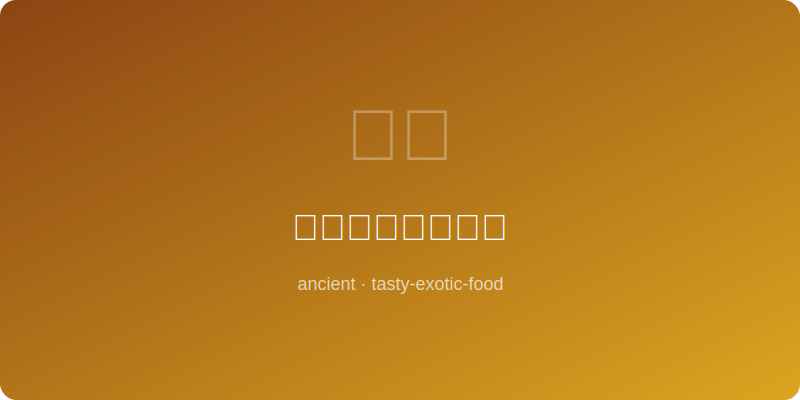

# 古波斯石榴酱烤肉 | Persian Pomegranate BBQ

  

> **朝代/时期 Dynasty/Era:** 阿契美尼德王朝 Achaemenid Empire (~400BC)
> **发源地 Origin:** 波斯（今伊朗） Persia (modern Iran)
> **类型 Type:** 烤肉 Grilled Meat

---

## 典故 Historical Background

古波斯帝国横跨三大洲，其宫廷饮食极尽奢华。石榴在波斯文化中象征丰饶与永生，以石榴汁腌制烤肉的传统可追溯至阿契美尼德王朝。波斯波利斯宫殿壁画中描绘了贵族宴饮烤肉的场景。石榴的酸甜与羊肉的肥美完美融合，至今仍是伊朗国菜的核心风味。

The ancient Persian Empire spanned three continents, and its court cuisine was extravagant. Pomegranate symbolized fertility and immortality in Persian culture; the tradition of marinating meat in pomegranate juice dates to the Achaemenid dynasty. Wall reliefs at Persepolis depict nobles feasting on grilled meats. The sweet-tartness of pomegranate fused with rich lamb remains the core flavor of Iranian national cuisine today.

---

## 食材 Ingredients

| 食材 Ingredient | 用量 Amount |
|---|---|
| 羊腿肉 Leg of lamb | 500克 500g |
| 石榴汁 Pomegranate juice | 1杯 1 cup |
| 石榴糖浆 Pomegranate molasses | 3大匙 3 tbsp |
| 洋葱 Onion | 1大个 1 large |
| 藏红花 Saffron | 一小撮 A pinch |
| 核桃碎 Crushed walnuts | 1/4杯 1/4 cup |
| 盐 Salt | 适量 To taste |
| 薄荷叶 Mint leaves | 适量 Garnish |

---

## 做法 Preparation

1. **切肉 Cut meat:** 羊腿肉切成拇指大小厚块，去除多余筋膜。Cut lamb into thumb-sized thick cubes, trim excess sinew.
2. **腌渍 Marinate:** 洋葱磨成泥取汁，与石榴汁、石榴糖浆、藏红花、盐混合，腌渍羊肉至少四个时辰。Grate onion and extract juice, mix with pomegranate juice, molasses, saffron, and salt; marinate lamb for at least 4 hours.
3. **穿串 Skewer:** 将腌好的羊肉块穿在扁铁签上，每块之间留少许间隙。Thread marinated lamb onto flat metal skewers with slight gaps between pieces.
4. **备火 Prepare fire:** 以果木炭生火至炭面覆白灰无明火。Build a fire with fruitwood charcoal until covered with white ash and no open flame.
5. **烤制 Grill:** 将肉串架于炭火之上，频繁翻转并刷剩余腌汁，烤至外焦内嫩。Place skewers over coals, turn frequently and baste with remaining marinade, grill until charred outside and tender inside.
6. **装盘 Plate:** 撒核桃碎与新鲜薄荷叶，配藏红花米饭和石榴籽点缀。Top with crushed walnuts and fresh mint, serve alongside saffron rice garnished with pomegranate seeds.

---

## 备注 Notes

- 扁铁签是波斯烤肉的关键工具，可防止肉块旋转以确保均匀受热。Flat metal skewers are essential — they prevent meat from spinning, ensuring even cooking.
- 古波斯人相信石榴籽的数量与天堂中的珍宝数量相同。Ancient Persians believed the number of seeds in a pomegranate equaled the treasures in paradise.
