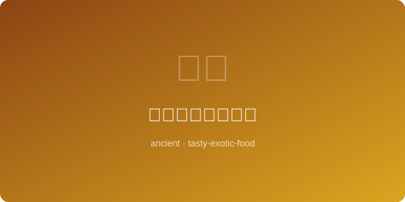

# 古罗马葡萄酒炖鸡

  

# Roman Wine Chicken

> **年代** | Era: 约公元100年 (~100 AD)
> **起源** | Origin: 古罗马帝国 | Roman Empire
> **类型** | Type: 主菜 | Main Course

---

## 简介 | Introduction

这道菜灵感源自古罗马美食家阿皮基乌斯（Apicius）所著的《论烹饪》，是罗马贵族宴席上的经典佳肴。罗马人嗜好以葡萄酒入菜，配合鱼露（garum）和多种香草，创造出浓郁而复杂的风味。这道炖鸡体现了罗马帝国鼎盛时期的奢华饮食文化。

Inspired by "De Re Coquinaria" by the Roman gourmet Apicius, this was a classic dish at patrician feasts. Romans loved cooking with wine, combining it with fish sauce (garum) and various herbs to create rich, complex flavors. This stewed chicken embodies the luxurious food culture of the Roman Empire at its height.

---

## 食材 | Ingredients

| 食材 | Ingredient | 用量 | Amount |
|------|-----------|------|--------|
| 整鸡 | Whole chicken | 1只约1.5公斤 | 1, ~1.5kg |
| 红葡萄酒 | Red wine | 300毫升 | 300ml |
| 鱼露 | Fish sauce (garum) | 2汤匙 | 2 tbsp |
| 蜂蜜 | Honey | 2汤匙 | 2 tbsp |
| 黑胡椒粒 | Black peppercorns | 1茶匙 | 1 tsp |
| 孜然 | Cumin | 1茶匙 | 1 tsp |
| 新鲜芫荽 | Fresh coriander | 一小把 | A handful |
| 橄榄油 | Olive oil | 3汤匙 | 3 tbsp |

---

## 做法 | Method

1. 整鸡洗净剁块，用鱼露和黑胡椒腌制30分钟。
2. 铜锅中倒入橄榄油，大火将鸡块煎至表面金黄。
3. 倒入红葡萄酒，加入蜂蜜、孜然，搅拌均匀。
4. 转小火，加盖慢炖约40分钟至鸡肉软烂。
5. 开盖收汁，撒上新鲜芫荽叶即可上桌。

---

## 历史典故 | Historical Notes

阿皮基乌斯的《论烹饪》是现存最古老的完整食谱集之一，记录了数百道罗马菜肴。罗马贵族的宴会（convivium）可持续数小时，宾客斜卧在榻上用餐。鱼露（garum）是罗马帝国最重要的调味品，由发酵鱼内脏制成，价格堪比黄金。葡萄酒则几乎出现在每一道罗马菜中。
