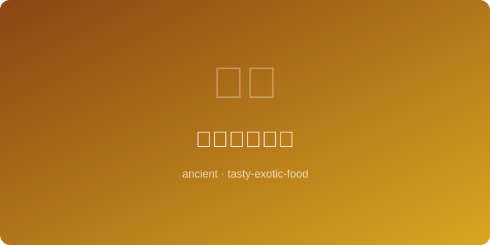

# 唐代长安烤馕 | Tang Chang'an Naan

  

> **朝代/时期 Dynasty/Era:** 唐朝 Tang Dynasty (~700AD)
> **发源地 Origin:** 长安（今西安） Chang'an (modern Xi'an)
> **类型 Type:** 主食 Staple / Bread

---

## 典故 Historical Background

唐代长安是丝绸之路的东方起点，胡商云集，胡饼（烤馕）随之传入中原。唐人白居易诗中有"胡麻饼样学京都"之句，可见烤馕已深入长安百姓生活。长安城内西市胡人聚居区，馕坑遍布，成为当时最受欢迎的街头美食之一。

Chang'an was the eastern terminus of the Silk Road, bustling with Central Asian merchants who brought naan bread to China. The Tang poet Bai Juyi wrote of "sesame cakes fashioned in the capital's style," showing how deeply naan had penetrated everyday life. The Western Market district, home to foreign merchants, was dotted with tandoor pits making this beloved street food.

---

## 食材 Ingredients

| 食材 Ingredient | 用量 Amount |
|---|---|
| 面粉 Wheat flour | 3杯 3 cups |
| 羊油 Mutton fat | 2大匙 2 tbsp |
| 盐 Salt | 1小匙 1 tsp |
| 酵母（老面） Sourdough starter | 适量 As needed |
| 温水 Warm water | 1杯 1 cup |
| 白芝麻 White sesame seeds | 2大匙 2 tbsp |
| 黑芝麻 Black sesame seeds | 1大匙 1 tbsp |
| 葱花 Chopped scallion | 适量 As needed |

---

## 做法 Preparation

1. **和面 Make dough:** 面粉加盐、羊油、酵母与温水，揉至光滑有弹性。Mix flour with salt, mutton fat, starter, and warm water; knead until smooth and elastic.
2. **发酵 Ferment:** 面团盖湿布，置温暖处发酵两个时辰至体积翻倍。Cover dough with damp cloth, ferment in a warm spot for 2 hours until doubled.
3. **整形 Shape:** 分割面团为掌心大小，擀成圆饼状，中间薄边缘厚。Divide dough into palm-sized portions, roll into rounds — thin center, thick edges.
4. **装饰 Decorate:** 表面刷水，撒芝麻与葱花，用指尖在中央戳出花纹防止鼓起。Brush surface with water, sprinkle sesame and scallion, poke a pattern in the center to prevent puffing.
5. **烤制 Bake:** 将馕贴于预热的馕坑（陶炉）内壁，高温烤至金黄酥脆，约一刻钟。Press naan onto the inner wall of a preheated tandoor (clay oven), bake at high heat until golden and crisp, about 15 minutes.
6. **出炉 Serve:** 趁热取出，外酥内软，可搭配羊肉汤或直接食用。Remove while hot — crispy outside, soft inside. Serve with lamb broth or eat plain.

---

## 备注 Notes

- 唐代馕坑以黏土砌成，底部烧炭火，温度极高。Tang-era tandoors were built of clay, heated with charcoal at the base to extreme temperatures.
- 若无馕坑，可用烤箱最高温加石板模拟效果。Without a tandoor, use an oven at maximum heat with a baking stone to approximate.
