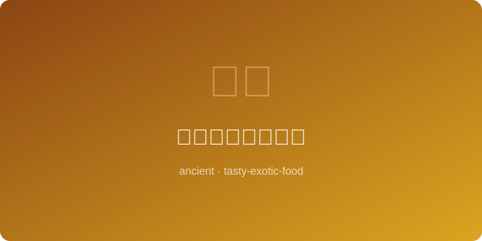

# 奥斯曼土耳其甜品 | Ottoman Baklava (奥斯曼帝国, ~1500 AD)

  

> ⏱ 准备 30分钟 + 烹饪 45分钟 | 💰 ~$5/份 | 🏷️ 古代名菜、奥斯曼、甜品、坚果

> **📜 历史** — 巴克拉瓦是奥斯曼帝国最辉煌的甜点遗产。15世纪的托普卡帕宫廷厨房将这道甜品发展到极致：层层薄如蝉翼的酥皮包裹碎坚果，浇上蜂蜜糖浆。每年斋月第15天，苏丹会命令制作托盘大小的巴克拉瓦分赐给禁卫军（Janissary），这一仪式被称为"巴克拉瓦行进"（Baklava Alayı）。
> **📜 History** — *Baklava is the Ottoman Empire's most glorious dessert legacy. The 15th-century Topkapi Palace kitchens perfected this confection: layers of phyllo as thin as cicada wings encasing crushed nuts, drenched in honey syrup. On the 15th day of Ramadan each year, the Sultan ordered tray-sized baklava distributed to the Janissary guards — a ceremony known as the "Baklava Procession" (Baklava Alayı).*

---

## 食材 | Ingredients

| 食材 | Ingredient | 用量 | Amount |
|------|-----------|------|--------|
| 酥皮（filo pastry） | Phyllo dough | 1盒（约450克） | 1 box (~1 lb) |
| 开心果（切碎） | Pistachios (chopped) | 1.5杯 | 1.5 cups |
| 核桃（切碎） | Walnuts (chopped) | 1杯 | 1 cup |
| 黄油（融化） | Butter (melted) | 1杯（2条） | 1 cup (2 sticks) |
| 糖 | Sugar | 1杯 | 1 cup |
| 水 | Water | 3/4杯 | 3/4 cup |
| 蜂蜜 | Honey | 1/4杯 | 1/4 cup |
| 柠檬汁 | Lemon juice | 1汤匙 | 1 tbsp |
| 玫瑰水（可选） | Rose water (optional) | 1茶匙 | 1 tsp |

---

## 做法 | Directions

1. **制糖浆** — 糖、水和柠檬汁放入小锅，中火煮沸后转小火煮10分钟至略浓稠。关火加入蜂蜜和玫瑰水，冷却备用。
   *Combine sugar, water, and lemon juice in a saucepan. Boil then simmer 10 minutes until slightly thick. Remove from heat, stir in honey and rose water. Cool completely.*

2. **铺层** — 烤盘刷黄油。铺8层酥皮（每层刷黄油），撒一半坚果；再铺6层酥皮（每层刷黄油），撒剩余坚果；最后铺8层酥皮（每层刷黄油）。
   *Butter a baking pan. Layer 8 phyllo sheets (brushing each with butter), spread half the nuts. Layer 6 more sheets (buttering each), spread remaining nuts. Top with 8 final sheets (buttering each).*

3. **切割烤制** — 用利刀切成菱形块（先切直线再切对角线），烤箱175°C（350°F）烤35-40分钟至金黄酥脆。
   *Cut into diamond shapes with a sharp knife (straight lines then diagonals). Bake at 175°C (350°F) for 35-40 minutes until golden and crisp.*

4. **浇糖浆** — 出炉后立刻将冷糖浆均匀浇在热巴克拉瓦上（冷糖浆+热酥皮=最佳吸收），静置4小时至入味。
   *Immediately pour cold syrup evenly over hot baklava (cold syrup + hot pastry = best absorption). Let stand 4 hours to absorb.*

---

## 历史注解 | Historical Notes

- 托普卡帕宫的厨房有超过800名厨师，其中专门制作巴克拉瓦的糕点师拥有最高地位。
  *Topkapi Palace kitchens employed over 800 cooks; pastry chefs specializing in baklava held the highest status.*

- 奥斯曼巴克拉瓦的酥皮要求薄到可以透过它阅读古兰经文字，这是衡量糕点师技艺的标准。
  *Ottoman baklava phyllo had to be thin enough to read Quran text through it — the benchmark for a pastry chef's skill.*

- 巴克拉瓦的起源存在争议，希腊、黎巴嫩、叙利亚和伊朗都声称拥有发明权。
  *Baklava's origins are disputed — Greece, Lebanon, Syria, and Iran all claim to have invented it.*

---

## 替代食材 | American Substitutions

| 原始食材 | Original | 替代品 | Substitution |
|----------|----------|--------|-------------|
| 酥皮（filo） | Phyllo dough | Athens品牌Phyllo（冷冻区） | Athens brand phyllo (freezer section) |
| 开心果 | Pistachios | Wonderful品牌去壳开心果 | Wonderful brand shelled pistachios |
| 玫瑰水 | Rose water | Cortas品牌玫瑰水（中东超市或Amazon） | Cortas brand rose water (Middle Eastern store or Amazon) |
| 黄油 | Butter | 无盐黄油（Land O'Lakes或Kerrygold） | Unsalted butter (Land O'Lakes or Kerrygold) |
