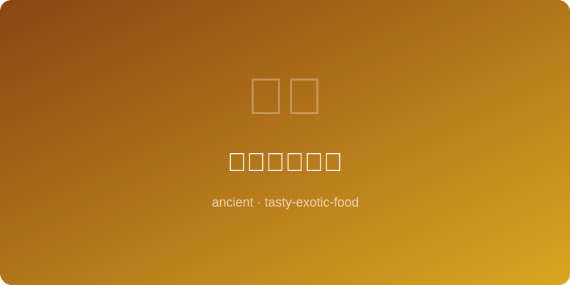

# 奥斯曼烤肉串 | Ottoman Kebab (奥斯曼帝国, ~1400 AD)

  

> ⏱ 准备 20分钟 + 烹饪 12分钟 | 💰 ~$7/份 | 🏷️ 古代名菜、奥斯曼帝国、烤制、羊肉

> **📜 历史** — 烤肉串（kebab）是奥斯曼帝国美食的标志。传说突厥士兵在行军途中将肉块串在剑上，在营火上烤制——这便是kebab的起源。到奥斯曼帝国鼎盛时期，托普卡帕宫的御厨房拥有数百名厨师，烤肉技艺已发展为精湛的烹饪艺术。1400年代的奥斯曼文献中已有详细的腌制烤肉配方，使用酸奶、香料和洋葱软化肉质。
> **📜 History** — *Kebab is the signature dish of Ottoman cuisine. Legend says Turkic soldiers skewered meat on their swords and grilled it over campfires during marches — the origin of kebab. By the Ottoman Empire's zenith, the Topkapi Palace kitchens employed hundreds of cooks, and kebab had evolved into a refined culinary art. Ottoman documents from the 1400s contain detailed marinated kebab recipes using yogurt, spices, and onions to tenderize meat.*

---

## 食材 | Ingredients

| 食材 | Ingredient | 用量 | Amount |
|------|-----------|------|--------|
| 羊腿肉（切2cm块） | Lamb leg (cut into 2cm cubes) | 1.5磅 | 1.5 lbs |
| 酸奶 | Plain yogurt | 1/2杯 | 1/2 cup |
| 洋葱（磨泥） | Onion (grated) | 1个 | 1 |
| 大蒜（磨泥） | Garlic (grated) | 3瓣 | 3 cloves |
| 橄榄油 | Olive oil | 2汤匙 | 2 tbsp |
| 小茴香粉 | Ground cumin | 1茶匙 | 1 tsp |
| 甜椒粉（paprika） | Paprika | 1茶匙 | 1 tsp |
| 阿勒颇辣椒碎（或红辣椒碎） | Aleppo pepper (or red pepper flakes) | 1/2茶匙 | 1/2 tsp |
| 盐 | Salt | 1茶匙 | 1 tsp |
| 黑胡椒 | Black pepper | 1/2茶匙 | 1/2 tsp |
| 新鲜欧芹（切碎） | Fresh parsley (chopped) | 2汤匙 | 2 tbsp |
| 柠檬 | Lemon | 1个 | 1 |

---

## 做法 | Directions

1. **腌制** — 将酸奶、洋葱泥、蒜泥、橄榄油和所有香料混合，放入羊肉块搅拌均匀，冷藏腌制至少2小时（最佳过夜）。
   *Mix yogurt, grated onion, garlic, olive oil, and all spices. Add lamb cubes and toss to coat. Refrigerate for at least 2 hours (overnight is best).*

2. **串肉** — 将腌好的羊肉串上金属烤串或预先浸泡过的竹签，每块之间留少许间隙。
   *Thread marinated lamb onto metal skewers or pre-soaked wooden skewers, leaving a small gap between pieces.*

3. **烤制** — 烤架预热至高温（或用烤箱broil模式）。烤串放上烤架，每面烤3-4分钟，共烤10-12分钟至表面焦香、内部微粉。
   *Preheat grill to high (or use oven broiler). Place skewers on grill and cook 3-4 minutes per side, about 10-12 minutes total, until charred outside and slightly pink inside.*

4. **上桌** — 撒上新鲜欧芹碎，配柠檬角、皮塔饼和酸奶酱食用。
   *Sprinkle with fresh parsley. Serve with lemon wedges, pita bread, and yogurt sauce.*

---

## 历史注解 | Historical Notes

- "Kebab"一词源自阿拉伯语"kabāb"，意为"烤肉"，在整个中东和中亚地区广泛使用。
  *The word "kebab" derives from Arabic "kabāb" meaning "roasted meat," used widely across the Middle East and Central Asia.*

- 奥斯曼帝国横跨三大洲，kebab吸收了阿拉伯、波斯和拜占庭的烹饪影响。
  *The Ottoman Empire spanned three continents; kebab absorbed culinary influences from Arab, Persian, and Byzantine traditions.*

- 甜椒粉（paprika）在此为近代调味，原版可能使用更多本地香料如苏木和漆树粉（sumac）。
  *Paprika is a modern seasoning here; the original likely used local spices like sumac and other indigenous seasonings.*

---

## 替代食材 | American Substitutions

| 原始食材 | Original | 替代品 | Substitution |
|----------|----------|--------|-------------|
| 羊腿肉 | Lamb leg | 牛肩肉或鸡腿肉 | Beef chuck or chicken thighs |
| 阿勒颇辣椒碎 | Aleppo pepper | 红辣椒碎（用量减半）+甜椒粉 | Red pepper flakes (half amount) + paprika |
| 酸奶 | Plain yogurt | 全脂希腊酸奶 | Full-fat Greek yogurt |
| 皮塔饼 | Pita bread | 超市烘焙区皮塔饼或玉米饼 | Store-bought pita or tortillas |
