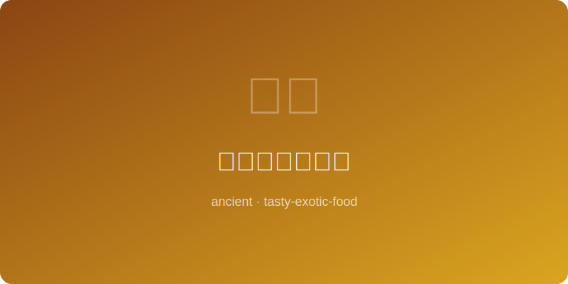

# 宋代东京梦华菜 | Song Capital Dream Dishes — Braised Pork Belly (北宋, ~1100 AD)

  

> ⏱ 准备 15分钟 + 烹饪 90分钟 | 💰 ~$6/份 | 🏷️ 古代名菜、宋朝、肉类、汴京

> **📜 历史** — 《东京梦华录》是孟元老追忆北宋都城汴京（今开封）繁华景象的笔记，详细记录了汴京七十二家正店和无数小食摊的美食盛况。书中描写的"煎肉"、"旋煎羊"和各式酒肆菜肴反映了宋代市井饮食的空前繁荣。本菜以《梦华录》中记载的红烧技法为基础，还原宋代汴京酒楼中最受欢迎的五花肉做法，甜咸交融、肥而不腻。
> **📜 History** — *"Dreams of Splendor of the Eastern Capital" (Dongjing Meng Hua Lu) by Meng Yuanlao recalls the magnificent culinary scene of Bianjing (modern Kaifeng), the Northern Song capital. It records 72 major restaurants and countless food stalls. This recipe recreates the braised pork belly popular in Song Dynasty taverns, based on the red-braising techniques described in the text — a sweet-savory dish that is rich but never greasy.*

---

## 食材 | Ingredients

| 食材 | Ingredient | 用量 | Amount |
|------|-----------|------|--------|
| 五花肉 | Pork belly | 500g | 1 lb |
| 黄酒 | Shaoxing wine | 1/2杯 | 1/2 cup |
| 酱油 | Soy sauce | 3汤匙 | 3 tbsp |
| 冰糖 | Rock sugar | 30g | 1 oz |
| 姜片 | Ginger slices | 4片 | 4 slices |
| 大葱段 | Scallion sections | 2根 | 2 stalks |
| 八角 | Star anise | 2颗 | 2 pieces |
| 桂皮 | Cinnamon stick | 1小段 | 1 small piece |
| 水 | Water | 1杯 | 1 cup |

---

## 做法 | Directions

1. **处理五花肉** — 五花肉切4厘米方块，冷水下锅焯水5分钟去血沫捞出，用热水冲洗干净沥干。
   *Cut pork belly into 4cm cubes. Blanch in cold water for 5 minutes to remove impurities, rinse with hot water, and drain.*

2. **炒糖色炖煮** — 锅中放少许油，小火融化冰糖至琥珀色，放入五花肉翻炒上色，加姜、葱、八角、桂皮，倒入黄酒和酱油翻匀，加水没过肉面，大火煮沸转小火慢炖75分钟。
   *Heat a little oil, melt rock sugar over low heat until amber. Add pork belly and toss to coat. Add ginger, scallion, star anise, and cinnamon. Pour in Shaoxing wine and soy sauce, stir, add water to cover meat. Bring to a boil, then simmer on low 75 minutes.*

3. **收汁装盘** — 转大火收汁至浓稠发亮，汤汁裹满每块肉，盛盘即可。
   *Turn heat to high and reduce sauce until thick and glossy, coating each piece of meat. Plate and serve.*

---

## 替代食材 | American Substitutions

| 原始食材 | Original | 替代品 | Substitution |
|----------|----------|--------|-------------|
| 黄酒 | Shaoxing wine | 干雪利酒（dry sherry） | Dry sherry |
| 冰糖 | Rock sugar | 红糖2汤匙 | 2 tbsp brown sugar |
| 五花肉 | Pork belly | Costco整块猪五花 | Costco whole pork belly |
| 桂皮 | Cinnamon stick | McCormick桂皮棒 | McCormick cinnamon stick |
