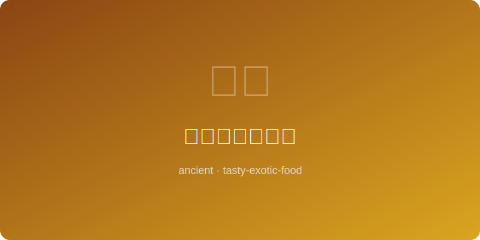

# 宋代临安蟹黄包 | Song Crab Roe Bun (南宋临安, ~1200 AD)

  

> ⏱ 准备 40分钟 + 发面1小时 + 烹饪 15分钟 | 💰 ~$8/份 | 🏷️ 古代名菜、宋朝、蟹黄、包子

> **📜 历史** — 南宋都城临安（今杭州）是中国美食的巅峰之城。《梦粱录》和《武林旧事》中记载了临安街头繁华的饮食文化，蟹黄包子是临安夜市最受欢迎的小吃之一。宋代的临安是世界上第一个人口超过百万的城市，其餐饮业的繁荣程度直到近代才被超越。蟹黄包承载了杭州最辉煌时代的味觉记忆。
> **📜 History** — *Lin'an (modern Hangzhou), capital of the Southern Song Dynasty, was the pinnacle of Chinese gastronomy. "Mengliang Lu" and "Wulin Jiushi" document Lin'an's vibrant food culture, with crab roe buns among the most popular night market snacks. Song-era Lin'an was the world's first city of over a million people, its restaurant scene unmatched until modern times. These buns carry the taste memory of Hangzhou's most glorious era.*

---

## 食材 | Ingredients

| 食材 | Ingredient | 用量 | Amount |
|------|-----------|------|--------|
| 中筋面粉 | All-purpose flour | 2杯 | 2 cups |
| 酵母 | Instant yeast | 1茶匙 | 1 tsp |
| 温水 | Warm water | 3/4杯 | 3/4 cup |
| 糖 | Sugar | 1汤匙 | 1 tbsp |
| 蟹黄/蟹膏 | Crab roe/tomalley | 100克 | 3.5 oz |
| 猪肉馅 | Ground pork | 200克 | 7 oz |
| 生姜（切末） | Ginger (minced) | 1汤匙 | 1 tbsp |
| 料酒 | Shaoxing wine | 1汤匙 | 1 tbsp |
| 酱油 | Soy sauce | 1汤匙 | 1 tbsp |
| 香油 | Sesame oil | 1茶匙 | 1 tsp |
| 盐 | Salt | 1/2茶匙 | 1/2 tsp |
| 白胡椒粉 | White pepper | 1/4茶匙 | 1/4 tsp |

---

## 做法 | Directions

1. **发面** — 面粉、酵母、糖和温水混合，揉成光滑面团，盖湿布发酵1小时至两倍大。
   *Mix flour, yeast, sugar, and warm water. Knead into a smooth dough, cover with a damp cloth, and rise 1 hour until doubled.*

2. **制馅** — 猪肉馅加姜末、料酒、酱油、香油、盐和白胡椒搅拌均匀，最后轻柔拌入蟹黄（避免打碎）。
   *Mix ground pork with ginger, wine, soy sauce, sesame oil, salt, and white pepper. Gently fold in crab roe last (avoid breaking it up).*

3. **包制** — 面团排气后分成12份，每份擀成中间厚边缘薄的圆片，包入馅料，捏出褶子收口。
   *Punch down dough, divide into 12 pieces. Roll each into a disc thicker in the center. Place filling inside, pleat and seal at the top.*

4. **蒸制** — 包子放在蒸笼纸上，二次醒发15分钟，大火蒸12-15分钟，关火后闷3分钟再开盖。
   *Place buns on parchment squares in a steamer. Proof 15 minutes. Steam over high heat 12-15 minutes, then let sit 3 minutes before uncovering.*

---

## 历史注解 | Historical Notes

- 《梦粱录》记载临安有"蟹羹""洗手蟹""蟹酿橙"等数十种蟹类菜品，蟹文化在宋代达到顶峰。
  *"Mengliang Lu" records dozens of crab dishes in Lin'an — crab soup, vinegar crab, crab-stuffed orange — crab culture peaked in the Song Dynasty.*

- 南宋临安的夜市从傍晚营业到凌晨三四点，包子铺是最早开张、最晚收摊的店铺之一。
  *Southern Song Lin'an night markets ran from evening until 3-4 AM; bun shops were among the first to open and last to close.*

- 宋代已有"包子"和"馒头"的明确区分，有馅的叫包子，无馅的叫馒头，这一叫法沿用至今。
  *By the Song Dynasty, "baozi" (filled) and "mantou" (unfilled) were clearly distinguished — terminology still in use today.*

---

## 替代食材 | American Substitutions

| 原始食材 | Original | 替代品 | Substitution |
|----------|----------|--------|-------------|
| 蟹黄/蟹膏 | Crab roe/tomalley | 罐装蟹肉+少许蟹膏黄油（Asian市场）或全蟹肉替代 | Canned crab meat + crab butter (Asian market) or all crab meat |
| 料酒 | Shaoxing wine | 干雪利酒（Dry Sherry） | Dry sherry |
| 猪肉馅 | Ground pork | 超市普通猪肉馅 | Regular ground pork from grocery |
| 香油 | Sesame oil | Kadoya芝麻油 | Kadoya sesame oil |
