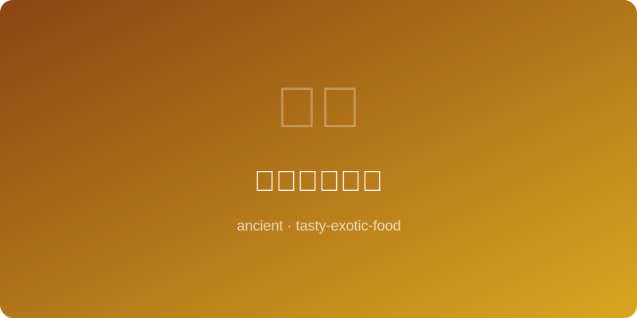

# 摩洛哥塔吉锅 | Moroccan Tagine (~800AD)

  

> ⏱ 准备20分+烹饪90分 | 💰~$14/份 | 🏷️ 古代名菜、摩洛哥

> **📜 历史** — 塔吉锅以其锥形陶盖得名，柏柏尔人发明的慢炖烹饪法能在沙漠中用最少的水做出鲜嫩菜肴。
> **📜 History** — *Named after its conical clay lid, the tagine was invented by Berbers to slow-cook tender dishes with minimal water in the desert.*

---

## 食材 | Ingredients

| 食材 | Ingredient | 用量 / Amount |
|------|-----------|---------------|
| 羊肩肉 | Lamb shoulder | 500g / 1.1lb |
| 杏干 | Dried apricots | 80g / 0.5 cup |
| 洋葱 | Onion | 1个 / 1 |
| 蜂蜜 | Honey | 30ml / 2 tbsp |
| 肉桂 | Cinnamon | 1根 / 1 stick |
| 杏仁 | Almonds | 40g / 0.25 cup |

---

## 做法 | Directions

### 1. 煎肉 | Sear Meat

羊肉切块煎至金黄，加洋葱丝炒软。
Cut lamb into pieces and sear golden, add sliced onion and soften.

### 2. 慢炖 | Slow Cook

加少量水、肉桂和杏干，盖锅小火炖80分钟。
Add a little water, cinnamon, and apricots; cover and simmer 80 minutes on low.

### 3. 装盘 | Finish

淋蜂蜜，撒烤杏仁，配古斯古斯米食用。
Drizzle with honey, scatter toasted almonds, serve with couscous.

---

## 要点 | Tips

| # | 要点 | Tip |
|---|------|-----|
| 1 | 煎肉时分批操作，锅内不要拥挤，否则出水无法上色 | Sear meat in batches; overcrowding the pan causes steaming instead of browning |
| 2 | 加水量刚没过肉的一半即可，锥形盖会自动回流蒸汽 | Add water only halfway up the meat; the conical lid recirculates steam naturally |
| 3 | 杏干在最后30分钟加入可保持形状，过早会煮烂 | Add apricots in the last 30 minutes to keep their shape; too early and they dissolve |

---

## 历史注解 | Historical Notes

塔吉锅的锥形盖设计并非装饰——蒸汽沿锥面上升后冷凝回滴，实现了无水循环烹饪，是北非干旱环境下的天才发明。柏柏尔人最初使用陶土在炭火上慢炖，后来阿拉伯商人带来了肉桂、藏红花等东方香料，使塔吉锅从朴素牧民餐演变为摩洛哥的国菜。传统中甜味与咸味的搭配（如蜂蜜配羊肉、杏干配橄榄）是马格里布烹饪的标志特征。

The tagine's conical lid is not decorative -- steam rises along the cone, condenses, and drips back down, achieving waterless-cycle cooking, a brilliant invention for arid North Africa. Berbers originally slow-cooked in clay pots over charcoal; later, Arab traders introduced Eastern spices like cinnamon and saffron, transforming the tagine from simple pastoral fare into Morocco's national dish. The traditional pairing of sweet and savory (honey with lamb, apricots with olives) is a hallmark of Maghreb cuisine.

---

## 替代食材 | American Substitutions

| 原料 | Ingredient | 替代 / Substitute | 备注 / Notes |
|------|-----------|-------------------|-------------|
| 羊肩肉 | Lamb shoulder | Chicken thighs | 炖时间减至45分钟 / Reduce to 45 min |
| 杏干 | Dried apricots | Dried cranberries | 风味不同 / Different flavor |
| 塔吉锅 | Tagine pot | Dutch oven | 效果接近 / Similar result |
