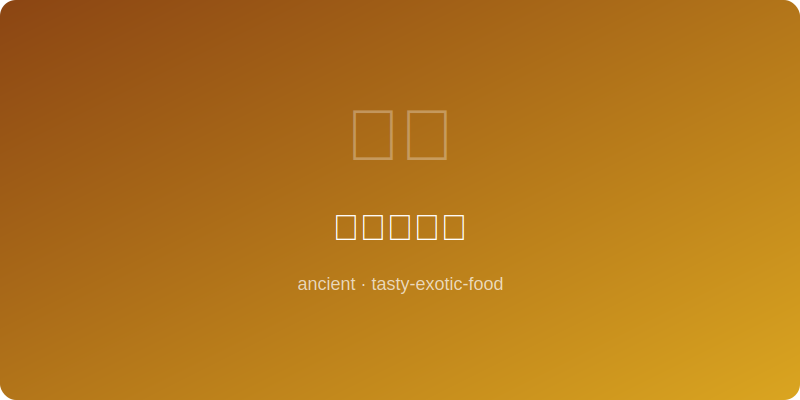

# 梁武帝素斋 Emperor Wu of Liang Vegetarian Meal

  

> 约公元500年 | 南朝梁 | 中国佛教素食之父
> Circa 500 AD | Liang Dynasty | Father of Chinese Buddhist Vegetarianism

---

## 简介 Introduction

梁武帝萧衍（464-549）是中国历史上最虔诚的佛教帝王，他颁布《断酒肉文》，
要求僧侣一律素食，从此奠定了中国汉传佛教素食的传统。梁武帝本人也长期
持斋素食，一日仅食一餐。这道素斋以当时常见的豆腐、菌菇和时蔬为主料，
清淡素雅，体现了"以食修心"的理念。

Emperor Wu of Liang, Xiao Yan (464-549), was the most devout Buddhist emperor
in Chinese history. His "Essay on Abstaining from Wine and Meat" mandated
monastic vegetarianism, establishing the Chinese Buddhist vegetarian tradition.
He himself ate one vegetarian meal a day. This dish uses tofu, mushrooms,
and seasonal greens — plain and elegant, embodying "cultivating the mind
through food."

---

## 食材 Ingredients

| 食材 Ingredient | 用量 Amount |
|---|---|
| 老豆腐 Firm tofu | 300g |
| 干香菇 Dried shiitake | 6朵 / 6 |
| 木耳 Black fungus (dried) | 15g |
| 笋片 Bamboo shoot slices | 100g |
| 青菜（小白菜）Baby bok choy | 200g |
| 生姜 Ginger | 10g |
| 酱油 Soy sauce | 15ml |
| 芝麻油 Sesame oil | 10ml |
| 盐 Salt | 适量 / to taste |
| 清水（或香菇水）Water or mushroom soaking liquid | 200ml |

---

## 做法 Instructions

1. **泡发 Rehydrate**: 干香菇和木耳提前用冷水泡发2小时，香菇水留用。
   Soak dried shiitake and fungus in cold water 2 hours, reserve mushroom liquid.

2. **切料 Cut ingredients**: 豆腐切厚片，香菇切片，木耳撕小块，笋切薄片。
   Slice tofu thick, slice shiitake, tear fungus into pieces, slice bamboo shoots thin.

3. **煎豆腐 Pan-fry tofu**: 豆腐片用少许油煎至两面金黄，取出备用。
   Pan-fry tofu slices with minimal oil until golden on both sides, set aside.

4. **炒菌菇 Cook mushrooms**: 姜丝爆香，加入香菇、木耳、笋片翻炒3分钟。
   Stir-fry ginger shreds, add shiitake, fungus, bamboo shoots for 3 min.

5. **合煮 Combine**: 加入香菇水和酱油，放入煎好的豆腐，中火炖10分钟。
   Add mushroom liquid and soy sauce, add tofu, simmer on medium 10 min.

6. **加菜 Add greens**: 放入小白菜烫至翠绿，淋芝麻油，调盐出锅。
   Add bok choy until bright green, drizzle sesame oil, season and serve.

---

*皇帝甘守清贫素食，以一己之力改变了千年的僧侣饮食。心净则食净。*
*An emperor embraced austere meals, changing monastic diet for a millennium. Pure mind, pure plate.*
