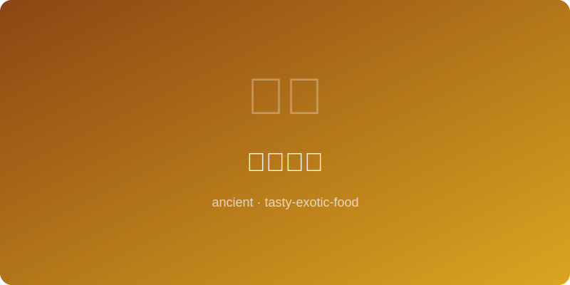

# 毛利烤肉 | Maori Hangi Earth Oven (毛利文明, ~1300 AD)

  

> ⏱ 准备 30分钟 + 烹饪 3-4小时 | 💰 ~$10/份 | 🏷️ 古代名菜、毛利、烤肉、新西兰

> **📜 历史** — 毛利人约在13世纪从波利尼西亚乘独木舟抵达新西兰（奥特亚罗瓦），带来了独特的"杭伊"（Hangi）地坑烹饪法。这种方法将火山石加热后放入地坑，食物包裹在湿布和树叶中，利用蒸汽和地热慢慢烹熟。杭伊不仅是一种烹饪方式，更是毛利社区凝聚力的象征——全村人共同挖坑、准备食材、分享食物。这一传统在现代新西兰的毛利聚会（Hui）中仍然延续。
> **📜 History** — *The Maori arrived in New Zealand (Aotearoa) from Polynesia by canoe around the 13th century, bringing the unique "Hangi" earth-oven cooking method. Volcanic stones are heated and placed in a pit; food wrapped in damp cloth and leaves cooks slowly using steam and geothermal heat. Hangi is not merely cooking — it symbolizes Maori community bonds, with the entire village digging, preparing, and sharing together. This tradition continues at modern Maori gatherings (Hui).*

---

## 食材 | Ingredients

| 食材 | Ingredient | 用量 | Amount |
|------|-----------|------|--------|
| 鸡腿（或羊肉块） | Chicken legs (or lamb chunks) | 4只 | 4 pieces |
| 红薯（切块） | Sweet potato (kumara, chunked) | 2个 | 2 |
| 南瓜（切块） | Pumpkin (chunked) | 1/4个 | 1/4 |
| 卷心菜（切块） | Cabbage (quartered) | 1/2个 | 1/2 |
| 洋葱（切块） | Onion (quartered) | 2个 | 2 |
| 黄油 | Butter | 3汤匙 | 3 tbsp |
| 盐和黑胡椒 | Salt and black pepper | 适量 | to taste |
| 铝箔纸 | Aluminum foil | 适量 | as needed |

---

## 做法 | Directions

1. **准备食材** — 所有肉类和蔬菜分别用盐和胡椒调味，每份食材加一小块黄油，分别用铝箔纸严密包裹。
   *Season all meats and vegetables separately with salt and pepper. Add a small knob of butter to each portion and wrap tightly in aluminum foil.*

2. **烤箱模拟杭伊** — 烤箱预热至160°C（325°F）。将包裹好的食材放入深烤盘，肉在底层蔬菜在上层，加入1杯水，盖上烤盘盖或铝箔纸密封。
   *Preheat oven to 160°C (325°F). Arrange foil-wrapped parcels in a deep roasting pan — meat on bottom, vegetables on top. Add 1 cup water, cover pan tightly with lid or foil.*

3. **慢烤** — 烤3-4小时，期间不要打开，让蒸汽充分循环。食物吸收蒸汽后会产生独特的"大地风味"。
   *Roast 3-4 hours without opening, allowing steam to circulate fully. The food absorbs the steam, developing a unique "earthy" flavor.*

4. **开封享用** — 小心打开铝箔（蒸汽很烫），将肉和蔬菜摆盘，浇上包中汁液即可。
   *Carefully open foil (steam is very hot). Arrange meat and vegetables on a platter, drizzle with collected juices.*

---

## 历史注解 | Historical Notes

- 传统杭伊使用的石头必须是火山石（如玄武岩），因为其他石头遇热可能炸裂。
  *Traditional Hangi requires volcanic stones (like basalt) because other rocks may shatter when heated.*

- 毛利传统中，杭伊烹饪的食物（kai）与精神信仰紧密相连，烹饪前要进行祈祷仪式（karakia）。
  *In Maori tradition, Hangi food (kai) is closely tied to spiritual beliefs; prayer rituals (karakia) are performed before cooking.*

---

## 替代食材 | American Substitutions

| 原始食材 | Original | 替代品 | Substitution |
|----------|----------|--------|-------------|
| 红薯（kumara） | Sweet potato (kumara) | 美国橙色红薯或紫薯 | American orange sweet potatoes or purple yams |
| 南瓜 | Pumpkin | 冬南瓜（butternut squash） | Butternut squash |
| 卷心菜 | Cabbage | 绿色卷心菜 | Green cabbage |
