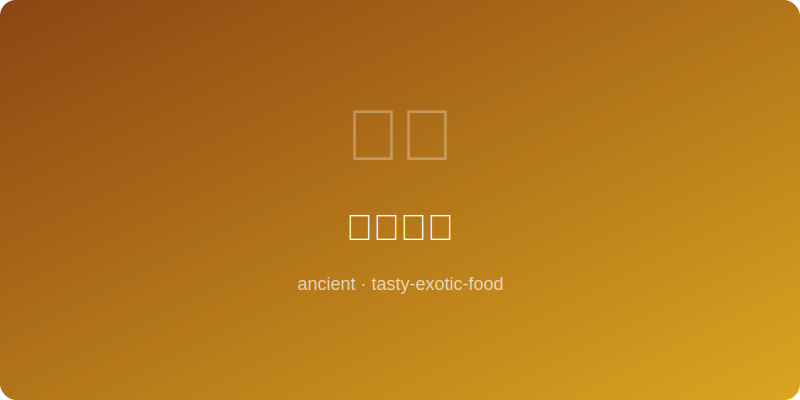

# 汉代煮饼

  

# Han Dynasty Boiled Cake

> **年代** | Era: 约公元前100年 (~100 BC)
> **起源** | Origin: 中国汉代 | Han Dynasty, China
> **类型** | Type: 主食 | Staple Food

---

## 简介 | Introduction

煮饼是汉代最常见的面食之一，所谓"饼"并非今日的烧饼，而是泛指一切面食。汉代的煮饼类似于今天的汤饼或面片汤，是将面团揪成小块下入沸水煮熟的朴素食物。从宫廷到民间，煮饼皆为日常主食，承载着大汉帝国的烟火气息。

Boiled cake was one of the most common wheat foods in the Han Dynasty. The term "bing" (cake) referred broadly to all wheat-based foods. Han boiled cake resembled today's soup noodles or torn dough soup — simple pieces of dough cooked in boiling water. From palace to peasant home, it was an everyday staple carrying the warmth of the great Han Empire.

---

## 食材 | Ingredients

| 食材 | Ingredient | 用量 | Amount |
|------|-----------|------|--------|
| 小麦粉 | Wheat flour | 250克 | 250g |
| 猪骨高汤 | Pork bone broth | 800毫升 | 800ml |
| 葱白 | Scallion whites | 2根 | 2 stalks |
| 鲜姜片 | Fresh ginger slices | 3片 | 3 slices |
| 盐 | Salt | 适量 | To taste |
| 酱（豆酱） | Bean paste | 1汤匙 | 1 tbsp |
| 猪肉片 | Sliced pork | 100克 | 100g |

---

## 做法 | Method

1. 小麦粉加水揉成光滑面团，醒面30分钟。
2. 猪骨高汤倒入陶釜中，加入姜片大火煮沸。
3. 将醒好的面团揪成拇指大小的面片。
4. 面片逐一下入沸腾的汤中，加入猪肉片。
5. 煮至面片浮起、猪肉变色，加入豆酱和盐调味。
6. 盛入碗中，撒上切细的葱白即成。

---

## 历史典故 | Historical Notes

《释名》载："饼，并也，溲面使合并也。"汉代人将面食统称为"饼"，其中煮饼是最基本的做法。汉武帝时期，小麦种植在北方大规模推广，煮饼逐渐成为百姓餐桌上的主角。考古发现的汉代厨房模型中，常可见煮饼的场景，反映了这种食物在当时的普遍性。
