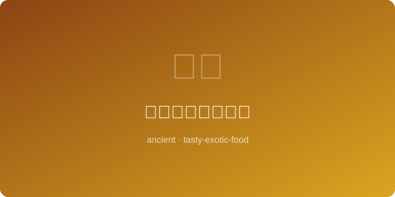

# 清代左宗棠鸡原型 | Qing Proto-General Tso's Chicken (~1850AD)

  

> ⏱ 准备20分+烹饪25分 | 💰~$11/份 | 🏷️ 古代名菜、清代、湘菜

> **📜 历史** — 左宗棠为晚清湘军名将，虽然"左宗棠鸡"实为1970年代彭长贵在台湾创制，但其灵感来源于湖南传统辣子鸡。此菜还原清代湖南乡间原型：干辣椒炒鸡块，酱香浓烈。
> **📜 History** — *Though "General Tso's Chicken" was created by Peng Chang-kuei in 1970s Taiwan, its roots lie in traditional Hunan chili chicken. This recipe recreates the Qing-era rural Hunan prototype: wok-fried chicken chunks with dried chilies and robust bean-paste flavor.*

---

## 食材 | Ingredients
| 食材 | Ingredient | 用量 / Amount |
|------|-----------|---------------|
| 鸡腿肉 | Chicken thighs | 500g / 1.1 lb |
| 干辣椒 | Dried chilies | 10个 / 10 pcs |
| 豆瓣酱 | Doubanjiang | 25g / 2 tbsp |
| 姜 | Ginger | 15g / 3 slices |
| 蒜 | Garlic | 5瓣 / 5 cloves |
| 酱油 | Soy sauce | 20ml / 4 tsp |
| 醋 | Vinegar | 10ml / 2 tsp |
| 花椒 | Sichuan peppercorn | 3g / ½ tsp |
| 淀粉 | Starch | 30g / 3 tbsp |
| 植物油 | Vegetable oil | 适量 / For frying |

---

## 做法 | Directions
### 1. 炸鸡 | Fry Chicken
鸡腿肉切块，拌淀粉和少许盐，油温180°C炸至金黄酥脆，捞出沥油。Cut thighs into chunks, coat with starch and a pinch of salt, deep-fry at 350°F until golden and crispy, drain.

### 2. 炒辣椒 | Toast Chilies
锅留底油，小火煸干辣椒和花椒至出香变色（勿焦），加姜蒜炒香。Leave a little oil in wok, toast dried chilies and peppercorns on low until fragrant and darkened (don't burn), add ginger and garlic.

### 3. 回锅翻炒 | Toss Together
倒入炸鸡块，加豆瓣酱、酱油和醋，大火翻炒30秒，使每块鸡肉裹满酱汁。Return fried chicken, add doubanjiang, soy sauce, and vinegar, toss on high heat 30 seconds until every piece is coated.

### 4. 上桌 | Serve
装盘即食，干香辣爽，配白米饭最佳。这是左将军家乡的真实味道。Plate and serve immediately — dry, fragrant, and boldly spicy. Best with steamed rice. This is the real taste of the General's homeland.

---

## 替代食材 | American Substitutions
| 原料 | Ingredient | 替代 / Substitute | 备注 / Notes |
|------|-----------|-------------------|-------------|
| 豆瓣酱 | Doubanjiang | Gochujang | 甜度略高 / Slightly sweeter |
| 干辣椒 | Dried chilies | Chile de arbol | 辣度接近 / Similar heat |
| 花椒 | Sichuan peppercorn | Black pepper + lemon zest | 模拟麻感 / Approximate numbing |
