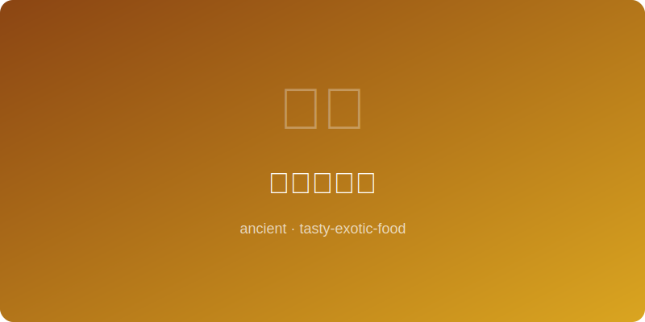

# 腓尼基烤鱼 | Phoenician Grilled Fish (腓尼基文明, ~1000 BC)

  

> ⏱ 准备 15分钟 + 烹饪 20分钟 | 💰 ~$8/份 | 🏷️ 古代名菜、腓尼基、海鲜

> **📜 历史** — 腓尼基人是地中海最伟大的航海民族，他们从推罗（Tyre）和西顿（Sidon）出发，将鱼类贸易和烹饪技法传遍整个地中海沿岸。腓尼基人以盐、香草和橄榄油腌制鲜鱼后在炭火上烤制，这种简单而美味的烹饪方式深刻影响了后来的希腊和罗马料理。他们还发明了鱼酱"garum"的原型。
> **📜 History** — *The Phoenicians were the Mediterranean's greatest seafarers, spreading fish trade and cooking techniques from Tyre and Sidon across the entire coastline. They marinated fresh fish with salt, herbs, and olive oil before grilling over charcoal — a simple yet delicious method that profoundly influenced later Greek and Roman cuisine. They also invented the prototype of the fish sauce "garum."*

---

## 食材 | Ingredients

| 食材 | Ingredient | 用量 | Amount |
|------|-----------|------|--------|
| 鲈鱼或鲷鱼（整条） | Sea bass or sea bream (whole) | 1条（约500g） | 1 fish (~1 lb) |
| 橄榄油 | Olive oil | 3汤匙 | 3 tbsp |
| 柠檬 | Lemon | 1个 | 1 |
| 新鲜百里香 | Fresh thyme | 4-5枝 | 4-5 sprigs |
| 大蒜（拍碎） | Garlic (crushed) | 3瓣 | 3 cloves |
| 海盐 | Sea salt | 1茶匙 | 1 tsp |
| 小茴香籽 | Cumin seeds | 1/2茶匙 | 1/2 tsp |
| 芫荽籽（压碎） | Coriander seeds (crushed) | 1/2茶匙 | 1/2 tsp |

---

## 做法 | Directions

1. **腌制鱼** — 鱼身两侧各划3刀，用海盐、小茴香籽和芫荽籽内外涂抹，塞入蒜瓣和百里香枝，淋橄榄油腌制15分钟。
   *Score the fish 3 times on each side. Rub inside and out with sea salt, cumin seeds, and crushed coriander. Stuff with garlic and thyme sprigs, drizzle with olive oil, and marinate 15 minutes.*

2. **炭火烤制** — 烤架预热至高温，将鱼放上烤制每面7-8分钟至鱼皮酥脆、鱼肉熟透可轻松脱骨。
   *Preheat grill to high heat. Grill fish 7-8 minutes per side until skin is crispy and flesh flakes easily from the bone.*

3. **装盘** — 整条鱼装盘，挤上新鲜柠檬汁，再淋少许橄榄油即可享用。
   *Plate the whole fish, squeeze fresh lemon juice over it, and drizzle with a touch more olive oil before serving.*

---

## 替代食材 | American Substitutions

| 原始食材 | Original | 替代品 | Substitution |
|----------|----------|--------|-------------|
| 鲈鱼/鲷鱼 | Sea bass/bream | 罗非鱼片或鲑鱼片 | Tilapia fillets or salmon fillets |
| 新鲜百里香 | Fresh thyme | 干百里香1茶匙 | 1 tsp dried thyme |
| 小茴香籽 | Cumin seeds | McCormick小茴香粉 | McCormick ground cumin |
| 芫荽籽 | Coriander seeds | 芫荽粉1/2茶匙 | 1/2 tsp ground coriander |
