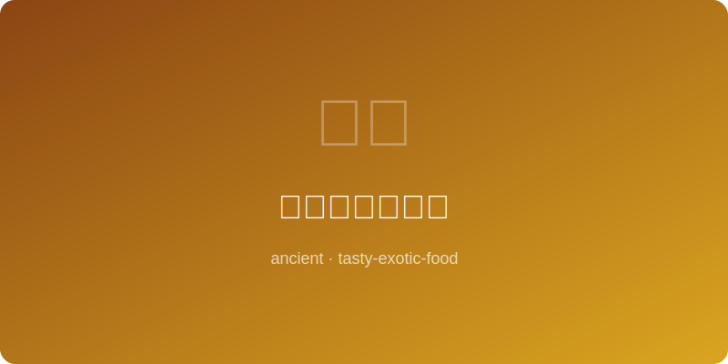

# 莫卧儿帝国烤鸡 | Mughal Tandoori Chicken (~1600AD)

  

> ⏱ 准备30分+腌制4小时+烹饪30分 | 💰~$12/份 | 🏷️ 古代名菜、莫卧儿帝国

> **📜 历史** — 莫卧儿帝国将中亚烤炉技术与印度香料融合，创造了坦都里烤鸡，至今仍是印度菜的标志。
> **📜 History** — *The Mughal Empire fused Central Asian tandoor techniques with Indian spices to create tandoori chicken, still India's iconic dish today.*

---

## 食材 | Ingredients

| 食材 | Ingredient | 用量 / Amount |
|------|-----------|---------------|
| 鸡腿 | Chicken legs | 6个 / 6 pcs |
| 酸奶 | Yogurt | 200g / 0.8 cup |
| 姜蒜泥 | Ginger-garlic paste | 30g / 2 tbsp |
| 辣椒粉 | Chili powder | 10g / 2 tsp |
| 姜黄粉 | Turmeric | 5g / 1 tsp |
| 青柠 | Lime | 1个 / 1 |

---

## 做法 | Directions

### 1. 腌制 | Marinate

鸡腿划刀，混合酸奶、姜蒜泥、辣椒粉和姜黄，涂满鸡腿腌4小时。
Score chicken, mix yogurt with ginger-garlic paste, chili, and turmeric; coat chicken and marinate 4 hours.

### 2. 高温烤 | Roast High

烤箱预热至最高温(250°C/480°F)，烤25-30分钟至表面微焦。
Preheat oven to max (480°F), roast 25-30 minutes until charred spots appear.

### 3. 上桌 | Serve

挤上青柠汁，配洋葱圈和薄荷酸奶酱。
Squeeze lime juice over chicken, serve with onion rings and mint yogurt sauce.

---

## 要点 | Tips

| # | 要点 | Tip |
|---|------|-----|
| 1 | 划刀要深入骨头，酸奶腌料才能彻底渗透 | Score deep to the bone so the yogurt marinade fully penetrates |
| 2 | 烤前将鸡腿从冰箱取出回温30分钟，受热更均匀 | Remove chicken from fridge 30 minutes before roasting for more even cooking |
| 3 | 烤架下铺锡纸接油，最后可将接住的汁液刷回鸡腿 | Line the rack below with foil to catch drippings; brush them back on at the end |

---

## 历史注解 | Historical Notes

坦都(tandoor)烤炉起源于中亚，随莫卧儿帝国创始人巴布尔(1526年)传入印度次大陆。莫卧儿宫廷厨师将中亚的烤炉技术与印度丰富的香料传统相结合，创造出红艳夺目的坦都里烤鸡。传统坦都炉温度可达480°C，高温瞬间锁住肉汁的同时赋予标志性的炭烤焦斑。现代tandoori鸡的标志性红色来自红辣椒粉和食用色素，而莫卧儿时代则使用藏红花和姜黄赋色。

The tandoor oven originated in Central Asia and entered the Indian subcontinent with Mughal founder Babur in 1526. Mughal court chefs married Central Asian oven techniques with India's rich spice tradition to create the vivid tandoori chicken. Traditional tandoor temperatures can reach 900°F, instantly sealing in juices while imparting the signature char marks. The iconic red color of modern tandoori chicken comes from red chili powder and food coloring, while the Mughal era used saffron and turmeric for color.

---

## 替代食材 | American Substitutions

| 原料 | Ingredient | 替代 / Substitute | 备注 / Notes |
|------|-----------|-------------------|-------------|
| 姜蒜泥 | Ginger-garlic paste | Fresh minced ginger + garlic | 各1 tbsp / 1 tbsp each |
| 酸奶 | Yogurt | Greek yogurt | 更浓稠更好 / Thicker is better |
| 姜黄粉 | Turmeric | Curry powder | 风味更复合 / More complex flavor |
