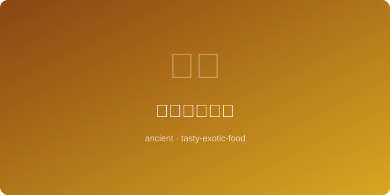

# 萨珊波斯烤鸡 | Sassanid Persian Roast Chicken

  

> **朝代/时期 Dynasty/Era:** 萨珊王朝 Sassanid Empire (~500AD)
> **发源地 Origin:** 波斯（今伊朗） Persia (modern Iran)
> **类型 Type:** 烤肉/宫廷菜 Roast / Court Dish

---

## 典故 Historical Background

萨珊王朝是伊斯兰征服前波斯文明的最后一个辉煌时期，其宫廷美食深刻影响了后来的阿拉伯与中亚烹饪传统。萨珊贵族以藏红花、玫瑰水和干果调味的烤鸡是波斯帝国宴席的经典菜肴。波斯诗歌中常以"金色烤鸡"比喻太阳，藏红花赋予鸡肉的金黄色被视为吉祥与权力的象征。此菜在拜火教圣节诺鲁兹（波斯新年）上尤为隆重。

The Sassanid dynasty was the last glorious era of Persian civilization before the Islamic conquest; its court cuisine profoundly influenced later Arab and Central Asian cooking. Sassanid nobles' roast chicken, seasoned with saffron, rose water, and dried fruits, was a classic at imperial banquets. Persian poetry often compared "golden roast chicken" to the sun — saffron's golden color symbolized fortune and power. This dish was especially prominent at the Zoroastrian festival of Nowruz (Persian New Year).

---

## 食材 Ingredients

| 食材 Ingredient | 用量 Amount |
|---|---|
| 整鸡 Whole chicken | 1只 1 whole |
| 藏红花 Saffron threads | 一大撮 A generous pinch |
| 玫瑰水 Rose water | 2大匙 2 tbsp |
| 黄油 Butter | 60克 60g |
| 杏仁片 Sliced almonds | 1/4杯 1/4 cup |
| 杏干 Dried apricots | 8颗 8 pieces |
| 蔓越莓干/伏牛花干 Barberries (zereshk) | 2大匙 2 tbsp |
| 洋葱 Onion | 1个 1 whole |
| 盐与黑胡椒 Salt & black pepper | 适量 To taste |

---

## 做法 Preparation

1. **泡藏红花 Bloom saffron:** 藏红花丝放入两大匙温水中浸泡至水变金黄色，约一刻钟。Steep saffron threads in 2 tbsp warm water until liquid turns golden, about 15 minutes.
2. **腌鸡 Marinate chicken:** 整鸡内外抹盐和黑胡椒，淋上藏红花水和玫瑰水，腌渍至少两个时辰。Rub chicken inside and out with salt and pepper, pour saffron water and rose water over it, marinate at least 2 hours.
3. **制馅 Prepare stuffing:** 黄油炒洋葱丝至金黄，加入杏干切丝、伏牛花干与杏仁片翻炒，以少量藏红花水着色。Fry onion in butter until golden, add sliced dried apricots, barberries, and almonds, stir-fry and color with a splash of saffron water.
4. **填腹 Stuff chicken:** 将炒好的干果馅填入鸡腹腔中，以棉线缝合封口。Stuff the sauteed dried fruit filling into the chicken cavity, sew shut with kitchen twine.
5. **烤制 Roast:** 鸡放入陶烤盘，表面涂抹软化的黄油，放入泥炉中以中火烤约一个半时辰，期间多次刷黄油与藏红花水。Place chicken in a clay roasting pan, brush with softened butter, roast in a clay oven at medium heat for about 1.5 hours, basting repeatedly with butter and saffron water.
6. **装盘 Plate:** 烤鸡置于银盘中，打开腹腔使干果馅溢出环绕，撒额外的杏仁片与伏牛花干，淋烤盘汁液。Place chicken on a silver platter, open the cavity to let stuffing spill around, scatter extra almonds and barberries, drizzle with pan juices.

---

## 备注 Notes

- 伏牛花（zereshk）是波斯料理的标志性食材，其红宝石般的色泽与酸甜口感不可替代。Barberries (zereshk) are a signature Persian ingredient — their ruby color and sweet-tart flavor are irreplaceable.
- 萨珊波斯的烹饪传统通过阿拉伯征服者传播至整个中东，成为阿拉伯宫廷料理的基础。Sassanid culinary traditions spread across the Middle East via Arab conquerors, becoming the foundation of Arab court cuisine.
