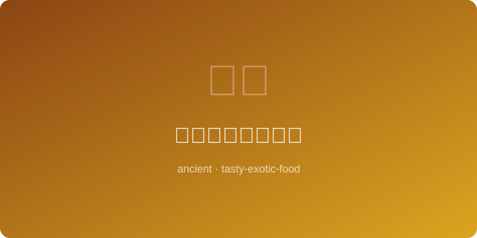

# 路易十四凡尔赛鸡 | Louis XIV Versailles Chicken

  

> **朝代/时期 Dynasty/Era:** 法国波旁王朝 French Bourbon Dynasty (~1680AD)
> **发源地 Origin:** 凡尔赛宫 Palace of Versailles
> **类型 Type:** 宫廷主菜 Royal Main Course

---

## 典故 Historical Background

路易十四以其对美食的狂热闻名于世，每日晚宴多达数十道菜肴。"太阳王"尤其钟爱布雷斯鸡——法国最优质的家禽品种。凡尔赛宫廷主厨以松露、奶油与白葡萄酒烹制此菜，将一只简单的烤鸡升华为宫廷艺术品。路易十四据说曾在一餐中食用四盘不同烹法的鸡肉。

Louis XIV was famous for his obsessive love of fine food, with nightly dinners featuring dozens of courses. The "Sun King" particularly favored Bresse chicken — France's finest poultry breed. Versailles court chefs elevated a simple roast chicken into a culinary work of art using truffles, cream, and white wine. Louis XIV reportedly consumed four different chicken preparations in a single meal.

---

## 食材 Ingredients

| 食材 Ingredient | 用量 Amount |
|---|---|
| 布雷斯鸡 Bresse chicken | 1只 1 whole |
| 黑松露 Black truffle | 1颗 1 whole |
| 黄油 Butter | 100克 100g |
| 浓奶油 Heavy cream | 1杯 1 cup |
| 白葡萄酒 White wine | 1杯 1 cup |
| 珍珠洋葱 Pearl onions | 12颗 12 |
| 蘑菇 Mushrooms | 200克 200g |
| 百里香 Thyme | 数枝 Several sprigs |
| 龙蒿 Tarragon | 数枝 Several sprigs |
| 盐与白胡椒 Salt & white pepper | 适量 To taste |

---

## 做法 Preparation

1. **松露填鸡 Stuff with truffle:** 黑松露切薄片，小心将松露片塞入鸡皮与胸肉之间，使鸡肉吸收松露香气。Slice truffle thin, carefully slide slices between the skin and breast meat to infuse the chicken with truffle aroma.
2. **煎鸡 Sear chicken:** 铜锅中融化一半黄油至起泡，将整鸡各面煎至金黄。Melt half the butter in a copper pan until foaming, sear the whole chicken golden on all sides.
3. **炒配菜 Cook garnish:** 另起锅，用剩余黄油炒珍珠洋葱与蘑菇至上色。In a separate pan, sautee pearl onions and mushrooms in remaining butter until colored.
4. **焖煮 Braise:** 鸡放入深锅，加白葡萄酒、百里香、龙蒿，盖盖以文火焖煮约一个时辰。Place chicken in a deep pot, add wine, thyme, tarragon, cover and braise on low heat for about 1 hour.
5. **制酱 Make sauce:** 取出鸡，锅汁过滤后大火收浓，加入奶油搅拌成丝滑浓酱，以盐和白胡椒调味。Remove chicken, strain the braising liquid, reduce on high heat, stir in cream to form a silky rich sauce, season with salt and white pepper.
6. **装盘 Plate:** 整鸡置于银盘中央，环绕珍珠洋葱与蘑菇，浇淋松露奶油酱汁，以新鲜龙蒿点缀。Place whole chicken on a silver platter, surround with onions and mushrooms, ladle truffle cream sauce over, garnish with fresh tarragon.

---

## 备注 Notes

- 凡尔赛宫厨房有超过三百名厨师，每日为数千名廷臣准备膳食。Versailles kitchens employed over 300 chefs, preparing meals daily for thousands of courtiers.
- 布雷斯鸡至今仍是法国唯一拥有AOC原产地认证的家禽品种。Bresse chicken remains the only French poultry breed with AOC protected origin status.
