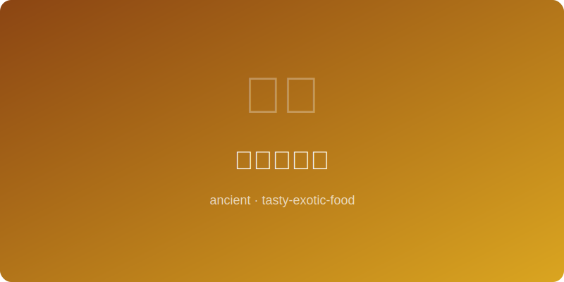

# 高丽参鸡汤 | Goryeo Ginseng Chicken Soup (~1100AD)

  

> ⏱ 准备20分+烹饪90分 | 💰~$18/份 | 🏷️ 古代名菜、高丽王朝

> **📜 历史** — 高丽时期人参被视为珍贵药材，参鸡汤是王室滋补圣品，至今仍是韩国国民养生菜。
> **📜 History** — *Ginseng was prized as precious medicine in the Goryeo Dynasty; samgyetang was a royal tonic and remains Korea's beloved health dish today.*

---

## 食材 | Ingredients

| 食材 | Ingredient | 用量 / Amount |
|------|-----------|---------------|
| 童子鸡 | Cornish hen | 1只 / 1 (~500g) |
| 人参 | Ginseng root | 1根 / 1 pc |
| 糯米 | Glutinous rice | 80g / 0.4 cup |
| 红枣 | Jujube dates | 4个 / 4 |
| 大蒜 | Garlic | 6瓣 / 6 cloves |
| 盐 | Salt | 适量 / To taste |

---

## 做法 | Directions

### 1. 填料 | Stuff Chicken

糯米泡水30分钟沥干，与大蒜、红枣一起塞入鸡腹，用牙签封口。
Soak glutinous rice 30 minutes, drain; stuff into chicken cavity with garlic and dates, seal with toothpick.

### 2. 炖煮 | Simmer

鸡放入锅中加水没过，放入人参，大火煮开转小火炖90分钟。
Place chicken in pot, cover with water, add ginseng, bring to boil then simmer 90 minutes.

### 3. 上桌 | Serve

汤炖至乳白浓稠，加盐调味，连鸡带汤盛入石锅。
Simmer until broth is milky and rich, season with salt, serve chicken and broth in a stone bowl.

---

## 要点 | Tips

| # | 要点 | Tip |
|---|------|-----|
| 1 | 糯米不要塞满鸡腹，留三分之一空间让米膨胀 | Do not overstuff the cavity; leave one-third empty for rice expansion |
| 2 | 炖煮过程中不断撇去浮沫，汤色才能清亮乳白 | Skim foam continuously during simmering for a clean, milky broth |
| 3 | 上桌前每人碗中放盐和胡椒，蘸鸡肉吃风味更佳 | Serve salt and pepper in small side dishes for dipping the chicken |

---

## 历史注解 | Historical Notes

高丽王朝(918-1392)时期，高丽参因品质卓越而成为与中国、日本贸易的珍贵商品。参鸡汤融合了韩医"以形补形"和"药食同源"的理念，在三伏天饮用滚烫的参鸡汤是韩国独特的"以热治热"养生传统。传统参鸡汤还会加入黄芪、栗子和银杏，使其兼具食补和药补功能。

During the Goryeo Dynasty (918-1392), Korean ginseng became a prized trade commodity with China and Japan due to its exceptional quality. Samgyetang embodies the Korean medical philosophy of "like treats like" and "food as medicine"; drinking piping-hot ginseng soup during the hottest summer days is a uniquely Korean "fight heat with heat" wellness tradition. Traditional samgyetang also includes astragalus, chestnuts, and ginkgo nuts, serving both as nourishment and herbal remedy.

---

## 替代食材 | American Substitutions

| 原料 | Ingredient | 替代 / Substitute | 备注 / Notes |
|------|-----------|-------------------|-------------|
| 人参 | Ginseng root | Ginseng tea bags (x3) | 韩国超市有售 / Available at Korean markets |
| 红枣 | Jujube dates | Medjool dates | 切半使用 / Use halved |
| 糯米 | Glutinous rice | Sushi rice | 口感略不同 / Slightly different |
