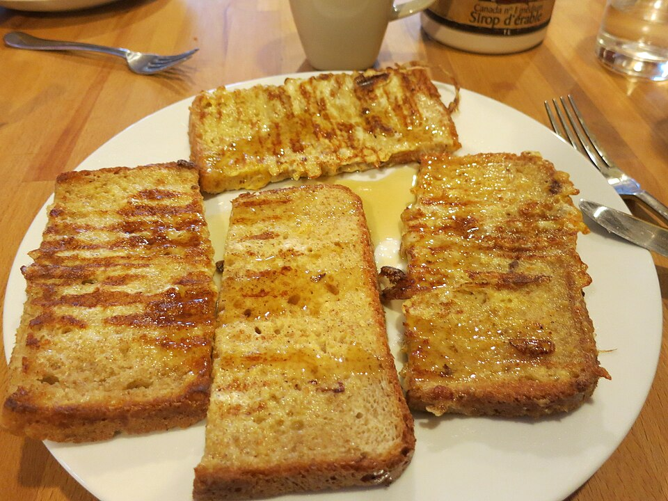

# 法式吐司 | French Toast (Lazy Student Edition)

> ⏱ 准备 3分钟 + 烹饪 5分钟 | 💰 ~$1.50/份 | 🏷️ 早餐、西式、全超市可买、零失败

  

> 留学生版法式吐司——不需要什么高级面包，普通吐司+鸡蛋+牛奶就行。蘸上枫糖浆，每一口都是金黄酥脆、内里绵软的幸福。周末慢悠悠的早午餐，配一杯咖啡，完美。
>
> *Student-edition French toast — no fancy brioche needed, just regular bread, eggs, and milk. Drizzle with maple syrup and every bite is golden-crispy outside, soft-custardy inside. A lazy weekend brunch with a cup of coffee — perfection.*

---

## 食材 | Ingredients

| 食材 | Ingredient | 用量 / Amount |
|------|-----------|---------------|
| 吐司面包 | Sliced bread | 4片 / 4 slices |
| 鸡蛋 | Eggs | 2个 / 2 |
| 牛奶 | Milk | 1/4杯 / 1/4 cup |
| 白糖 | Sugar | 1汤匙 / 1 tbsp |
| 肉桂粉 (可选) | Cinnamon (optional) | 1/4茶匙 / 1/4 tsp |
| 黄油或油 | Butter or oil | 适量 / for frying |
| 枫糖浆 | Maple syrup | 适量 / for topping |

---

## 做法 | Directions

### 1. 调蛋液 | Mix Egg Wash
碗中打入鸡蛋，加牛奶、糖和肉桂粉搅匀。

Beat eggs with milk, sugar, and cinnamon in a shallow bowl.

### 2. 蘸 | Dip
每片面包在蛋液中两面蘸匀（不要泡太久，3秒就够）。

Dip each bread slice in the egg mixture, coating both sides (don't soak — 3 seconds per side).

### 3. 煎 | Pan-fry
不粘锅中融化黄油，中火煎面包至两面金黄，每面约2分钟。

Melt butter in a non-stick pan. Cook over medium heat until golden on both sides, ~2 minutes per side.

### 4. 上桌 | Serve
淋枫糖浆，撒糖粉，配水果。

Drizzle with maple syrup, dust with powdered sugar, serve with fruit.

---

## 要点 | Tips

| 要点 | Tip |
|------|-----|
| 面包不要泡太久，否则煎的时候会碎 | Don't over-soak — the bread will fall apart when cooking |
| 用黄油煎比用油香 | Butter tastes better than oil for this |
| 隔夜面包更好，比新鲜面包不容易散 | Day-old bread works better — it holds together |
| 配新鲜水果（蓝莓、草莓、香蕉）更棒 | Top with fresh berries, strawberries, or banana slices |

---

## 替代食材 | American Substitutions

| 原料 | Ingredient | 替代 / Substitute | 备注 / Notes |
|------|-----------|-------------------|--------------|
| 面包 | Bread | 任何超市 / Any supermarket | 厚切 Texas toast 最好 / Thick-cut Texas toast is best |
| 枫糖浆 | Maple syrup | 任何超市 / Any supermarket | Trader Joe's 有 100% pure maple syrup |
| 黄油 | Butter | 任何超市 / Any supermarket | — |
