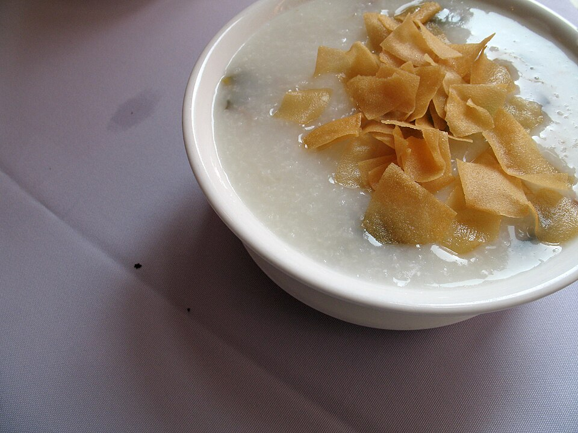

# 皮蛋瘦肉粥 | Century Egg & Pork Congee

> ⏱ 准备 10分钟 + 烹饪 45分钟 (Instant Pot 20分钟) | 💰 ~$3/份 | 🏷️ 早餐、暖胃、一锅出

  

> 粤式早茶的经典——米粒煮到完全融化，配上皮蛋和瘦肉丝，咸鲜顺滑。生病的时候、冬天的早晨、深夜加班的时候，一碗粥就是最好的安慰。Instant Pot 20分钟就能煮出餐厅级别的稠粥。
>
> *A Cantonese dim sum classic — rice simmered until it dissolves into a silky porridge, studded with century egg and shredded pork. When you're sick, on cold mornings, or during late-night study sessions, a bowl of congee is the ultimate comfort. Instant Pot gets restaurant-quality results in 20 minutes.*

---

## 食材 | Ingredients

| 食材 | Ingredient | 用量 / Amount |
|------|-----------|---------------|
| 大米 | Rice | 1/2杯 / 1/2 cup |
| 皮蛋 | Century eggs | 2个 / 2 |
| 猪里脊肉 | Pork tenderloin | 100g |
| 姜 | Ginger | 3片 / 3 slices |
| 葱花 | Chopped scallion | 适量 / for garnish |
| 盐 | Salt | 适量 / to taste |
| 白胡椒粉 | White pepper | 少许 / a pinch |
| 香油 | Sesame oil | 少许 / a drizzle |
| 水 | Water | 1500ml |

---

## 做法 | Directions

### 1. 备料 | Prep
米洗净泡20分钟。猪肉切细丝，加少许盐和淀粉抓匀。皮蛋切小丁。

Rinse rice and soak 20 minutes. Shred the pork, toss with a pinch of salt and cornstarch. Dice century eggs.

### 2. 煮粥 | Cook Congee
锅中加水和姜片烧开，下米和一半皮蛋丁，大火烧开后转最小火，不断搅拌，煮40-45分钟至米粒开花。

Bring water and ginger to a boil. Add rice and half the century egg. Boil, reduce to lowest heat, stir frequently, and cook 40–45 minutes until rice breaks down completely.

**Instant Pot：** 米+水+姜+皮蛋，Porridge 模式20分钟，自然释压。

**Instant Pot:** Rice + water + ginger + century egg, Porridge mode 20 min, natural release.

### 3. 加肉和调味 | Add Pork & Season
下肉丝搅散，煮2分钟至熟。加入剩余皮蛋丁、盐和白胡椒粉。

Add pork shreds, stir to separate, cook 2 minutes. Add remaining century egg, salt, and white pepper.

### 4. 上桌 | Serve
盛出淋香油，撒葱花。

Ladle into bowls, drizzle sesame oil, sprinkle with scallions.

---

## 要点 | Tips

| 要点 | Tip |
|------|-----|
| 煮粥要一次加够水，中途加水会影响口感 | Add all water at the start — adding mid-cook ruins the texture |
| 不断搅拌防止粘底 | Stir frequently to prevent sticking |
| Instant Pot 是煮粥神器 | Instant Pot is a congee game-changer |
| 可以前一天晚上煮好，早上微波热一下 | Cook the night before, microwave in the morning |

---

## 替代食材 | American Substitutions

| 原料 | Ingredient | 替代 / Substitute | 备注 / Notes |
|------|-----------|-------------------|--------------|
| 皮蛋 | Century eggs | 亚洲超市/Amazon | ~$3/4个 / ~$3 for 4 |
| 猪里脊 | Pork tenderloin | 任何超市 / Any supermarket | 鸡胸肉也行 / Chicken breast works too |
