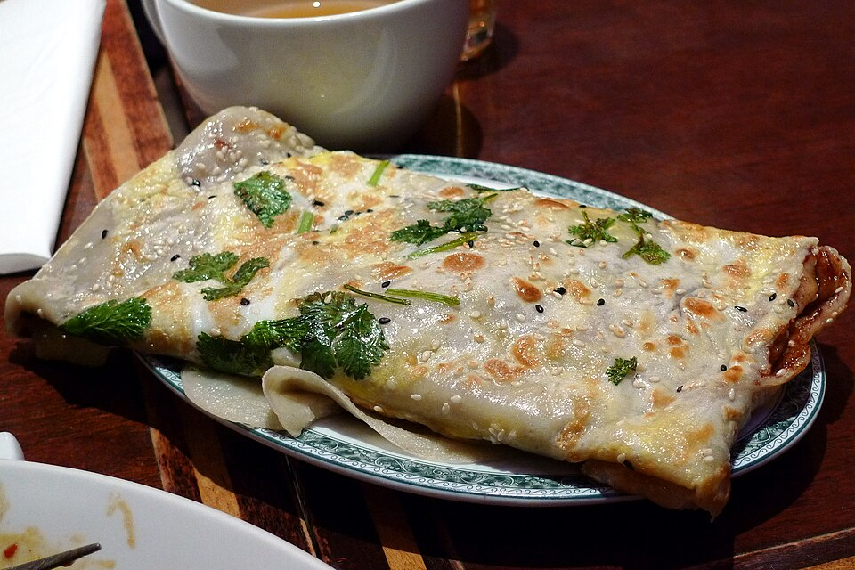

# 鸡蛋饼 | Chinese Egg Pancake

> ⏱ 准备 3分钟 + 烹饪 5分钟 | 💰 ~$1/份 | 🏷️ 早餐、快手、全超市可买

  

> 中国版 pancake——面粉+鸡蛋+葱花，搅一搅煎一煎，5分钟出锅。比美式 pancake 更香更有嚼劲，可甜可咸。赶课的早晨，这是你最快的热早餐选择。
>
> *The Chinese pancake — flour, eggs, and scallions, stirred together and pan-fried in 5 minutes. More savory and chewy than American pancakes, it can go sweet or savory. On rushed mornings before class, this is your fastest hot breakfast option.*

---

## 食材 | Ingredients

| 食材 | Ingredient | 用量 / Amount |
|------|-----------|---------------|
| 面粉 | All-purpose flour | 1/2杯 / 1/2 cup |
| 鸡蛋 | Eggs | 2个 / 2 |
| 葱花 | Chopped scallion | 2汤匙 / 2 tbsp |
| 水 | Water | 1/3杯 / 1/3 cup |
| 盐 | Salt | 1/4茶匙 / 1/4 tsp |
| 植物油 | Vegetable oil | 少许 / a little |

---

## 做法 | Directions

### 1. 调面糊 | Mix Batter
碗中打入鸡蛋，加面粉、水和盐搅匀至无颗粒。加入葱花。面糊应该像稀酸奶的浓度。

Beat eggs in a bowl. Add flour, water, and salt. Whisk until smooth with no lumps. Stir in scallions. Batter should be the consistency of thin yogurt.

### 2. 煎 | Pan-fry
不粘锅刷薄油，中火加热。倒入一半面糊，转动锅子让面糊铺满锅底。煎2分钟至底面金黄，翻面再煎1分钟。

Lightly oil a non-stick pan over medium heat. Pour in half the batter, tilting the pan to spread evenly. Cook 2 minutes until the bottom is golden. Flip and cook 1 more minute.

### 3. 吃 | Eat
可以直接吃，也可以刷甜面酱/辣酱卷起来吃。

Eat as-is, or brush with hoisin/chili sauce and roll up.

---

## 要点 | Tips

| 要点 | Tip |
|------|-----|
| 面糊不要太稠，要能流动 | Batter shouldn't be thick — it should flow easily |
| 中火慢煎，大火会外焦里生 | Medium heat for even cooking — high heat burns the outside |
| 加火腿丁或芝士更丰富 | Add diced ham or cheese for a heartier version |

---

## 替代食材 | American Substitutions

| 原料 | Ingredient | 替代 / Substitute | 备注 / Notes |
|------|-----------|-------------------|--------------|
| 面粉 | All-purpose flour | 任何超市 / Any supermarket | — |
| 鸡蛋 | Eggs | 任何超市 / Any supermarket | — |
| 葱 | Scallion | 任何超市 / Any supermarket | — |
