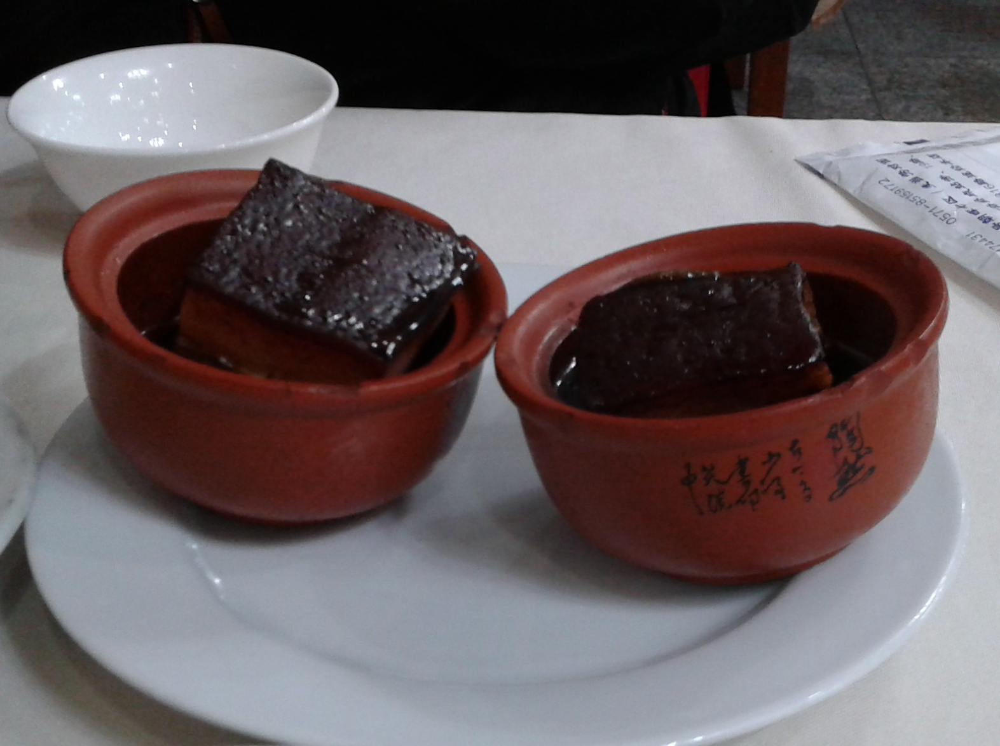

# 东坡肉 | Dongpo Braised Pork

> ⏱ 准备 20分钟 + 烹饪 3.5小时 | 💰 ~$8/份 (~$4 with Costco pork belly) | 🏷️ 经典、周末项目、一锅出

  

> 以北宋文学家苏东坡命名，相传苏轼被贬杭州时所创。选用五花肉，经焯水、煎制、慢炖而成，色如玛瑙，肥而不腻，入口即化。
>
> *Named after the great Song Dynasty poet Su Dongpo, who is said to have created this dish during his time as governor of Hangzhou. Pork belly is blanched, seared, and slow-braised until it gleams like agate — rich yet never greasy, melting on the tongue.*

---

## 食材 | Ingredients

| 食材 | Ingredient | 用量 / Amount |
|------|-----------|---------------|
| 五花肉 | Pork belly (skin-on) | 1000g |
| 绍兴黄酒 | Shaoxing yellow wine | 250ml |
| 酱油 | Soy sauce | 4汤匙 / 4 tbsp |
| 老抽 | Dark soy sauce | 1汤匙 / 1 tbsp |
| 冰糖 | Rock sugar | 50g |
| 姜 | Ginger | 4片 / 4 slices |
| 葱 | Scallion | 4根 / 4 stalks |

---

## 做法 | Directions

### 1. 焯水 | Blanch
五花肉整块冷水下锅，焯水10分钟，捞出切成约5cm见方的块。

Place the whole pork belly in cold water. Bring to a boil and blanch for 10 minutes. Remove and cut into ~5 cm cubes.

### 2. 摆锅 | Arrange in Pot
砂锅底铺上葱段和姜片，将肉块皮朝下整齐摆入。

Line the bottom of a clay pot with scallion segments and ginger slices. Place pork cubes skin-side down in a single layer.

### 3. 调味慢炖 | Season & Slow-Braise
加入黄酒、酱油、老抽、冰糖，液面没过肉的三分之二。大火烧开后，转最小火，加盖慢炖2小时。

Add Shaoxing wine, soy sauce, dark soy sauce, and rock sugar. The liquid should cover two-thirds of the meat. Bring to a boil, then reduce to the lowest heat. Cover and braise for 2 hours.

### 4. 翻面续炖 | Flip & Continue
将肉块翻面（皮朝上），继续小火炖1小时。

Flip each piece skin-side up and continue braising on low heat for another hour.

### 5. 蒸制 | Final Steam
取出肉块装入小碗，浇上汤汁，上蒸锅蒸30分钟即可。

Transfer each piece into an individual bowl. Spoon braising liquid over the top. Steam for 30 minutes.

---

## 要点 | Tips

| 要点 | Tip |
|------|-----|
| 选三层分明的五花肉，肥瘦比约 6:4 | Choose pork belly with distinct layers; fat-to-lean ratio ≈ 6:4 |
| 黄酒要用绍兴黄酒，是灵魂所在 | Must use Shaoxing yellow wine — it is the soul of the dish |
| 全程小火慢炖 | Low and slow the entire time |
| "慢着火，少着水，火候足时它自美" — 苏东坡 | *"Gentle flame, little water — when the heat is right, beauty comes on its own."* — Su Dongpo |
| 最后蒸制是关键一步，使肉质更加酥烂 | The final steaming is essential — it renders the meat supremely tender |

---

## 替代食材 | American Substitutions

| 原料 | Ingredient | 替代 / Substitute | 备注 / Notes |
|------|-----------|-------------------|--------------|
| 五花肉 (带皮) | Pork belly (skin-on) | Costco 有带皮五花肉；亚洲超市必有 | Must have skin on — ask the butcher if not displayed |
| 绍兴黄酒 | Shaoxing yellow wine | Dry sherry (Fino or Amontillado) | ⚠️ 切勿用标注 "cooking wine" 的产品，含盐 / Never use salted "cooking wine" |
| 老抽 | Dark soy sauce | Lee Kum Kee 品牌，Walmart/Target 有售 | 或普通酱油+少许糖蜜 / Or regular soy + a touch of molasses |
| 冰糖 | Rock sugar | 白砂糖 (granulated sugar)，用量减30% | 亚洲超市有冰糖 / Rock sugar available at Asian markets |
| 砂锅 | Clay pot | Dutch oven (Le Creuset / Lodge) | 铸铁锅效果也很好 / Cast iron works great |
