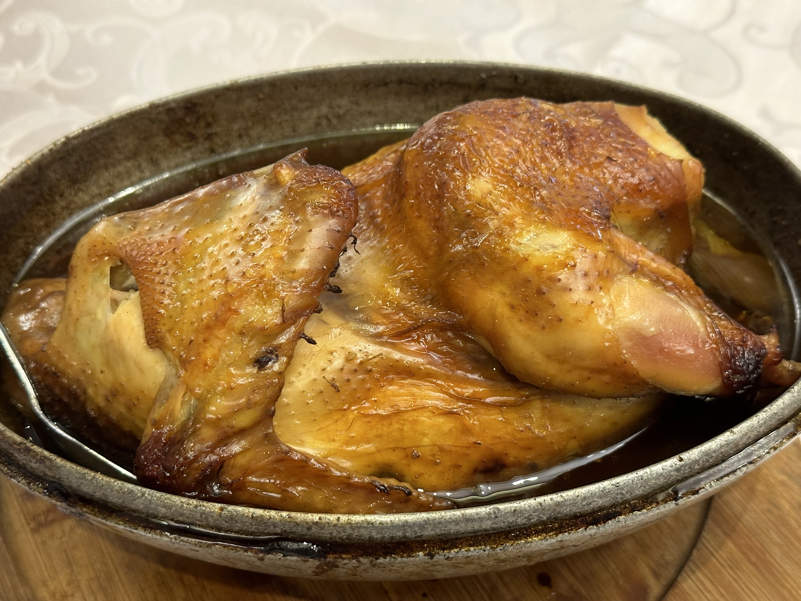

# 叫化童鸡 | Beggar's Chicken

> ⏱ 准备 30分钟 + 烹饪 3小时 | 💰 ~$6/份 | 🏷️ 经典、周末项目、烤箱

  

> 相传古时一乞丐偶得一鸡，苦无炊具，遂以泥裹之投入火中烧烤，剥去泥壳后鸡肉异香扑鼻。后经历代厨师改良，以荷叶包裹、酥泥封烤，成为杭州名菜。
>
> *Legend has it that a beggar once stole a chicken but had no pot to cook it. He wrapped it in mud and roasted it in a fire — when the clay was cracked open, the aroma was irresistible. Refined over centuries by Hangzhou chefs, the dish now uses lotus leaves and clay to seal in extraordinary flavor.*

---

## 食材 | Ingredients

| 食材 | Ingredient | 用量 / Amount |
|------|-----------|---------------|
| 嫩母鸡 | Young hen (or Cornish game hen) | 1只 (~1.5kg) |
| 干荷叶 | Dried lotus leaves | 2-3张 / 2-3 sheets |
| 五花肉丁 | Diced pork belly | 100g |
| 香菇 | Dried shiitake mushrooms | 5朵 / 5 pieces |
| 绍兴黄酒 | Shaoxing yellow wine | 3汤匙 / 3 tbsp |
| 酱油 | Soy sauce | 2汤匙 / 2 tbsp |
| 老抽 | Dark soy sauce | 1汤匙 / 1 tbsp |
| 白糖 | Sugar | 1汤匙 / 1 tbsp |
| 姜 | Ginger | 3片 / 3 slices |
| 葱 | Scallion | 2根 / 2 stalks |
| 盐 | Salt | 适量 / to taste |
| 五香粉 | Five-spice powder | 1茶匙 / 1 tsp |
| 面粉 | Flour (for sealing dough) | 500g |

---

## 做法 | Directions

### 1. 腌制 | Marinate
将鸡洗净擦干，内外均匀抹上盐、酱油、老抽、黄酒和五香粉，腌制2小时以上。

Clean and dry the chicken. Rub inside and out with salt, soy sauce, dark soy sauce, Shaoxing wine, and five-spice powder. Marinate for at least 2 hours.

### 2. 制馅 | Prepare the Filling
五花肉丁、泡发切丁的香菇加少许酱油和黄酒炒香，塞入鸡腹中。

Dice the pork belly and rehydrated shiitake mushrooms. Stir-fry briefly with soy sauce and wine, then stuff into the chicken cavity.

### 3. 包裹 | Wrap
干荷叶用温水泡软，将鸡用荷叶紧紧包裹两到三层。

Soak the dried lotus leaves in warm water until pliable. Wrap the chicken tightly in 2–3 layers of lotus leaves.

### 4. 封泥 | Seal with Dough
面粉加水和成较硬的面团，擀成大片，将荷叶鸡完全包裹密封。

Mix flour and water into a stiff dough. Roll it out and wrap the lotus-leaf bundle completely, sealing all seams.

### 5. 烤制 | Roast
放入预热至180°C (350°F) 的烤箱，烤约2.5-3小时，至面壳变硬呈金黄色。

Place in an oven preheated to 180°C (350°F). Roast for 2.5–3 hours until the dough shell is hard and golden.

### 6. 开壳上桌 | Crack & Serve
取出后用锤子敲开面壳，揭去荷叶，鸡肉香气四溢，肉质酥烂。

Crack the shell open at the table with a mallet. Peel away the lotus leaves — the chicken will be fall-off-the-bone tender and intensely fragrant.

---

## 要点 | Tips

| 要点 | Tip |
|------|-----|
| 鸡不宜过大，1.5kg左右最佳 | A smaller chicken (~1.5 kg / 3 lbs) cooks more evenly |
| 荷叶包裹要紧实，防止汁水外漏 | Wrap the lotus leaves tightly to trap all the juices |
| 面壳只是密封工具，不食用 | The dough shell is just a seal — it is not eaten |
| 可用锡纸辅助包裹增强密封 | A layer of foil under the dough helps ensure a tight seal |
| 烤制时间根据鸡的大小调整 | Adjust roasting time based on the size of the chicken |

---

## 替代食材 | American Substitutions

| 原料 | Ingredient | 替代 / Substitute | 备注 / Notes |
|------|-----------|-------------------|--------------|
| 嫩母鸡 | Young hen | Cornish game hen (2只) | 美国超市常见，每只约680g / Widely available, ~1.5 lbs each |
| 干荷叶 | Dried lotus leaves | Amazon/亚洲超市有售；或用 parchment paper + banana leaves | Parchment paper alone works in a pinch |
| 香菇 | Dried shiitake | 任何超市干货区 / Dried shiitake at any supermarket | — |
| 五香粉 | Five-spice powder | McCormick 牌在主流超市有售 / McCormick brand at most stores | — |
| 绍兴黄酒 | Shaoxing wine | Dry sherry (Fino) | 亚洲超市有正宗绍兴酒 / Asian markets carry the real thing |
