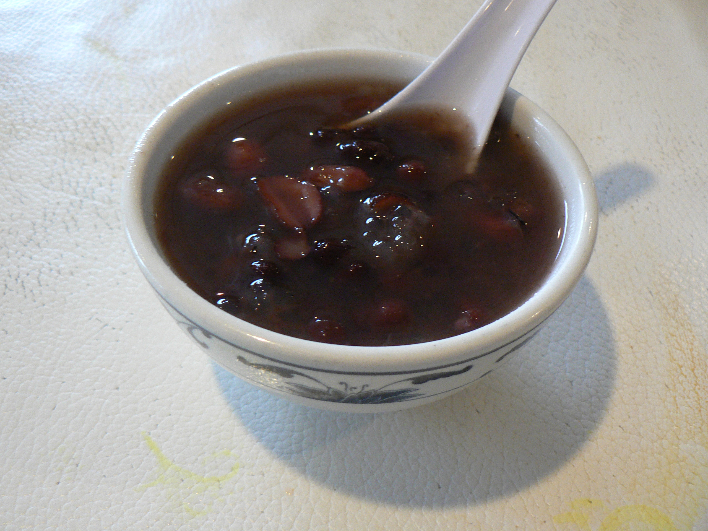

# 红豆汤 | Red Bean Sweet Soup

> ⏱ 准备 5分钟 + 烹饪 60分钟 (Instant Pot 25分钟) | 💰 ~$2/份 | 🏷️ 中式甜品、一锅出、暖心

  

> 中国人冬天最爱的甜汤——红豆煮到开花，加冰糖，甜蜜暖心。小时候妈妈煮的味道，在美国也能轻松复刻。红豆在亚洲超市、Amazon、甚至 Whole Foods 的 bulk bins 都能找到。
>
> *The classic Chinese winter comfort dessert — red beans simmered until they burst open, sweetened with rock sugar. The taste of mom's cooking. Red beans are available at Asian markets, Amazon, and even Whole Foods bulk bins.*

---

## 食材 | Ingredients

| 食材 | Ingredient | 用量 / Amount |
|------|-----------|---------------|
| 红豆 (小红豆/赤小豆) | Red beans (adzuki beans) | 1杯 / 1 cup (~200g) |
| 冰糖或白糖 | Rock sugar or white sugar | 50-80g (按甜度调整) |
| 水 | Water | 1000ml |
| 陈皮 (可选) | Dried tangerine peel (optional) | 1小片 / 1 small piece |

---

## 做法 | Directions

### 1. 泡豆 | Soak
红豆洗净，浸泡4小时或隔夜（缩短煮制时间）。

Rinse red beans and soak for 4 hours or overnight (reduces cooking time).

### 2. 煮 | Simmer
锅中加水和红豆（加陈皮如果有），大火烧开后转小火，煮45-60分钟至红豆软烂开花。

Add water and beans (plus tangerine peel if using) to a pot. Bring to a boil, reduce to low heat, and simmer 45–60 minutes until beans are soft and burst open.

**Instant Pot 快速版：** 高压25分钟，自然释压。

**Instant Pot shortcut:** High pressure 25 minutes, natural release.

### 3. 加糖 | Sweeten
加入冰糖搅匀，煮至糖完全融化。

Add rock sugar and stir until fully dissolved.

---

## 要点 | Tips

| 要点 | Tip |
|------|-----|
| 提前泡豆可以大幅缩短煮制时间 | Soaking drastically reduces cooking time |
| 糖要最后加，早加豆子煮不烂 | Add sugar at the END — adding early prevents beans from softening |
| 可以加汤圆/年糕/莲子一起煮 | Add glutinous rice balls, rice cakes, or lotus seeds for variety |
| 冷藏3天，热一热就能喝 | Keeps 3 days refrigerated — just reheat |

---

## 替代食材 | American Substitutions

| 原料 | Ingredient | 替代 / Substitute | 备注 / Notes |
|------|-----------|-------------------|--------------|
| 红豆 | Adzuki beans | 亚洲超市、Amazon、Whole Foods bulk bins | 不要用 kidney beans，完全不同 / NOT kidney beans |
| 冰糖 | Rock sugar | 白砂糖 / Granulated sugar | 用量减30% / Use 30% less |
