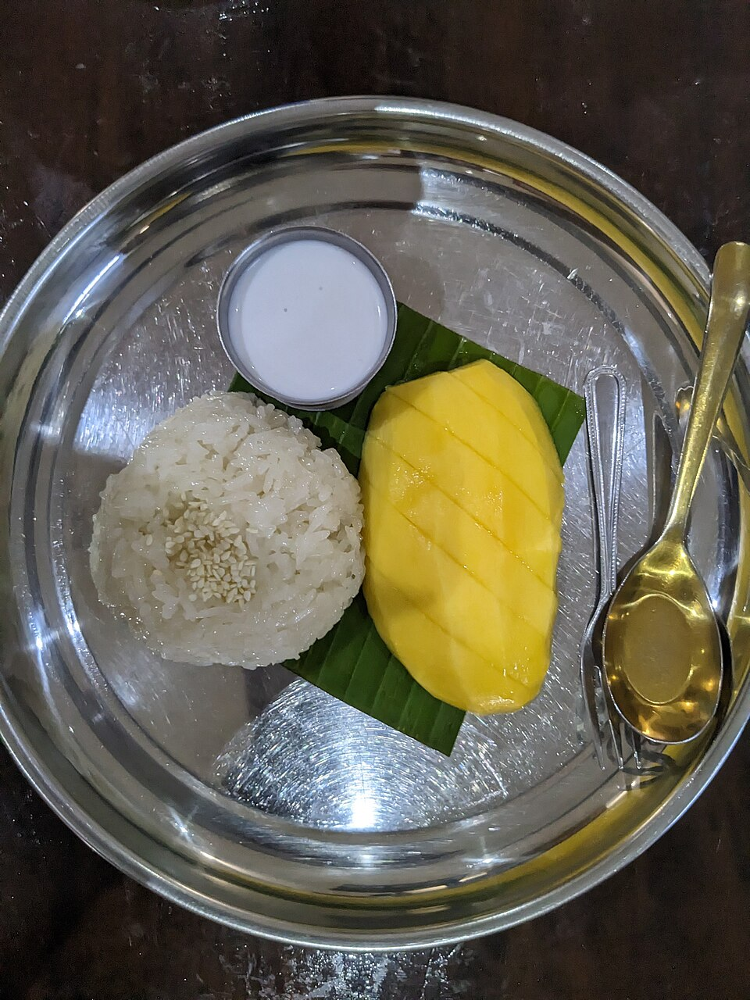

# 芒果糯米饭 | Mango Sticky Rice

> ⏱ 准备 10分钟 + 烹饪 25分钟 | 💰 ~$5/份 | 🏷️ 泰国甜品、全超市可买

  

> 泰餐厅最受欢迎的甜品，自己做成本只有外面的1/3。甜糯的椰奶糯米饭配上金黄的芒果，每一口都是热带的味道。关键食材只有三样：糯米、椰奶、芒果。
>
> *The most popular Thai restaurant dessert — homemade, it costs 1/3 of eating out. Sweet coconut sticky rice paired with golden mango, every bite tastes like the tropics. Just three key ingredients: sticky rice, coconut milk, and mango.*

---

## 食材 | Ingredients

| 食材 | Ingredient | 用量 / Amount |
|------|-----------|---------------|
| 糯米 | Sticky rice (glutinous rice) | 1杯 / 1 cup |
| 椰奶 | Coconut milk (full fat) | 1罐 (400ml / 13.5 oz) |
| 白糖 | Sugar | 4汤匙 / 4 tbsp |
| 盐 | Salt | 1/4茶匙 / 1/4 tsp |
| 芒果 | Ripe mango | 1-2个 / 1-2 |

---

## 做法 | Directions

### 1. 泡米 | Soak Rice
糯米洗净，浸泡至少4小时（或隔夜）。

Rinse sticky rice and soak for at least 4 hours (or overnight).

### 2. 蒸米 | Steam Rice
沥干糯米，放入蒸锅蒸20-25分钟至完全熟透。（也可用微波炉：加等量水，高火8分钟。）

Drain and steam the rice for 20–25 minutes until fully cooked. (Microwave shortcut: add equal water, high power 8 minutes.)

### 3. 调椰奶酱 | Make Coconut Sauce
取2/3椰奶加入3汤匙糖和盐，小火加热至糖溶化（不要煮沸）。趁热倒入蒸好的糯米中，搅拌均匀，盖上盖子焖10分钟。

Heat 2/3 of the coconut milk with 3 tbsp sugar and salt on low until sugar dissolves (don't boil). Pour over the hot sticky rice, stir, cover, and let it absorb for 10 minutes.

### 4. 装盘 | Plate
芒果切片。糯米饭装盘，摆上芒果片，淋上剩余的1/3椰奶（加1汤匙糖搅匀）。

Slice the mango. Plate the sticky rice, arrange mango slices alongside, drizzle the remaining 1/3 coconut milk (mixed with 1 tbsp sugar) over the top.

---

## 要点 | Tips

| 要点 | Tip |
|------|-----|
| 糯米必须提前泡，否则蒸不透 | Sticky rice MUST be soaked in advance — it won't cook through otherwise |
| 椰奶要趁糯米热的时候倒入，才能吸收 | Pour coconut milk while rice is still hot — that's when it absorbs |
| 芒果要选熟透的，香甜软糯 | Choose very ripe mangoes — sweet and soft |
| 用全脂椰奶，低脂的味道差很多 | Use FULL FAT coconut milk — low-fat tastes nothing like it |

---

## 替代食材 | American Substitutions

| 原料 | Ingredient | 替代 / Substitute | 备注 / Notes |
|------|-----------|-------------------|--------------|
| 糯米 | Sticky rice | 亚洲超市/Amazon；Walmart 有时有 | 搜 "glutinous rice" 或 "sweet rice" |
| 椰奶 | Coconut milk | 任何超市罐头区 / Canned aisle | Thai Kitchen 或 Trader Joe's 品牌 |
| 芒果 | Mango | 任何超市 / Any supermarket | Ataulfo/Honey mango 最甜 |
