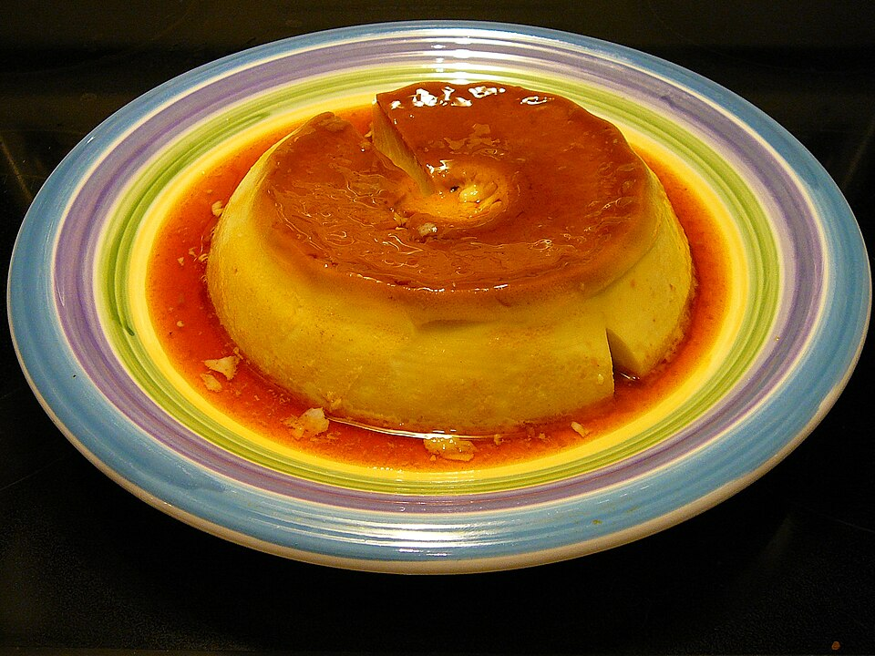

# 鸡蛋布丁 | Egg Pudding (Custard)

> ⏱ 准备 5分钟 + 烹饪 15分钟 + 冷藏 2小时 | 💰 ~$1.50/份 | 🏷️ 甜品、全超市可买、适合新手

  

> 比外面买的布丁好吃100倍，而且只要鸡蛋、牛奶和糖。口感嫩滑如丝绸，入口即化。做一批放冰箱，随时有甜品吃。这是最便宜的幸福感。
>
> *100x better than store-bought pudding, and it only needs eggs, milk, and sugar. Silky smooth, melts on the tongue. Make a batch, keep in the fridge, and you always have dessert on hand. The cheapest happiness money can buy.*

---

## 食材 | Ingredients

| 食材 | Ingredient | 用量 / Amount |
|------|-----------|---------------|
| 鸡蛋 | Eggs | 3个 / 3 |
| 牛奶 | Whole milk | 250ml / 1 cup |
| 白糖 | Sugar | 40g (~3 tbsp) |
| 香草精 (可选) | Vanilla extract (optional) | 1/2茶匙 / 1/2 tsp |

**焦糖底 (可选) / Caramel base (optional):**

| 食材 | Ingredient | 用量 / Amount |
|------|-----------|---------------|
| 白糖 | Sugar | 3汤匙 / 3 tbsp |
| 水 | Water | 1汤匙 / 1 tbsp |

---

## 做法 | Directions

### 1. 做焦糖 (可选) | Make Caramel (Optional)
小锅中放3汤匙糖和1汤匙水，中火加热不要搅拌，晃动锅子至糖融化变深琥珀色。倒入杯底。

Put 3 tbsp sugar and 1 tbsp water in a small pot. Heat on medium without stirring — just swirl the pan until sugar melts and turns dark amber. Pour into the bottom of cups/ramekins.

### 2. 调蛋液 | Mix Custard
鸡蛋打散（不要打出泡沫），加入糖搅匀。加入牛奶和香草精，搅匀。过滤一次（去掉蛋筋，口感更滑）。

Beat eggs gently (don't create foam). Stir in sugar until dissolved. Add milk and vanilla, mix. Strain once through a sieve (removes egg strands for smoother texture).

### 3. 蒸 | Steam
将蛋液倒入杯子/碗中，盖上保鲜膜或锡纸。放入蒸锅，中小火蒸12-15分钟至凝固（用牙签插入，不粘即可）。

Pour custard into cups/bowls. Cover with plastic wrap or foil. Steam on medium-low heat for 12–15 minutes until set (a toothpick should come out clean).

### 4. 冷藏 | Chill
取出放凉，冷藏2小时以上。冰凉后食用最佳。

Let cool, then refrigerate for 2+ hours. Best served cold.

---

## 要点 | Tips

| 要点 | Tip |
|------|-----|
| 蛋液要过滤，口感天差地别 | Strain the custard — it makes a massive difference in smoothness |
| 蒸的时候火不能太大，否则会有气孔 | Don't steam on high heat — you'll get air bubbles |
| 盖锡纸防止水蒸气滴入 | Cover with foil to prevent water drips from ruining the surface |
| 用全脂牛奶，低脂的不够浓郁 | Use whole milk — low-fat won't be rich enough |

---

## 替代食材 | American Substitutions

| 原料 | Ingredient | 替代 / Substitute | 备注 / Notes |
|------|-----------|-------------------|--------------|
| 鸡蛋 | Eggs | 任何超市 / Any supermarket | — |
| 牛奶 | Whole milk | 任何超市 / Any supermarket | 全脂！/ Whole fat! |
| 香草精 | Vanilla extract | 任何超市烘焙区 / Baking aisle | — |
