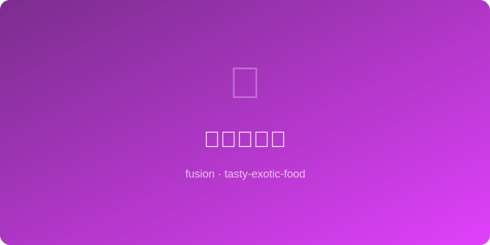

# 五香烤坚果 | Five-Spice Roasted Nuts

  

> 🤖 AI Original — 中式五香遇上混合坚果的酥脆派对

---

## 基本信息

- **难度**: ⭐ 超简单
- **时间**: 25 分钟
- **份量**: 约 400g
- **类型**: 零食 / 下酒菜

---

## 食材清单

| 食材 | 用量 | 备注 |
|------|------|------|
| 混合坚果 | 300g | 腰果、杏仁、核桃、花生 |
| 五香粉 | 1 大勺 | 现磨更香 |
| 蛋清 | 1 个 | 帮助调料附着 |
| 红糖 | 2 大勺 | 增加焦糖感 |
| 盐 | 1 小勺 | 海盐更佳 |
| 酱油 | 1 小勺 | 提鲜增色 |
| 辣椒粉 | 1/2 小勺 | 可选，微辣 |
| 白胡椒粉 | 1/4 小勺 | 增加层次 |

---

## 制作步骤

1. **烤箱预热** 至 160°C（320°F），烤盘铺烘焙纸。
2. **蛋清打发**: 蛋清打至起泡但不成型，加入酱油搅匀。
3. **混合调料**: 另一碗中将五香粉、红糖、盐、辣椒粉、白胡椒粉混合。
4. **裹衣**: 坚果倒入蛋清液中拌匀，再倒入调料碗中充分翻拌，使每颗坚果裹满调料。
5. **铺烤**: 单层平铺在烤盘上，颗粒间保持间距。
6. **烘烤**: 烤 20 分钟，中途取出翻拌一次（第 10 分钟时）。
7. **冷却**: 出炉后在烤盘上完全冷却，坚果会变得更加酥脆。

---

## 小贴士

- 坚果种类可以随意搭配，加入南瓜子或夏威夷果也很棒。
- 低温慢烤是关键，温度过高容易外焦里生。
- 完全冷却后装入密封罐，可保存 2 周。
- 可作为沙拉配料撒在蔬菜沙拉上，口感丰富。

---

*🤖 AI Original Recipe — 五香粉的温暖芬芳裹挟每一颗坚果，是追剧、佐酒、待客的万能小食。*
