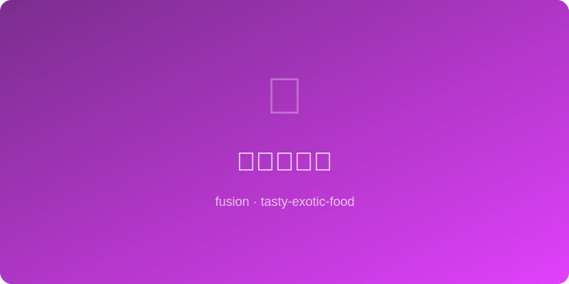

# 五香烤红薯 | Five-Spice Roasted Sweet Potato

  

> **AI Original** - Caramelized sweet potato wedges perfumed with warm Chinese five-spice

---

## 基本信息 | Basic Info

| 项目 | 详情 |
|------|------|
| 份量 Serves | 3-4人份 |
| 准备时间 Prep | 10分钟 |
| 烹饪时间 Cook | 35分钟 |
| 难度 Difficulty | ★☆☆☆☆ |

---

## 食材 | Ingredients

- 红薯 sweet potato — 2个大的（约600g）
- 五香粉 five-spice powder — 1茶匙
- 橄榄油 olive oil — 2大匙
- 蜂蜜 honey — 1大匙
- 海盐 sea salt — 3/4茶匙
- 黑胡椒 black pepper — 1/2茶匙
- 蒜粉 garlic powder — 1/2茶匙
- 葱花 scallion — 适量（装饰）
- 酸奶油 sour cream — 可选搭配

---

## 做法 | Instructions

1. **预热烤箱** — 210°C (410°F)，烤盘铺烘焙纸。
2. **切块** — 红薯洗净不去皮，切成均匀楔形块或厚片。
3. **调味** — 红薯块放大碗中，加橄榄油、五香粉、蒜粉、盐、黑胡椒拌匀，确保每块都裹上调料。
4. **铺盘** — 切面朝下单层铺在烤盘上，不要重叠。
5. **烘烤** — 烤20分钟翻面，再烤12-15分钟至边缘焦脆、内部绵软。
6. **蜜汁** — 出炉趁热淋上蜂蜜，撒葱花，配酸奶油蘸食。

---

## 小贴士 | Tips

- 五香粉的桂皮、八角与红薯的天然甜味是经典组合。
- 切块大小尽量一致，确保均匀受热。
- 红薯不去皮，烤后皮会变脆，增加口感层次。
- 剩余的五香烤红薯可以做成沙拉或者拌入谷物碗中。
