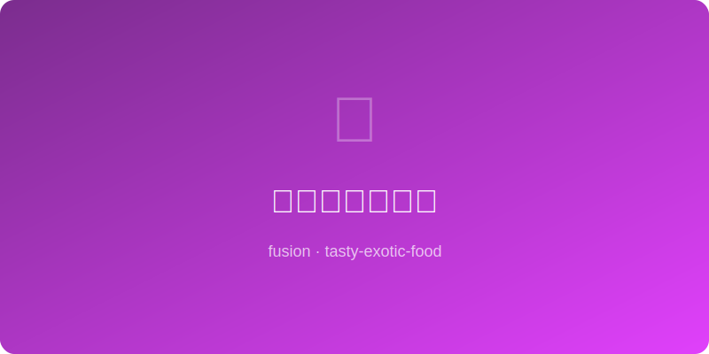

# 五香蜂蜜烤培根 | Five-Spice Honey Bacon

  

> 🤖 AI Original — 中式五香粉与蜂蜜为培根注入东方灵魂

---

## 基本信息

- **难度**: ⭐ 超简单
- **时间**: 25 分钟
- **份量**: 2-3 人份
- **类型**: 早餐 / 配菜

---

## 食材清单

| 食材 | 用量 | 备注 |
|------|------|------|
| 厚切培根 | 8 片 | 约 250g |
| 五香粉 | 1 大勺 | 现配更香 |
| 蜂蜜 | 2 大勺 | 涂面用 |
| 红糖 | 1 大勺 | 增加焦糖层次 |
| 黑胡椒 | 1/2 小勺 | 粗磨 |
| 辣椒碎 | 1/4 小勺 | 可选，微辣 |

---

## 制作步骤

1. **烤箱预热** 至 190°C（375°F），烤盘铺锡纸并放上烤网。
2. **调香料**: 五香粉、红糖、黑胡椒和辣椒碎混合均匀。
3. **涂蜜**: 培根排在烤网上，正面刷一层薄蜂蜜。
4. **撒料**: 均匀撒上混合香料粉，轻轻按压使其附着。
5. **烘烤**: 放入烤箱中层，烤 12 分钟。
6. **翻面**: 取出翻面，另一面也刷蜂蜜撒香料。
7. **再烤**: 继续烤 8-10 分钟，至培根焦脆呈深琥珀色。
8. **冷却**: 出炉后在烤网上静置 3 分钟，蜂蜜层会凝固变脆。

---

## 小贴士

- 五香粉的八角和桂皮香与猪肉天生是绝配。
- 最后几分钟注意观察，蜂蜜和红糖容易焦糊。
- 培根出炉后会变得更脆，不要等到全硬才出炉。
- 夹在鸡蛋三明治或汉堡里，瞬间提升整个早餐的档次。
- 也可以切碎撒在沙拉上做酥脆培根碎。

---

*🤖 AI Original Recipe — 五香粉的温暖辛香与蜂蜜的焦甜拥抱每一片培根，是中式卤味精神的西式表达。*
