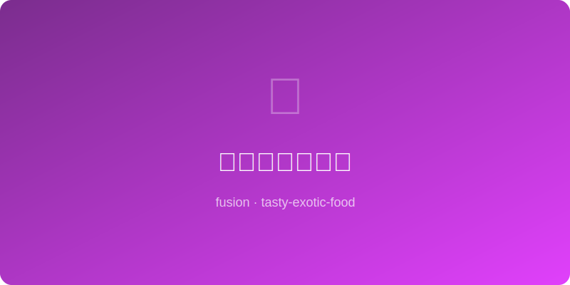

# 味噌枫糖烤核桃 Miso Maple Roasted Walnuts

  

> 日本 x 加拿大 | 零食/佐酒小食
> Japan x Canada | Snack / Bar Nibble

---

## 简介 Introduction

味噌的咸鲜与枫糖的焦甜是一对完美的跨文化拍档。白味噌带来柔和的发酵
鲜味（umami），加拿大枫糖浆提供了深沉的焦糖甜香，两者在烤箱的高温下
融合在核桃表面，形成一层又酥又粘的外壳。这款零食一旦开始就无法停下，
是聚会和佐酒的最佳拍档。

White miso's mellow umami and Canadian maple syrup's deep caramel sweetness
are a perfect cross-cultural match. Fused at high heat onto walnut surfaces,
they form a crispy-sticky shell. Once you start, you cannot stop — the
ultimate party snack and bar nibble.

---

## 食材 Ingredients

| 食材 Ingredient | 用量 Amount |
|---|---|
| 核桃仁 Walnut halves | 300g |
| 白味噌 White miso | 25g |
| 枫糖浆 Maple syrup | 40ml |
| 酱油 Soy sauce | 5ml |
| 植物油 Neutral oil | 15ml |
| 海盐片 Flaky sea salt | 3g |
| 七味粉（可选）Shichimi togarashi | 2g |
| 黑胡椒 Black pepper | 适量 / to taste |

---

## 做法 Instructions

1. **预热 Preheat**: 烤箱预热160°C，烤盘铺烘焙纸。
   Preheat oven to 160°C, line a baking sheet with parchment.

2. **调酱 Mix glaze**: 白味噌、枫糖浆、酱油和植物油混合搅拌至顺滑。
   Whisk miso, maple syrup, soy sauce, and oil until smooth.

3. **拌核桃 Coat walnuts**: 将酱汁倒入核桃中翻拌，确保每颗均匀裹上。
   Pour glaze over walnuts, toss until every piece is evenly coated.

4. **铺排 Spread**: 单层铺在烤盘上，核桃之间留出空隙。
   Spread in a single layer with space between each walnut.

5. **烘烤 Bake**: 160°C烤15分钟，取出翻拌一次，再烤10分钟至深金色。
   Bake 15 min at 160°C, toss, return for 10 more min until deep golden.

6. **调味 Season**: 出炉立即撒海盐片、黑胡椒和七味粉。
   Immediately sprinkle flaky salt, black pepper, and shichimi.

7. **冷却 Cool**: 完全冷却后会变得更酥脆，密封保存可放一周。
   They crisp further as they cool. Store airtight up to one week.

---

*咸甜之间的完美平衡，东京的味噌遇上蒙特利尔的枫糖，一颗核桃撬动两个世界。*
*Perfect balance of salt and sweet — Tokyo miso meets Montreal maple, one walnut bridges two worlds.*
