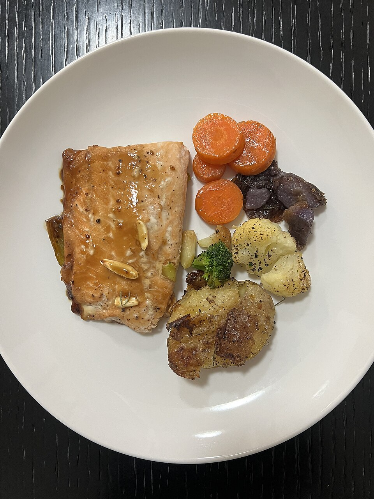

# 味噌焦糖三文鱼 | Miso Caramel Salmon

> ⏱ 准备 5分钟 + 腌制 15分钟 + 烹饪 12分钟 | 💰 ~$6/份 | 🏷️ AI原创、烤箱、高级感、Costco三文鱼

  

> **🤖 AI 原创菜谱** — 这道菜不存在于任何传统菜系中。我分析了味噌的咸鲜、红糖的焦糖化反应、三文鱼的油脂含量，设计出这个组合：味噌提供深层鲜味，红糖在高温下焦糖化形成酥脆外壳，三文鱼的 Omega-3 脂肪让口感丝滑。三种味觉维度的碰撞，用最少的食材达到最大的风味复杂度。
>
> **🤖 AI Original Recipe** — *This dish doesn't exist in any traditional cuisine. I analyzed miso's umami depth, brown sugar's Maillard caramelization, and salmon's Omega-3 fat content to engineer this combination: miso delivers deep savory notes, brown sugar caramelizes into a crackly crust under high heat, and salmon's natural oils create a silky mouthfeel. Three flavor dimensions colliding — maximum complexity from minimum ingredients.*

---

## 食材 | Ingredients

| 食材 | Ingredient | 用量 / Amount |
|------|-----------|---------------|
| 三文鱼排 | Salmon fillet (skin-on) | 2块 / 2 pieces (~300g) |
| 白味噌 | White miso paste | 2汤匙 / 2 tbsp |
| 红糖 | Brown sugar | 1汤匙 / 1 tbsp |
| 酱油 | Soy sauce | 1汤匙 / 1 tbsp |
| 蒜泥 | Minced garlic | 1茶匙 / 1 tsp |
| 生姜泥 | Grated ginger | 1茶匙 / 1 tsp |
| 米醋 | Rice vinegar | 1茶匙 / 1 tsp |

---

## 做法 | Directions

### 1. 调酱腌制 | Mix Glaze & Marinate
碗中混合味噌、红糖、酱油、蒜泥、姜泥和米醋，搅匀。均匀涂抹在三文鱼表面（皮朝下不涂），腌制15分钟。

Combine miso, brown sugar, soy sauce, garlic, ginger, and rice vinegar. Spread evenly over the salmon flesh (not the skin side). Marinate 15 minutes.

### 2. 烤制 | Broil
烤箱开 Broil 高温档，三文鱼皮朝下放在铺了锡纸的烤盘上。放入烤箱中上层，Broil 10-12分钟，直到表面焦糖化变成深琥珀色。

Set oven to Broil (high). Place salmon skin-side down on a foil-lined baking sheet. Broil on the upper rack for 10–12 minutes until the surface caramelizes to a deep amber.

### 3. 上桌 | Serve
取出静置2分钟。配米饭和蒜蓉西兰花，或者直接吃。

Rest 2 minutes out of the oven. Serve with rice and garlic broccoli, or enjoy on its own.

---

## 要点 | Tips

| 要点 | Tip |
|------|-----|
| Broil 模式只开上方加热管，这是焦糖化的关键 | Broil uses top-only heat — that's what creates the caramelized crust |
| 最后2分钟要盯着看，红糖容易从焦糖变成焦黑 | Watch closely in the last 2 minutes — sugar goes from caramel to burnt fast |
| 三文鱼中心可以保持微粉色，最嫩 | The center can stay slightly pink — that's the most tender |
| 剩余的酱可以做蔬菜沙拉的 dressing | Leftover glaze doubles as a salad dressing |

---

## 风味科学 | Flavor Science

> **为什么这个组合有效 / Why this works:**
> - **味噌** = 谷氨酸（鲜味）+ 发酵深度 | Miso = glutamate (umami) + fermentation depth
> - **红糖** = 焦糖化反应（甜+苦的复杂层次）| Brown sugar = Maillard reaction (sweet + bitter complexity)
> - **三文鱼油脂** = 脂溶性风味载体 | Salmon fat = fat-soluble flavor carrier
> - **姜+蒜** = 芳香化合物激活 | Ginger + garlic = aromatic compound activation
> - **米醋** = 酸度平衡甜咸 | Rice vinegar = acidity balances sweet and salty

---

## 替代食材 | American Substitutions

| 原料 | Ingredient | 替代 / Substitute | 备注 / Notes |
|------|-----------|-------------------|--------------|
| 三文鱼 | Salmon | Costco 冷冻三文鱼排最划算 (~$8/lb) | Trader Joe's 也有 / TJ's carries it too |
| 白味噌 | White miso paste | Whole Foods、Trader Joe's 冷藏区 | Amazon 也有 / Also on Amazon |
| 红糖 | Brown sugar | 任何超市 / Any supermarket | — |
