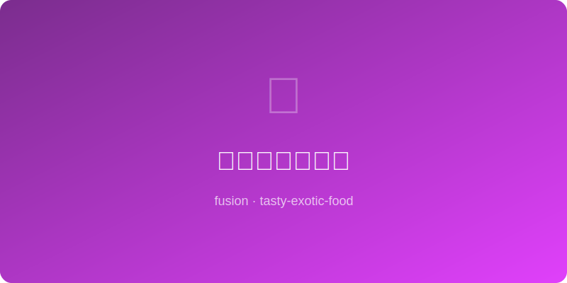

# 味噌焦糖布朗尼 | Miso Caramel Brownies

  

> ⏱ 准备 15分钟 + 烹饪 25分钟 | 💰 ~$5/份(9块) | 🏷️ 🤖AI原创、烤箱、甜品、进阶

> **🤖 AI 原创菜谱** — 在经典布朗尼面糊中加入味噌焦糖漩涡，每一口都是"甜-苦-鲜"三重奏。味噌的发酵鲜味让巧克力的苦甜变得更有层次，焦糖的甜在味噌的咸衬托下更加明亮——这是一款需要你闭眼品味的布朗尼。
> **🤖 AI Original Recipe** — *Swirl miso caramel into classic brownie batter for a "sweet-bitter-umami" trio in every bite. Miso's fermented depth adds dimension to chocolate's bittersweet, and caramel's sweetness shines brighter against miso's salt — a brownie that demands you close your eyes and taste.*

---

## 食材 | Ingredients

| 食材 | Ingredient | 用量 / Amount |
|------|-----------|---------------|
| 黑巧克力 | Dark chocolate | 150g / 5 oz |
| 黄油 | Unsalted butter | 115g / 1/2 cup |
| 糖 | Granulated sugar | 150g / 3/4 cup |
| 鸡蛋 | Eggs | 2个 / 2 |
| 中筋面粉 | All-purpose flour | 60g / 1/2 cup |
| 白味噌 | White miso paste | 2汤匙 / 2 tbsp |
| 焦糖酱 | Caramel sauce | 3汤匙 / 3 tbsp |
| 海盐片 | Flaky sea salt | 适量 / for topping |

---

## 做法 | Directions

### 1. 做味噌焦糖 | Make Miso Caramel
焦糖酱微波20秒加热，搅入味噌至完全融合。备用。

Warm caramel sauce 20 seconds in microwave, whisk in miso until fully combined. Set aside.

### 2. 做布朗尼糊 | Make Brownie Batter
巧克力和黄油隔水融化。加糖搅匀，逐个加蛋搅拌，筛入面粉拌匀。

Melt chocolate and butter together. Stir in sugar, add eggs one at a time, fold in flour.

### 3. 组装烤制 | Swirl & Bake
面糊倒入铺了烘焙纸的8寸方烤盘。将味噌焦糖一匙一匙滴在表面，用筷子画"之"字形拉出漩涡。撒海盐。175°C (350°F) 烤22-25分钟。

Pour batter into a parchment-lined 8-inch square pan. Dollop miso caramel on top and use a chopstick to create "Z" pattern swirls. Sprinkle sea salt. Bake at 175°C (350°F) for 22–25 min.

### 4. 冷却切块 | Cool & Cut
完全冷却后再切（至少30分钟），切成9块。

Cool completely before cutting (at least 30 min). Slice into 9 squares.

---

## 风味科学 | Flavor Science

> **为什么味噌+巧克力+焦糖是终极三角 / Why this works:**
> 三种食材分别代表三种"发酵/加热产物"的风味维度：味噌的谷氨酸（鲜味发酵），巧克力的可可碱+苯乙胺（烘焙发酵），焦糖的呋喃酮+麦芽酚（糖热分解）。当这三种化学反应的产物在口腔中相遇，它们激活了鲜味、苦味、甜味三种受体的协同效应——你的味觉系统被"全频段"刺激，产生比任何单一维度都强烈得多的愉悦信号。海盐的钠离子进一步放大了谷氨酸的鲜味感知。
>
> *Three ingredients represent three "fermentation/heating" flavor dimensions: miso's glutamate (umami fermentation), chocolate's theobromine + phenylethylamine (roast fermentation), caramel's furaneol + maltol (sugar thermolysis). When these three chemical reaction products meet on the palate, they activate umami, bitter, and sweet receptors synergistically — your taste system gets "full-spectrum" stimulation, producing pleasure signals far more intense than any single dimension. Sodium from sea salt further amplifies glutamate's umami perception.*

---

## 要点 | Tips

| 要点 | Tip |
|------|-----|
| 漩涡不要拉太多次，3-4下就够 | Don't over-swirl — 3-4 strokes are enough |
| 宁可少烤不要多烤，中心微湿才是fudgy | Underbake slightly — moist center = fudgy perfection |
| 冷透了再切，热的时候切会碎 | Cool COMPLETELY before cutting — hot brownies crumble |
| 冷藏后口感更密实，像生巧克力 | Refrigerated brownies are even denser — like nama chocolate |

---

## 替代食材 | American Substitutions

| 原料 | Ingredient | 替代 / Substitute | 备注 / Notes |
|------|-----------|-------------------|--------------|
| 白味噌 | White miso | Trader Joe's / Whole Foods ~$4 | 不要用红味噌，太咸 |
| 焦糖酱 | Caramel sauce | Trader Joe's fleur de sel caramel ~$4 | 超市烘焙区也有 |
| 黑巧克力 | Dark chocolate | Ghirardelli 60-70%, 任何超市 | Baker's chocolate 也行 |
