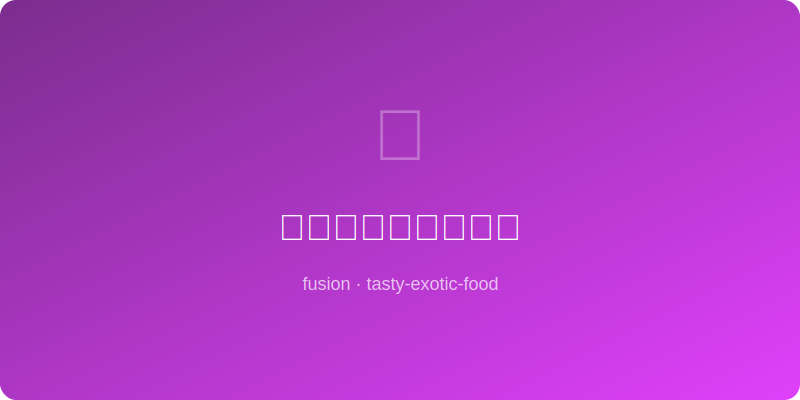

# 味噌焦糖核桃布朗尼 | Miso Walnut Brownie

  

> ⏱ 准备 20分钟 + 烹饪 25分钟 | 💰 ~$5/批(9块) | 🏷️ 融合创意、AI原创、烘焙、甜点

> 白味噌加入巧克力布朗尼面糊中，带来一种说不出但上瘾的咸鲜底味，让巧克力的风味更深邃复杂。顶部的焦糖核桃提供嘎嘣脆的口感对比——这不是普通的布朗尼，这是你吃过之后所有其他布朗尼都会变得无聊的那种。
>
> *White miso folded into chocolate brownie batter creates an indescribable but addictive savory undertone that deepens the chocolate flavor into something profound. Caramelized walnuts on top provide a crunchy contrast — this isn't just a brownie, it's the kind that makes every other brownie boring by comparison.*

---

## 食材 | Ingredients

| 食材 | Ingredient | 用量 / Amount |
|------|-----------|---------------|
| **布朗尼** | **Brownie** | |
| 黑巧克力 (70%) | Dark chocolate (70%) | 150g |
| 无盐黄油 | Unsalted butter | 100g |
| 白味噌 | White miso paste | 2汤匙 / 2 tbsp |
| 鸡蛋 | Eggs | 2个 / 2 |
| 红糖 | Brown sugar | 120g |
| 中筋面粉 | All-purpose flour | 60g |
| 可可粉 | Cocoa powder | 20g |
| 盐 | Salt | 1/4茶匙 / 1/4 tsp |
| **焦糖核桃** | **Caramel Walnuts** | |
| 核桃 | Walnuts | 80g，粗碎 / 80g, roughly broken |
| 糖 | Sugar | 30g |
| 水 | Water | 1汤匙 / 1 tbsp |

---

## 做法 | Directions

### 1. 融化巧克力 | Melt Chocolate
巧克力和黄油隔水融化搅匀，离火后加入味噌搅至完全融合，放凉。

Melt chocolate and butter over a double boiler. Off heat, whisk in miso until fully incorporated. Cool slightly.

### 2. 混合面糊 | Mix Batter
鸡蛋和红糖打至蓬松（约3分钟），倒入巧克力味噌混合物搅匀。筛入面粉、可可粉和盐，翻拌至无干粉。

Beat eggs and brown sugar until fluffy (~3 min). Fold in chocolate-miso mixture. Sift in flour, cocoa, and salt. Fold until just combined.

### 3. 做焦糖核桃 | Caramelize Walnuts
小锅中糖和水中火煮至琥珀色，倒入核桃快速翻拌裹匀，倒在油纸上放凉掰碎。

Cook sugar and water in a small pan over medium heat until amber. Toss in walnuts, stir to coat, pour onto parchment and cool. Break into pieces.

### 4. 烤制 | Bake
面糊倒入20cm方形烤盘（铺油纸），顶部撒焦糖核桃碎轻按入面糊。175°C烤22-25分钟，插牙签带出湿润碎屑即可（不要烤干）。

Pour batter into a 20cm/8in square pan (lined with parchment). Press caramel walnut pieces into top. Bake at 175°C/350°F for 22-25 min — a toothpick should come out with moist crumbs (not dry).

---

## 要点 | Tips

| 要点 | Tip |
|------|-----|
| 味噌让你尝不出具体是什么，但就是更好吃——这就对了 | Miso adds depth you can't name but definitely taste — that's the point |
| 宁可underbake也不要overbake，冷却后会继续凝固 | Better underbaked than over — it firms up as it cools |
| 冷藏后口感更fudgy，室温更cakey，看你喜好 | Chilled = fudgier, room temp = cakier — your call |
| 顶部撒一点海盐片会让味道更跳 | A flaky salt finish makes the flavors pop even more |
