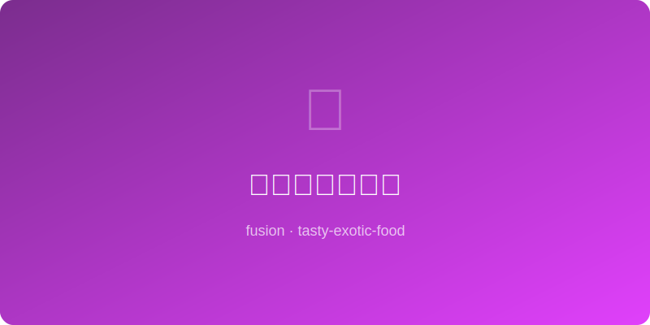

# 味噌焦糖烤坚果 | Miso Caramel Mixed Nuts

  

> ⏱ 准备5分+烹饪18分 | 💰~$8/份 | 🏷️ 创意融合、零食、日式

> **💡 灵感** — 味噌的深层鲜味与焦糖的酥脆甜蜜让混合坚果上瘾到无法停手。这道零食兼具日式居酒屋的咸香和西式焦糖坚果的颓废感，是配酒或下午茶的杀手级小食。
> **💡 Inspiration** — *Miso's deep umami and caramel's brittle sweetness make these mixed nuts dangerously addictive. Part izakaya salty snack, part Western caramel indulgence — a killer pairing for drinks or afternoon tea.*

---

## 食材 | Ingredients
| 食材 | Ingredient | 用量 / Amount |
|------|-----------|---------------|
| 混合坚果 | Mixed nuts | 250g / 2 cups |
| 白味噌 | White miso | 25g / 1½ tbsp |
| 黄油 | Butter | 30g / 2 tbsp |
| 红糖 | Brown sugar | 40g / 3 tbsp |
| 枫糖浆 | Maple syrup | 20ml / 4 tsp |
| 辣椒粉 | Cayenne pepper | 1g / ¼ tsp (optional) |
| 海盐片 | Flaky sea salt | 少许 / A pinch |

---

## 做法 | Directions
### 1. 做味噌焦糖 | Make Miso Caramel
小锅融化黄油，加红糖和枫糖浆搅至起泡，离火拌入味噌和辣椒粉搅匀。Melt butter in a small pan, stir in brown sugar and maple syrup until bubbling, remove from heat and whisk in miso and cayenne.

### 2. 拌坚果 | Coat Nuts
混合坚果倒入味噌焦糖中翻拌，确保每颗都裹满酱汁。Toss mixed nuts into miso caramel, stir until every nut is coated.

### 3. 烤制 | Bake
铺在油纸烤盘上，烤箱170°C烤15-18分钟，每5分钟翻拌一次防粘连，烤至深金色。Spread on a parchment-lined sheet, bake at 340°F for 15-18 minutes, toss every 5 minutes to prevent sticking, until deep golden.

### 4. 冷却上桌 | Cool & Serve
出炉立刻撒海盐片，冷却至室温后变得酥脆。密封保存可放10天。Sprinkle flaky salt immediately, cool to room temperature for maximum crunch. Store airtight up to 10 days.

---

## 替代食材 | American Substitutions
| 原料 | Ingredient | 替代 / Substitute | 备注 / Notes |
|------|-----------|-------------------|-------------|
| 白味噌 | White miso | Yellow miso (减量) | 咸度更高 / Saltier, use less |
| 枫糖浆 | Maple syrup | Honey | 甜度更高 / Sweeter |
| 混合坚果 | Mixed nuts | 单一坚果均可 / Any single nut | 核桃或腰果最佳 / Walnuts or cashews best |
