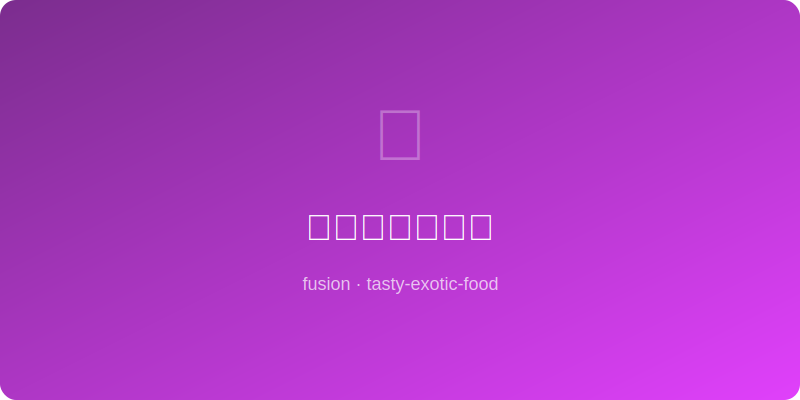

# 味噌焦糖烤苹果 | Miso Caramel Baked Apple

  

> ⏱ 准备10分+烹饪30分 | 💰~$6/份 | 🏷️ 创意融合、甜品、日式

> **💡 灵感** — 白味噌的咸鲜与焦糖的甜蜜碰撞，让普通烤苹果变成一道咸甜平衡的惊艳甜品。味噌中的氨基酸在高温下产生深层焦香，是日式与西式烘焙的完美交汇点。
> **💡 Inspiration** — *White miso's savory umami meets sweet caramel, transforming a simple baked apple into a stunningly balanced dessert. Miso's amino acids caramelize deeply at high heat — a perfect East-meets-West baking crossover.*

---

## 食材 | Ingredients
| 食材 | Ingredient | 用量 / Amount |
|------|-----------|---------------|
| 富士苹果 | Fuji apple | 4个 / 4 pcs |
| 白味噌 | White miso | 30g / 2 tbsp |
| 黄油 | Butter | 50g / 3½ tbsp |
| 红糖 | Brown sugar | 60g / ¼ cup |
| 淡奶油 | Heavy cream | 60ml / ¼ cup |
| 核桃碎 | Chopped walnuts | 30g / 3 tbsp |
| 肉桂粉 | Cinnamon | 2g / ½ tsp |
| 海盐片 | Flaky sea salt | 少许 / A pinch |

---

## 做法 | Directions
### 1. 处理苹果 | Prep Apples
苹果从顶部挖去果核（不要穿底），内壁撒少许肉桂粉。Core apples from the top (don't cut through the bottom), dust insides with cinnamon.

### 2. 做味噌焦糖 | Make Miso Caramel
小锅中融化黄油，加红糖搅拌至起泡，加入淡奶油搅匀，离火后拌入白味噌，搅至丝滑。Melt butter in a small saucepan, stir in brown sugar until bubbling, add cream and stir, remove from heat and whisk in miso until silky smooth.

### 3. 烤制 | Bake
苹果放烤盘，每个中间填入核桃碎，浇满味噌焦糖酱，烤箱180°C烤25-30分钟至苹果软透起皱。Place apples in a baking dish, fill centers with walnuts, pour miso caramel over each, bake at 350°F for 25-30 minutes until apples are soft and wrinkled.

### 4. 上桌 | Serve
趁热上桌，再淋一勺锅底焦糖汁，撒海盐片提味。可搭配香草冰淇淋。Serve hot, spoon extra caramel from the pan over top, finish with flaky sea salt. Pair with vanilla ice cream.

---

## 替代食材 | American Substitutions
| 原料 | Ingredient | 替代 / Substitute | 备注 / Notes |
|------|-----------|-------------------|-------------|
| 白味噌 | White miso | Yellow miso | 咸度略高，减量 / Saltier, use less |
| 富士苹果 | Fuji apple | Honeycrisp / Granny Smith | 酸甜均可 / Sweet or tart both work |
| 核桃 | Walnuts | Pecans | 同样出色 / Equally excellent |
