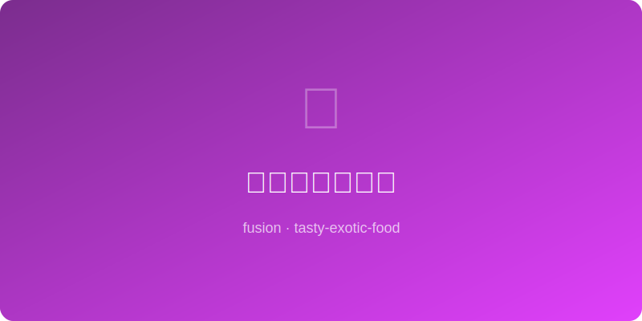

# 味噌芝麻沙拉酱 | Miso Sesame Dressing

  

> 🤖 AI Original — 万能百搭的日式风味沙拉酱，一瓶搞定所有沙拉

---

## 基本信息

- **难度**: ⭐ 超简单
- **时间**: 10 分钟
- **份量**: 约 250ml
- **类型**: 酱汁 / 调味

---

## 食材清单

| 食材 | 用量 | 备注 |
|------|------|------|
| 白味噌 | 2 大勺 | 信州味噌 |
| 芝麻酱 | 2 大勺 | 中式芝麻酱或 tahini |
| 米醋 | 2 大勺 | 温和酸度 |
| 酱油 | 1 大勺 | 生抽 |
| 蜂蜜 | 1 大勺 | 平衡咸酸 |
| 芝麻油 | 1 大勺 | 纯芝麻油 |
| 姜末 | 1 小勺 | 新鲜姜泥 |
| 温水 | 2-3 大勺 | 调节浓稠度 |
| 白芝麻 | 1 大勺 | 炒熟，拌入 |

---

## 制作步骤

1. **混合基底**: 碗中放入味噌和芝麻酱，先用少量温水搅开至顺滑无颗粒。
2. **加液体调料**: 依次加入米醋、酱油、蜂蜜和芝麻油，持续搅拌。
3. **加姜末**: 拌入新鲜姜末，充分混合。
4. **调浓度**: 根据需要逐勺加入温水，搅匀至可流动的酱汁稠度。
5. **加芝麻**: 拌入炒熟的白芝麻。
6. **试味调整**: 尝一下，偏咸加蜂蜜，偏甜加醋，偏淡加酱油。
7. **装瓶**: 倒入干净的玻璃瓶中密封保存。

---

## 推荐搭配

- **绿叶沙拉**: 生菜、芝麻菜、水菜搭配牛油果和小番茄。
- **谷物碗**: 糙米或藜麦碗上淋一勺，简餐立刻升级。
- **涮菜蘸料**: 烫青菜、白切肉蘸着吃非常开胃。
- **冷面调味**: 拌冷荞麦面或乌冬面，夏日必备。

---

## 小贴士

- 冷藏保存可放 1 周，每次使用前摇匀。
- 芝麻酱和味噌容易结块，一定要先用温水化开。
- 想要更浓郁可以增加芝麻酱比例。
- 可加入少许柚子汁或柠檬汁，增添清新感。

---

*🤖 AI Original Recipe — 味噌的鲜、芝麻的香、米醋的酸、蜂蜜的甜，四重奏调出一瓶百搭万能酱。*
