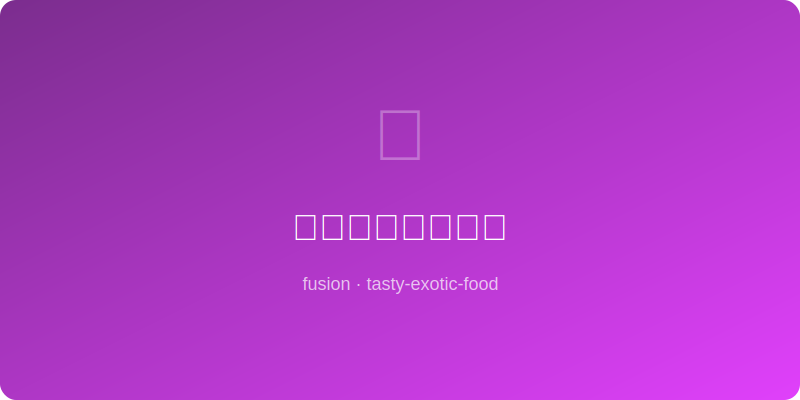

# 味噌蜂蜜烤三文鱼 | Miso Honey Glazed Salmon

  

> **AI Original** - Silky salmon fillet under a caramelized miso-honey glaze, umami at its finest

---

## 基本信息 | Basic Info

| 项目 | 详情 |
|------|------|
| 份量 Serves | 2人份 |
| 准备时间 Prep | 5分钟 + 腌制30分钟 |
| 烹饪时间 Cook | 15分钟 |
| 难度 Difficulty | ★★☆☆☆ |

---

## 食材 | Ingredients

- 三文鱼排 salmon fillet — 2片（约180g/片，带皮）
- 白味噌 white miso paste — 2大匙
- 蜂蜜 honey — 1.5大匙
- 酱油 soy sauce — 1茶匙
- 米醋 rice vinegar — 1茶匙
- 芝麻油 sesame oil — 1茶匙
- 姜 ginger — 1小块（磨泥）
- 白芝麻 white sesame — 适量
- 葱花 scallion — 适量

---

## 做法 | Instructions

1. **调味噌蜜汁** — 白味噌、蜂蜜、酱油、米醋、芝麻油、姜泥搅拌至顺滑。
2. **腌制** — 三文鱼拍干水分，均匀涂上味噌蜜汁，冷藏腌制30分钟至2小时。
3. **预热烤箱** — 220°C (425°F)，烤盘铺锡纸。
4. **烤制** — 三文鱼皮面朝下放在烤盘上，送入烤箱中上层烤12-15分钟，至表面焦糖化、鱼肉刚好熟透。
5. **收尾** — 最后1分钟可开上火模式 (broil) 让表面更焦。
6. **装盘** — 撒白芝麻和葱花，搭配米饭和蔬菜享用。

---

## 小贴士 | Tips

- 味噌和蜂蜜在高温下会快速焦糖化，注意不要烤过头。
- 三文鱼内部微微半透明（medium）口感最嫩。
- 腌制不要超过2小时，味噌盐分太高会使鱼肉变咸变硬。
- 同样的酱汁也适用于鳕鱼和鸡胸肉。
