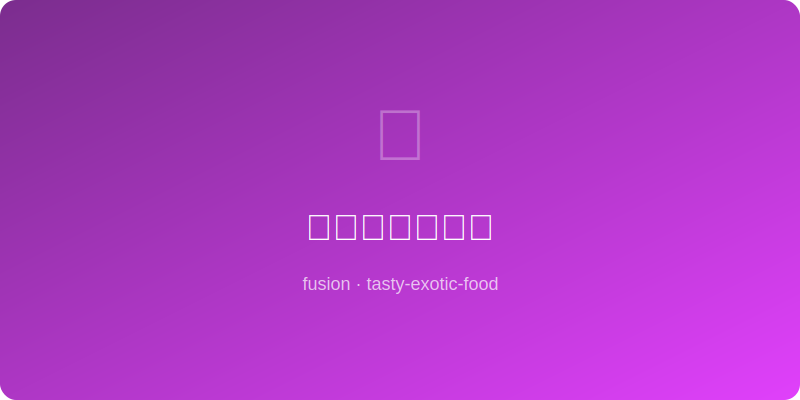

# 味噌黄油烤蘑菇 | Miso Butter Mushrooms

  

> ⏱ 25分钟 | 💰~$7/份 | 🏷️ 🤖AI原创、融合菜、素食、小食

> **🤖 AI 原创** — 法式黄油的奶香与日式味噌的发酵鲜味在蘑菇的多孔表面交汇，每一口都是鲜味炸弹。
> **🤖 AI Original** — *French butter's cream meets Japanese miso's fermented depth on mushrooms' porous surface — every bite is an umami bomb.*

---

## 食材 | Ingredients
| 食材 | Ingredient | 用量 / Amount |
|------|-----------|---------------|
| 混合蘑菇 | Mixed mushrooms (shiitake, oyster, king) | 400g / 14 oz |
| 无盐黄油 | Unsalted butter | 45g / 3 tbsp |
| 白味噌 | White miso paste | 25g / 1.5 tbsp |
| 蒜末 | Minced garlic | 10g / 2 cloves |
| 百里香 | Fresh thyme | 3枝 / 3 sprigs |
| 黑胡椒 | Black pepper | 适量 / to taste |

---

## 做法 | Directions
### 1. 调味噌黄油 | Make Miso Butter
室温黄油与味噌、蒜末拌匀成味噌黄油酱。
Mix softened butter with miso and minced garlic until a smooth miso butter forms.

### 2. 烤蘑菇 | Roast Mushrooms
蘑菇撕成大块，与味噌黄油和百里香拌匀，铺在烤盘上200°C/400°F烤18-20分钟至边缘焦脆。
Tear mushrooms into large pieces, toss with miso butter and thyme, spread on a baking sheet. Roast at 200°C/400°F for 18-20 min until edges are crispy.

### 3. 装盘调味 | Finish & Serve
出炉撒黑胡椒和少许海盐片，可搭配烤面包或作为配菜。
Remove, season with black pepper and a flake of sea salt. Serve on toast or as a side dish.

---

## 风味科学 | Flavor Science
> 味噌中的谷氨酸与蘑菇自身的鸟苷酸（GMP）产生协同增鲜效应，鲜味感知提升8-15倍；黄油的乳脂肪作为风味载体延长鲜味停留。 *Miso's glutamate synergizes with mushrooms' GMP for 8-15x umami amplification; butter's milk fat acts as a flavor vehicle, extending umami persistence.*

---

## 替代食材 | American Substitutions
| 原料 | Ingredient | 替代 / Substitute | 备注 / Notes |
|------|-----------|-------------------|-------------|
| 混合蘑菇 | Mixed mushrooms | 白蘑菇 / White button mushrooms | 超市常见 / Most available |
| 白味噌 | White miso | 帕玛森碎 / Grated Parmesan | 同为谷氨酸丰富 / Also glutamate-rich |
| 百里香 | Thyme | 迷迭香 / Rosemary | 同类木本香草 / Similar woody herb |
