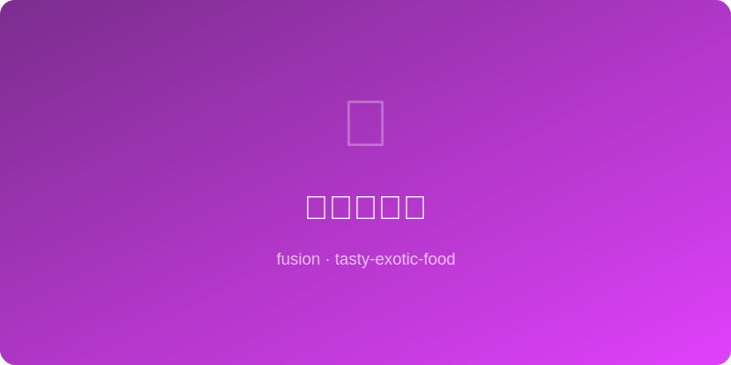

# 咖啡红烧肉 | Coffee Braised Pork

  

> ⏱ 90分钟 | 💰~$12/份 | 🏷️ 🤖AI原创、融合菜、硬菜、慢炖

> **🤖 AI 原创** — 浓缩咖啡取代冰糖炒色，赋予红烧肉意式烘焙的深沉苦香与丝绒般的焦糖色泽。
> **🤖 AI Original** — *Espresso replaces rock sugar for color, lending braised pork belly a velvety Italian-roast bitterness and deep mahogany glaze.*

---

## 食材 | Ingredients
| 食材 | Ingredient | 用量 / Amount |
|------|-----------|---------------|
| 五花肉 | Pork belly | 500g / 1.1 lb |
| 浓缩咖啡 | Espresso shot | 60ml / 2 shots |
| 生抽 | Light soy sauce | 30ml / 2 tbsp |
| 老抽 | Dark soy sauce | 15ml / 1 tbsp |
| 冰糖 | Rock sugar | 20g / 4 pcs |
| 八角 | Star anise | 2颗 / 2 whole |

---

## 做法 | Directions
### 1. 焯水切块 | Blanch & Cut
五花肉冷水下锅焯去血沫，捞出切3cm方块。
Blanch pork belly in cold water, skim scum, drain, and cut into 3cm cubes.

### 2. 炒糖炖煮 | Caramelize & Braise
锅中少油炒化冰糖至琥珀色，下肉块翻炒上色，加咖啡、生抽、老抽、八角和没过肉的热水，大火烧开转小火炖60分钟。
Melt rock sugar in a little oil until amber, toss in pork to coat, add espresso, soy sauces, star anise, and hot water to cover. Boil then simmer 60 min.

### 3. 大火收汁 | Reduce Glaze
开盖大火收汁至酱汁浓稠挂肉，装盘。
Uncover, turn heat to high, reduce sauce until thick and clinging to each cube. Plate.

---

## 风味科学 | Flavor Science
> 咖啡中的绿原酸在长时间炖煮中分解，产生类焦糖风味分子，与猪肉的美拉德产物叠加出复杂的烘烤香气。 *Chlorogenic acid in coffee breaks down during braising, yielding caramel-like molecules that layer with pork's Maillard compounds for complex roasted aromas.*

---

## 替代食材 | American Substitutions
| 原料 | Ingredient | 替代 / Substitute | 备注 / Notes |
|------|-----------|-------------------|-------------|
| 五花肉 | Pork belly | 猪肩肉 / Pork shoulder | 更易购买 / More available, slightly leaner |
| 浓缩咖啡 | Espresso | 速溶咖啡粉2tbsp / Instant coffee 2 tbsp | 溶于少量热水 / Dissolve in a little hot water |
| 老抽 | Dark soy sauce | 普通酱油+少许糖蜜 / Soy + molasses dash | 模拟上色效果 / Mimics coloring effect |
