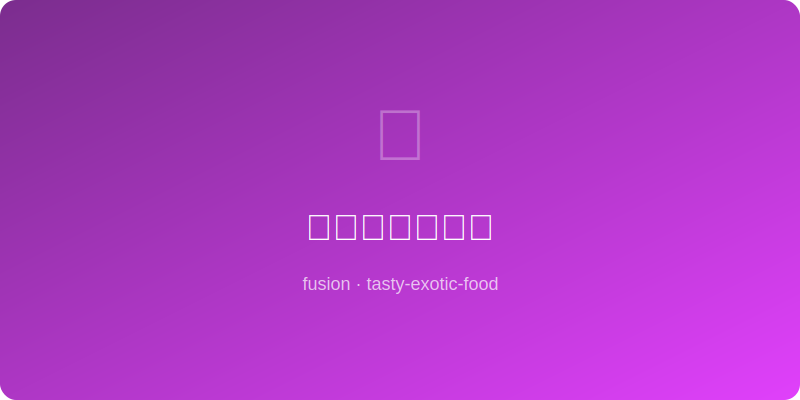

# 姜汁可乐热红酒 | Ginger Cola Mulled Wine

  

> ⏱ 20分钟 | 💰~$7/份 | 🏷️ 🤖AI原创、融合菜、饮品、冬季暖身

> **🤖 AI 原创** — 中式姜汁可乐的驱寒哲学与欧洲热红酒的圣诞浪漫合二为一，一杯暖到灵魂的跨文化拥抱。
> **🤖 AI Original** — *Chinese ginger cola's cold-busting wisdom merges with European mulled wine romance — a cross-cultural hug in a mug that warms you to the soul.*

---

## 食材 | Ingredients
| 食材 | Ingredient | 用量 / Amount |
|------|-----------|---------------|
| 红葡萄酒 | Red wine (dry) | 375ml / 1½ cups |
| 可口可乐 | Coca-Cola | 250ml / 1 cup |
| 老姜 | Old ginger, sliced | 30g / 1 inch |
| 肉桂棒 | Cinnamon stick | 1根 / 1 |
| 八角 | Star anise | 1颗 / 1 |
| 橙片 | Orange slices | 3片 / 3 slices |

---

## 做法 | Directions
### 1. 煮香料 | Simmer Spices
姜片、肉桂、八角和橙片加可乐小火煮5分钟，释放香气。
Simmer ginger, cinnamon, star anise, and orange slices in cola for 5 min to extract aromas.

### 2. 加红酒 | Add Wine
倒入红酒，保持微沸（不要煮沸）加热10分钟，让酒精与香料充分融合。
Pour in red wine, maintain a gentle simmer (never boil) for 10 min to marry alcohol and spices.

### 3. 过滤上桌 | Strain & Serve
滤去渣滓，倒入马克杯，以橙片和肉桂棒装饰，趁热饮用。
Strain into mugs, garnish with a fresh orange slice and cinnamon stick, serve hot.

---

## 风味科学 | Flavor Science
> 姜辣素（gingerol）加热后转化为姜烯酚（shogaol），辣感更温和持久；可乐的磷酸平衡红酒单宁的涩感，焦糖色素增添甜香。 *Gingerol converts to shogaol when heated, yielding a milder, lasting warmth; cola's phosphoric acid softens wine tannins while caramel coloring adds sweetness.*

---

## 替代食材 | American Substitutions
| 原料 | Ingredient | 替代 / Substitute | 备注 / Notes |
|------|-----------|-------------------|-------------|
| 红葡萄酒 | Red wine | 葡萄汁 / Grape juice | 无酒精版本 / Non-alcoholic version |
| 老姜 | Old ginger | 姜粉1tsp / Ground ginger 1 tsp | 方便替代 / Convenient swap |
| 可口可乐 | Coca-Cola | 黑樱桃苏打 / Black cherry soda | 类似焦糖甜感 / Similar caramel sweetness |
