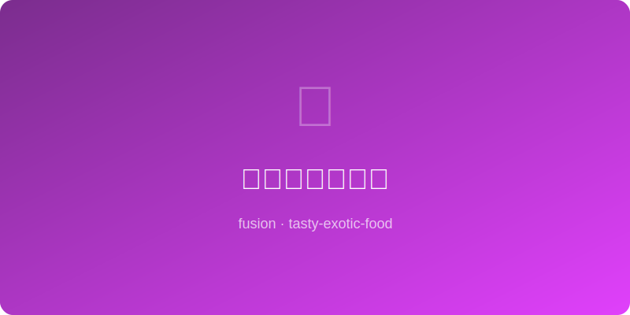

# 椰汁芋圆西米露 | Coconut Taro Sago

  

> ⏱ 45分钟 | 💰~$5/份 | 🏷️ 🤖AI原创、融合菜、甜品、东南亚×台湾

> **🤖 AI 原创** — 台湾芋圆的Q弹邂逅东南亚椰汁西米露的丝滑，紫色与白色在碗中编织热带的梦。
> **🤖 AI Original** — *Taiwanese taro balls' chewy bounce meets Southeast Asian coconut sago's silky pour — purple and white weave a tropical dream in a bowl.*

---

## 食材 | Ingredients
| 食材 | Ingredient | 用量 / Amount |
|------|-----------|---------------|
| 芋头 | Taro, steamed and mashed | 200g / 7 oz |
| 木薯粉 | Tapioca starch | 100g / ¾ cup |
| 小西米 | Small sago/tapioca pearls | 60g / ¼ cup |
| 椰浆 | Coconut milk | 400ml / 1⅔ cups |
| 冰糖 | Rock sugar | 50g / ¼ cup |
| 芒果丁（可选）| Mango cubes (optional) | 100g / ½ cup |

---

## 做法 | Directions
### 1. 做芋圆 | Make Taro Balls
蒸熟芋头捣泥，趁热加入木薯粉揉成光滑面团，搓成小圆球。
Mash steamed taro while hot, knead in tapioca starch to form a smooth dough, roll into small balls.

### 2. 煮西米和芋圆 | Cook Sago & Taro Balls
西米大火煮至半透明后闷10分钟至全透明，过冷水；芋圆另起锅煮至浮起后再煮2分钟，过冷水。
Boil sago until translucent center remains, cover and rest 10 min, rinse cold. Boil taro balls until they float + 2 min, rinse cold.

### 3. 组装甜汤 | Assemble
椰浆与冰糖加热至糖化，可冷可热。碗中放入西米、芋圆，浇椰汁，点缀芒果丁。
Heat coconut milk with rock sugar until dissolved — serve warm or chilled. Place sago and taro balls in bowls, pour coconut milk, top with mango.

---

## 风味科学 | Flavor Science
> 芋头淀粉与木薯粉的直链/支链淀粉比例差异创造出外软内Q的双层口感；椰浆的中链脂肪酸快速释放香气分子，增强芋头的天然奶香。 *The amylose/amylopectin ratio difference between taro and tapioca starch creates a soft-outside, chewy-inside dual texture; coconut's MCTs rapidly release aroma molecules, enhancing taro's natural creaminess.*

---

## 替代食材 | American Substitutions
| 原料 | Ingredient | 替代 / Substitute | 备注 / Notes |
|------|-----------|-------------------|-------------|
| 芋头 | Taro | 紫薯 / Purple sweet potato | 颜色更鲜艳 / Even more vibrant color |
| 小西米 | Sago pearls | 珍珠粉圆 / Boba pearls | 口感更大颗 / Larger, chewier |
| 椰浆 | Coconut milk | 燕麦奶+椰子精 / Oat milk + coconut extract | 椰子过敏者适用 / Coconut-free option |
