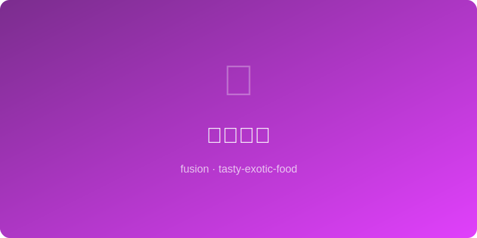

# 泡菜汉堡 | Kimchi Smash Burger

  

> ⏱ 准备 10分钟 + 烹饪 8分钟 | 💰 ~$4/份 | 🏷️ 🤖AI原创、平底锅、快手、派对

> **🤖 AI 原创菜谱** — 美式 smash burger 的焦脆牛肉饼遇上韩国泡菜的酸辣爽脆，再加上一层蒜味蛋黄酱，这是韩国街头和美国 diner 的混血儿。泡菜的酸切开牛肉的油腻，每一口都是完美的"酸-肉-辣"三角。
> **🤖 AI Original Recipe** — *The crispy smashed beef patty of an American diner meets Korean kimchi's tangy crunch, topped with garlic mayo — a love child of Seoul street food and a US burger joint. Kimchi's acidity cuts through beef's richness for a perfect "sour-meat-spicy" triangle in every bite.*

---

## 食材 | Ingredients

| 食材 | Ingredient | 用量 / Amount |
|------|-----------|---------------|
| 牛绞肉 | Ground beef (80/20) | 200g / 7 oz |
| 泡菜 | Kimchi (chopped) | 1/3杯 / 1/3 cup |
| 汉堡面包 | Burger buns | 2个 / 2 |
| 美式芝士 | American cheese slices | 2片 / 2 |
| 蛋黄酱 | Mayonnaise | 2汤匙 / 2 tbsp |
| 蒜泥 | Minced garlic | 1/2茶匙 / 1/2 tsp |
| 是拉差辣酱 | Sriracha | 1茶匙 / 1 tsp |

---

## 做法 | Directions

### 1. 做蒜辣酱 | Make Garlic-Chili Mayo
蛋黄酱+蒜泥+是拉差搅匀备用。

Mix mayo, garlic, and Sriracha. Set aside.

### 2. Smash 牛肉饼 | Smash the Patties
牛肉分成2个球，铸铁锅大火烧至冒烟。肉球放入，用锅铲用力压扁成薄饼，撒盐。煎2分钟不要动，翻面放芝士片，再煎1分钟。

Divide beef into 2 balls. Heat cast iron to smoking. Place balls and SMASH flat with a spatula, season with salt. Cook 2 min without touching, flip, add cheese, cook 1 min more.

### 3. 组装 | Build the Burger
面包烤至微焦。底层涂蒜辣酱，放肉饼，堆泡菜，盖上面包。

Toast buns lightly. Spread garlic-chili mayo on bottom bun, stack the patty, pile on kimchi, close the bun.

### 4. 开吃 | Devour
双手握紧，一口咬下——酸辣肉汁会流出来，备好纸巾。

Grip tight, take a big bite — tangy, spicy meat juices will flow. Have napkins ready.

---

## 风味科学 | Flavor Science

> **为什么泡菜是汉堡的终极搭档 / Why this works:**
> 泡菜在发酵过程中产生乳酸（sour）和大量游离谷氨酸（umami），这两种化合物精准地解决了汉堡的两个问题：酸味切油腻，鲜味提深度。泡菜的脆爽口感对比 smash burger 的焦脆形成"脆-脆"叠加（不同类型的脆感），让大脑的触觉处理中心持续亢奋。芝士融化后的酪蛋白还能结合泡菜的辣椒素，把辣度柔化到恰好可以忍受的"快感区"。
>
> *During fermentation, kimchi produces lactic acid (sour) and abundant free glutamate (umami) — precisely addressing two burger weaknesses: acid cuts grease, umami adds depth. Kimchi's fresh crunch vs. smash burger's caramelized crunch creates a "crunch-on-crunch" stack (different textures) that keeps the brain's tactile center firing. Melted cheese casein binds kimchi's capsaicin, softening heat to the exact "pleasure zone" threshold.*

---

## 要点 | Tips

| 要点 | Tip |
|------|-----|
| 铸铁锅一定要烧到冒烟才放肉 | Cast iron must be SMOKING hot before adding meat |
| 压扁后不要动！美拉德反应需要2分钟 | Don't touch after smashing! Maillard reaction needs a full 2 min |
| 泡菜要挤掉多余汁水，否则面包会软 | Squeeze excess liquid from kimchi — soggy buns ruin everything |
| 80/20 牛肉最佳，太瘦的肉没有味道 | 80/20 beef is ideal — leaner meat = less flavor |

---

## 替代食材 | American Substitutions

| 原料 | Ingredient | 替代 / Substitute | 备注 / Notes |
|------|-----------|-------------------|--------------|
| 泡菜 | Kimchi | Trader Joe's / Whole Foods 冷藏区 ~$4 | 韩国超市大罐最划算 |
| 牛绞肉 | Ground beef | 任何超市，选 80/20 | Costco 大包装最划算 |
| 面包 | Burger buns | Martin's potato rolls 最佳 | 任何超市面包区 |
